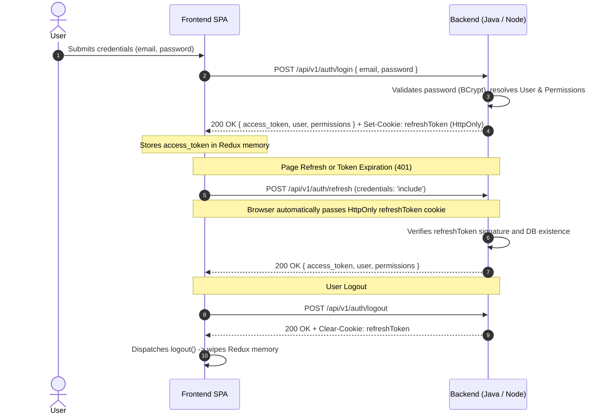
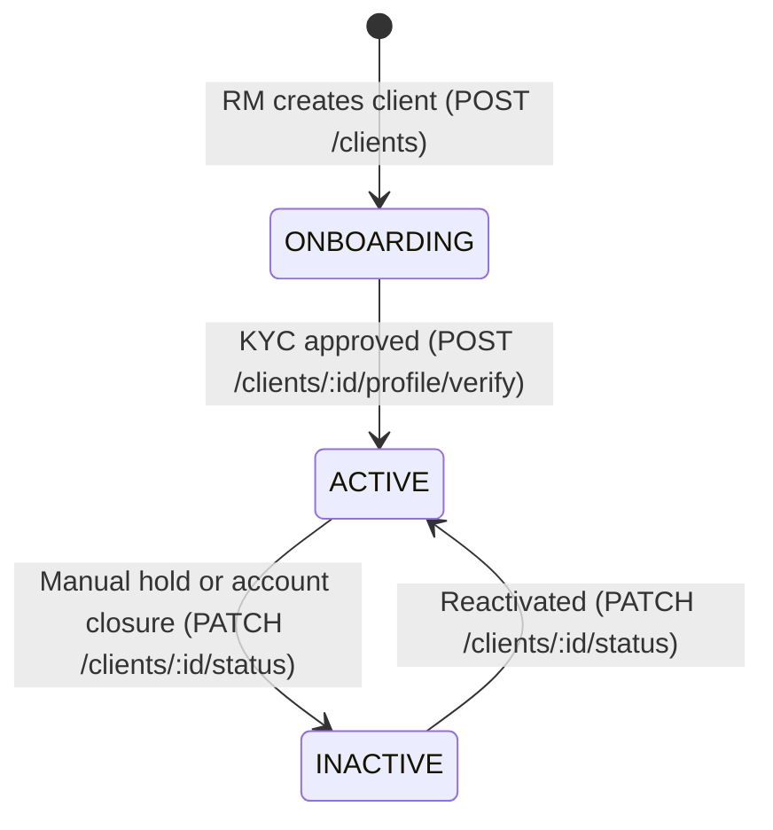
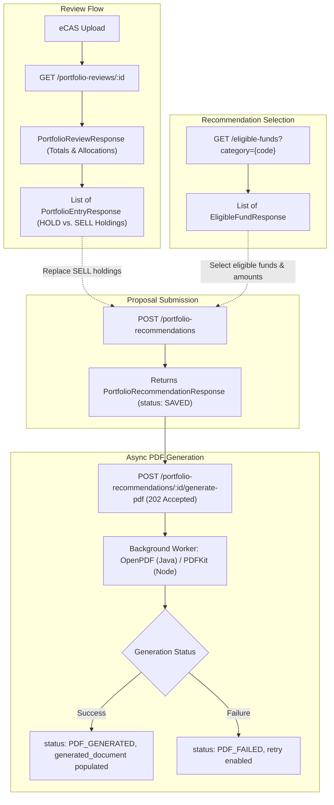

# Backend Architecture & Implementation Summary: Java Spring Boot vs. Node.js/Express

This document provides a comprehensive architectural and operational comparison between the two backend implementations of the **WealthTech CRM** (`backend-java` and `backend-nodejs`). Both services expose an **identical wire contract**, allowing the React frontend to switch between them seamlessly without changing client-side DTOs or endpoints.

---

## 1. Unified Wire Contract & Transport Protocol

| Architectural Concern | Java Spring Boot (`backend-java`) | Node.js + Express (`backend-nodejs`) | Frontend Wire Contract |
| :--- | :--- | :--- | :--- |
| **Default Base Route** | `/api/v1` | `/api/v1` *(or configurable `API_PREFIX`)* | `VITE_BASE_URL` env variable |
| **JSON Casing** | `snake_case` (Jackson naming strategy) | `snake_case` (`snakeCaseResponse` interceptor) | All request/response keys are `snake_case` |
| **JWT Architecture** | **Slim JWT**: Subject = user `email`, 15-min expiration | **Slim JWT**: Subject = user `email`, 15-min expiration | Short-lived `accessToken` held strictly in-memory (Redux) |
| **Session Persistence** | 7-day `refreshToken` in `HttpOnly`, `SameSite` cookie | 7-day `refreshToken` in `HttpOnly`, `SameSite` cookie | Sent automatically by browser with `credentials: 'include'` |
| **RBAC Authority Format**| Codenames: `resource:action` (e.g., `client:read`) | Codenames: `resource:action` (e.g., `client:read`) | Frontend `PermissionsEnum` matches these exact strings |
| **Pagination Protocol** | Cursor-based (`?cursor=` & `?page_size=`) | Cursor-based (`?cursor=` & `?page_size=`) | `{ results, next, previous, page_size }` envelope |
| **Dropdown Shape** | `{ display_name: string, value: T }` | `{ display_name: string, value: T }` | Uniform `DropdownOption<T>` for selects & tables |

---

## 2. Authentication & Session Lifecycle (`/auth`)

### Key Design Decisions:
1. **Slim JWT over Fat JWT**: Only the user email is signed into the JWT payload. Permissions are evaluated against the database or cache in real-time. If an administrator revokes an employee's permissions, the revocation takes effect immediately rather than waiting 15 minutes for a fat token to expire.
2. **HttpOnly Cookie for Refresh**: Neutralizes Cross-Site Scripting (XSS) attacks by preventing client-side JavaScript access to long-lived credentials.

---

## 3. Domain 1: Client Lifecycle & Compliance (`/clients`)

### Business Rules & State Machine:
- **Active Client Assumption**: Every customer in the database is an active client/investor. The legacy `PROSPECT` bifurcation has been eliminated.
- **Automatic RM Fallback**: When an onboarding client is created without specifying a Relationship Manager, the service defaults the RM to the authenticated employee (`currentUserId`).

### Data Storage Architecture:
- **Vertical Partitioning**:
  - `Client`: Stores high-frequency searchable data (`first_name`, `last_name`, `email`, `phone`, `pan`, `status`, `relationship_manager_id`).
  - `ClientProfile`: Stores heavy compliance, address, and KYC verification records (`kyc_status`, `address_line`, `city`, `pincode`).
- **Bulk Spreadsheet Ingestion**:
  - `GET /clients/bulk-template`: Streams pre-styled `.xlsx` template.
  - `POST /clients/bulk-upload`: Parses rows from memory buffer, executes background batch ingestion, and gracefully skips duplicate emails/PANs/phones without failing the batch.

---

## 4. Domain 2: Risk Appetite Assessment (`/risk-questions`, `/risk-assessments`)

### Operational Architecture:
- **Single-Page Grid (Not a Wizard)**: All 14 assessment questions render simultaneously.
- **Real-Time Auto-Save**: Selecting an option immediately issues `POST /risk-assessments/:raId/submit-answer`.
- **Authoritative Server Scoring**: The client never calculates or persists scores. Final score tallying (14–70 points) and risk categorization are performed server-side on `POST /risk-assessments/:raId/complete-assessment`.

### Score Bands:
| Score Band | Category Code | Display Name |
| :--- | :--- | :--- |
| **14 – 28** | `very_conservative` | Very Conservative |
| **29 – 42** | `conservative` | Conservative |
| **43 – 56** | `moderate` | Moderate |
| **57 – 63** | `aggressive` | Aggressive |
| **64 – 70** | `very_aggressive` | Very Aggressive |

> **Critical Route Note**: Both backends expose the latest completed assessment at:  
> `GET /api/v1/risk-assessments/clients/:clientId/latest` (plural `clients`).  
> This route serves as the mandatory pre-condition gate before creating a Portfolio Recommendation.

---

## 5. Domain 3: Portfolio Review & Recommendation Engine

### Key Technical Details:
1. **Flow Types**:
   - `REPLACE_FUNDS`: Tied to an existing `portfolio_review_id`; each new fund replaces an existing `SELL` entry.
   - `NEW_PORTFOLIO`: Standalone fund recommendation proposal built directly from the eligible universe.
2. **Immutable Proposals**: Recommendation proposals freeze fund NAVs, asset classes, and allocation amounts upon creation for compliance audit trails.
3. **Async PDF Polling**: Triggering PDF generation returns `202 Accepted`. The client polls `GET /portfolio-recommendations/:id` every 2.5 seconds until `status === 'PDF_GENERATED'`.

---

## 6. Domain 4: User Manager & RBAC (`/users`, `/groups`, `/roles`, `/permissions`)

### Hierarchical Model:
$$\text{Department (Group)} \longrightarrow \text{Role} \longrightarrow \text{Permissions (M:N)}$$
$$\text{User} \in \text{Department} \times \text{Role} \quad (\text{with optional } reports\_to \text{ self-reference})$$

### Cascading Form Dropdowns:
1. `GET /groups/dropdown` $\rightarrow$ Select Department.
2. `GET /roles/dropdown?groupId={id}` $\rightarrow$ Filter Roles available within the selected Department.
3. `GET /users/dropdown?groupId={id}&excludeUserId={id}` $\rightarrow$ Filter eligible managers within the Department (excluding the current user during edit).

### Delete Operations Excluded:
Both backends intentionally omit `DELETE` endpoints on users, roles, groups, and permissions. Hard-deleting relational roles would orphan active user sessions and introduce security holes; inactive entities are instead handled via status/deactivation flags.

---

## 7. Codebase Implementation Parity Matrix

| Feature / Responsibility | Java Spring Boot (`backend-java`) | Node.js + Express (`backend-nodejs`) |
| :--- | :--- | :--- |
| **Primary Framework** | Spring Boot 3.4.3 (Java 21) | Express 4.x + TypeScript 5.x |
| **Persistence Engine** | Spring Data JPA / Hibernate (PostgreSQL) | Mongoose 8.x (MongoDB Atlas) |
| **Password Hashing** | Spring Security `BCryptPasswordEncoder` | `bcryptjs` (salt rounds: 10) |
| **JWT Generation & Parsing** | `io.jsonwebtoken:jjwt-api:0.12.6` | `jsonwebtoken:^9.0.2` |
| **Structured Logging** | SLF4J + Logback (`@Slf4j`) | Pino + `pino-http` (`logger.ts`) |
| **PDF Document Generation** | OpenPDF (`com.github.librepdf:openpdf`) | `pdfkit:^0.15.0` vector streaming |
| **Spreadsheet Ingestion** | Apache POI (`poi-ooxml:5.4.0`) | `exceljs:^4.4.0` buffer parsing |
| **Validation Layer** | Jakarta Validation (`@Valid`, `@NotBlank`) | Explicit controller / middleware validators |
| **Error Handling Pipeline** | `@RestControllerAdvice` + Global Exception Handler | 4-argument Express `errorHandler` + `AppError` |
| **Code Quality Guardrails** | Strong typing, zero raw types | Strict TypeScript, **zero `any`**, logger-before-error |
