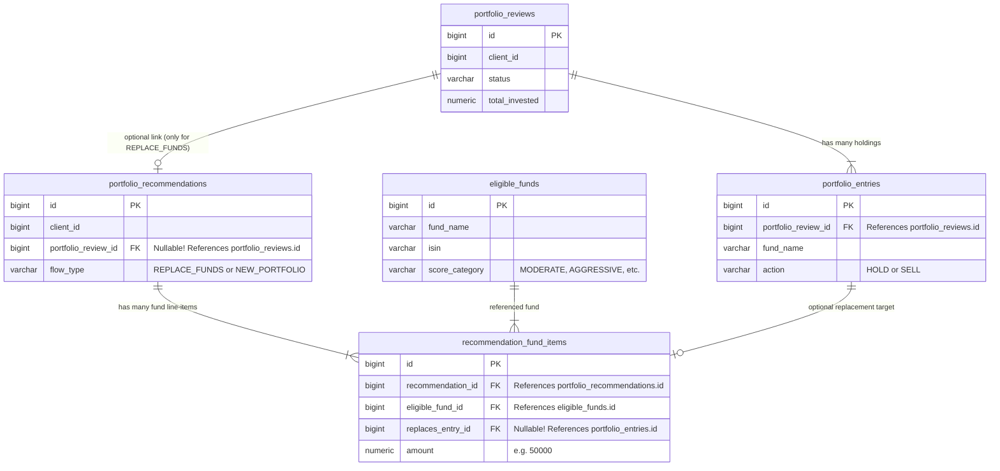
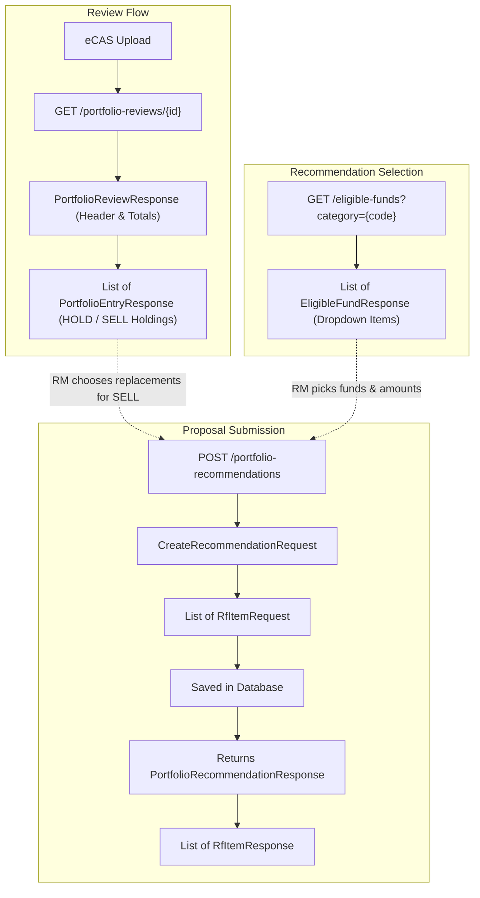
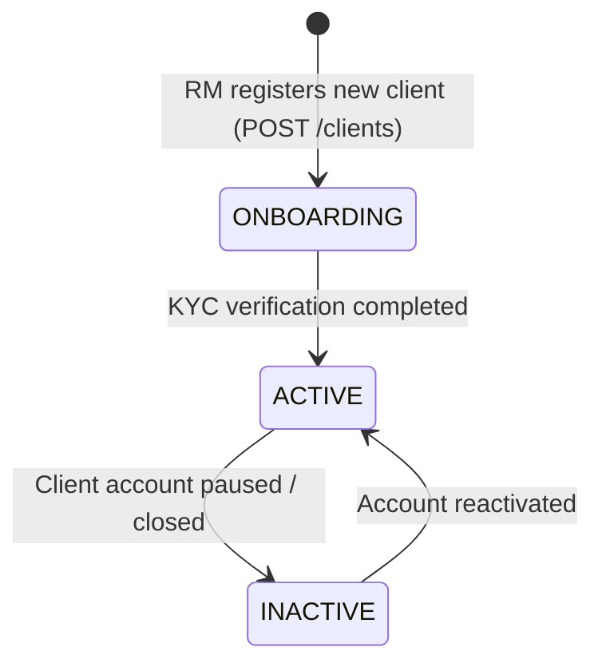
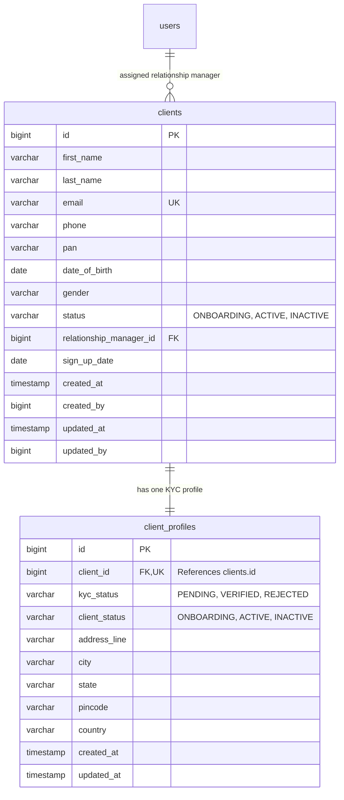

### Implementation

#### Authentication
1. Create User, Group, Permission, Role entities with relationships
2. Create user repository to fetch user by email, role and permissions for that user, and group for that role
3. Create a custom UserDetailsService which calls the userRepository `findByEmail` method, populates `authorities` with role and permission codenames and returns the user object with authorities
4. Create a JwtTokenProvider class which will generate JWT tokens for the user after successful login:
    - `generateToken(Authentication authentication)`: Takes the authenticated `UserDetails` principal, sets the subject of token as user's email (username is email) and issues the token with expiration time (15 minutes by default).
    - `getEmailFromJwt(String token)`: Parses and verifies the token's signature and then extracts the subject (email) from the token.
    - `validateToken(String token)`: Validates the token signature and catches specific JWT exceptions (malformed, expired, etc.) and returns false if validation fails.
5. Create a `JwtAuthenticationFilter` class extending `OncePerRequestFilter`:
    - Extends `OncePerRequestFilter` to guarantee token validation occurs exactly once per HTTP request dispatch.
    - `getJwtFromRequest(request)`: Extracts the raw JWT token from the `Authorization: Bearer <token>` HTTP header.
    - `doFilterInternal(...)`: Validates the token signature, extracts the user's email, loads `UserDetails` (with role & permissions), and sets the `UsernamePasswordAuthenticationToken` in Spring's `SecurityContextHolder`.
    - Invokes `filterChain.doFilter(request, response)` to pass the request down the security filter chain.
6. Security Configuration in `SecurityConfig.java`:
    - Configures BCryptPasswordEncoder as the password encoder.
    - Exposes AuthenticationManager Bean which is used by AuthService during login to set the security context.
    - Disables CSRF, sets session policy to STATELESS.
    - Sets public vs protected routes
    - Registers JwtAuthenticationFilter to intercept every request and validate token
7. Authentication API Layer (`AuthService.java` & `AuthController.java`):
    - `LoginDto`: Record validating `@NotBlank` email and password.
    - `AuthResponse`: Record returning `accessToken`, `tokenType`, `message`, user profile metadata (`email`), `role`, and `permissions` set.
    - `AuthService`: Handles `login()` (generates 15-min access token + sets 7-day `refreshToken` HttpOnly cookie directly on `HttpServletResponse`), `refreshAccessToken()`, and `logout()`.
    - `AuthController`:
        - `POST /java-wtc-api/v1/auth/login`: Accepts `@Valid @RequestBody LoginDto`, delegates cookie handling to `AuthService`, and returns `AuthResponse` in JSON body.
        - `POST /java-wtc-api/v1/auth/refresh`: Reads `@CookieValue(name = "refreshToken")` and issues a fresh `accessToken`.
        - `POST /java-wtc-api/v1/auth/logout`: Clears the `refreshToken` cookie via `AuthService`.

#### User Management
1. Creating the user:
   - Controller receives `CreateUserRequest` DTO.
   - Service checks if email is unique; if not, return `409 Conflict`.
   - Generate a default password, hash it with BCrypt, and store it in the `users.password` column.
   - `CustomUserDetailsService` reads the stored hash automatically — no extra wiring needed.
   - Return `UserResponse` with `password` excluded from JSON (`@JsonIgnore` on entity).

2. Get user by id:
   - If found, return `UserResponse` with joined `role`, `group`, and `reportsTo` using JPA `JOIN FETCH`.
   - If not found, return `404 Not Found`.

3. Update user by id:
   - If found, apply partial updates from `UpdateUserRequest` and return updated `UserResponse`.
   - If not found, return `404 Not Found`.

4. Get user list:
   - Return paginated results using **cursor-based pagination** (`?cursor=` / `?page_size=N`, default 50, max 1500).
   - Each item uses `DropdownOption<Long>` for `role`, `group`, and `reportsTo` so the frontend can render tables and dropdowns without extra lookups.

5. Creating the group:
   - Check if group **name** already exists; if yes, return `409 Conflict`.
   - Create empty group. Existing `roles` and `users` collections are inverse sides — they are populated automatically by JPA when related entities are saved.

6. Get group list:
   - Cursor-based pagination, same convention as user list.

7. Creating the role:
   - Enforce uniqueness of role **name within a group** (composite unique constraint on `group_id + name`, or service-layer check).
   - Save role with empty `permissions` initially; permissions are assigned later via `set-permissions` endpoint.

8. Dropdown APIs for cascading form behavior:
   - `GET /java-wtc-api/v1/groups/dropdown` → all groups as `DropdownOption<Long>`
   - `GET /java-wtc-api/v1/roles/dropdown?groupId=` → roles in the specified group, or `[]` if `groupId` is missing
   - `GET /java-wtc-api/v1/users/dropdown?groupId=&excludeUserId=` → users in the specified group, excluding the current user when editing; returns `[]` if `groupId` is missing
   - The Add/Edit User form uses these to enforce: Department must be selected before Role or Reports-To options become available.

9. Permissions:
   - Seed the `permissions` table at application startup with the full `PermissionsEnum` catalogue so authorization rules are available immediately.
   - `GET /permissions/` returns the full catalogue; the frontend groups them by `content_type` for the checkbox matrix UI.
   - `POST /roles/{id}/set-permissions/` assigns permissions to a role and invalidates the `AuthenticatedUser` cache so live sessions pick up permission changes.

---

#### Interview discussion: Delete operations and cascading
- **Current scope:** Delete endpoints are not implemented. The frontend does not expose delete UI for users, groups, roles, or permissions.
- **Why cascading deletes are dangerous in RBAC:**
  - Roles and groups are shared references. One role may be assigned to many users; one group may contain many roles and users.
  - Using `CascadeType.REMOVE` on `Group → Role` or `Role → User` would silently delete dependent records, potentially breaking authorization for active users.
  - Even without JPA cascade, a raw `DELETE FROM groups WHERE id = ?` would leave foreign keys dangling unless the DB enforces `ON DELETE RESTRICT`.
- What would be required if delete is ever added:
  - Soft-delete or explicit reassignment before hard delete.
  - Service-layer guards: `409 Conflict` if a group still has roles/users, or if a role still has users.
  - No JPA `CascadeType.REMOVE` on any RBAC relationship.

---

#### Portfolio Review & Recommendation

##### 1. Domain Entities & Database Schema

##### 2. DTO & API Lifecycle Workflow

##### 3. Recommendation Status & Async PDF Generation State Machine

```mermaid
stateDiagram-v2
    [*] --> SAVED : "POST /portfolio-recommendations (Proposal created, document URL is null)"

    SAVED --> SAVED : "POST /portfolio-recommendations/{id}/generate-pdf (HTTP 202 Accepted)"
    note right of SAVED
        Frontend polls GET /portfolio-recommendations/{id}
        every 2.5s with active loading spinner
    end note

    SAVED --> PDF_GENERATED : "OpenPDF worker completes & saves file to disk"
    SAVED --> PDF_FAILED : "Worker encounters exception (caught in try/catch)"

    PDF_FAILED --> SAVED : "RM clicks Retry (POST /portfolio-recommendations/{id}/generate-pdf)"

    PDF_GENERATED --> [*] : "Frontend polling terminates; Download PDF CTA enabled"
```

- **`SAVED`**: Initial state upon proposal creation (`POST /portfolio-recommendations`). `generated_document_url` is `null`. When `POST /portfolio-recommendations/{id}/generate-pdf` is called, the endpoint immediately returns `202 Accepted` and delegates execution to `@Async generatePdfAsync()`. The frontend UI runs a 2.5s polling loop on `GET /portfolio-recommendations/{id}`.
- **`PDF_GENERATED`**: The asynchronous OpenPDF worker finishes rendering tables, sums, and SEBI disclaimers to `uploads/recommendations/recommendation_{id}.pdf`, sets `generated_document_url`, and commits `PDF_GENERATED`. Frontend polling terminates upon seeing this state and reveals the download link.
- **`PDF_FAILED`**: If rendering or disk I/O throws an error, the async worker catches the exception and marks the status as `PDF_FAILED`. The frontend halts polling and renders a retry button allowing the RM to re-trigger generation.

---

#### Customer Management

##### 1. Business Rule & Lifecycle Architecture
> [!NOTE]
> **Client / Investor Assumption**: The system operates under the foundational business rule that any customer added to the database is an active client / investor. The concept of a separate `PROSPECT` stage and `client_type` bifurcation has been intentionally eliminated; every customer entity represents an active client/investor with an assigned Relationship Manager and an associated KYC profile.

##### 2. Domain Schema

---

#### 3. Database Architecture & Design Highlights
1. **1NF (Atomic Data)**: Every cell holds a single value—for example, addresses are split into separate `city`, `state`, and `pincode` columns instead of one long comma-separated string.
2. **2NF & 3NF (Clean Relationships)**: Data is stored in only one place—for example, users link to a `role`, which links to a `department`, so renaming a department updates just one row instead of thousands of users.
3. **Vertical Partitioning**: We split the client into two tables—frequently browsed info (name, email, status) lives in `clients`, while heavy KYC and address details live in `client_profiles` to keep client searches fast.
4. **Intentional Denormalization**: We freeze the mutual fund price on recommendation proposals like a printed store receipt, so if fund prices change tomorrow, past client proposals stay permanently accurate for audits.
5. **Smart Indexing**: Unique indexes block duplicate emails and PANs, while a composite index on `(status, rm_id, id)` lets the database jump straight to the next page of clients without scanning millions of rows.

