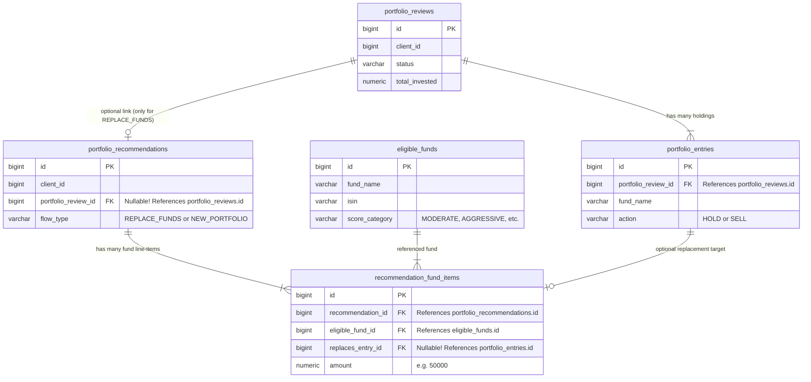
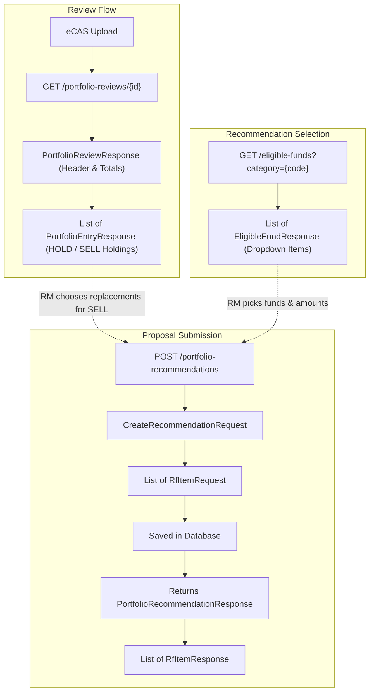
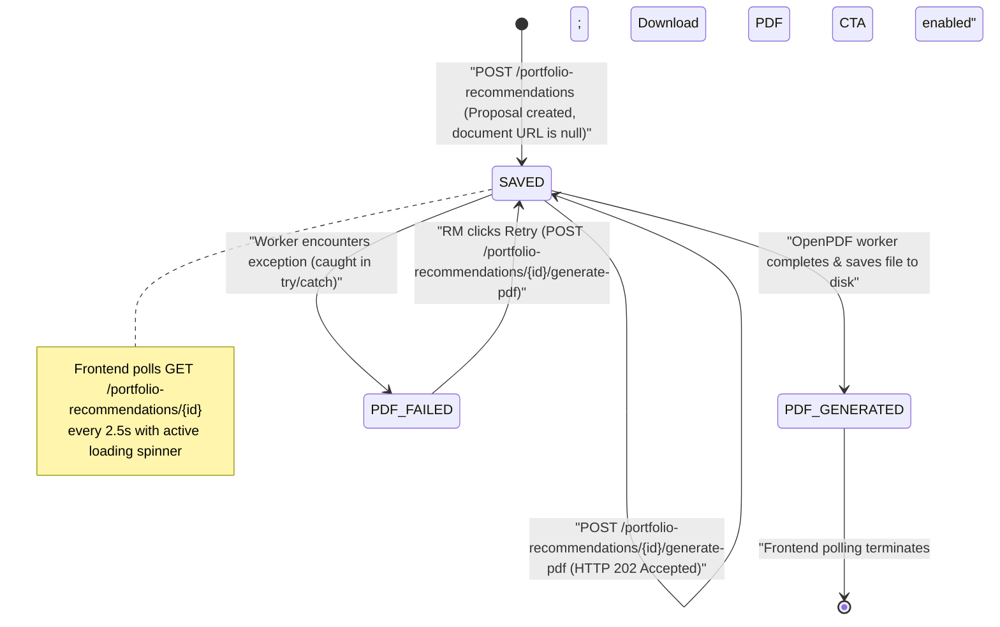
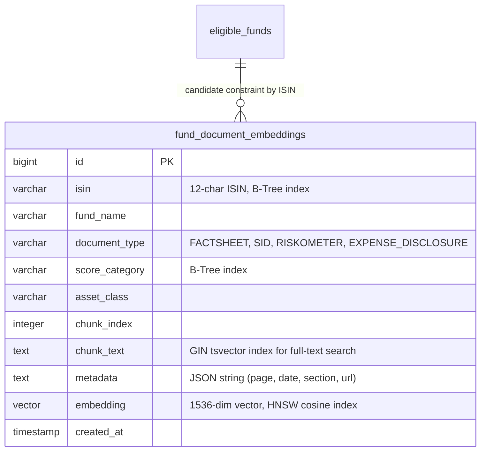
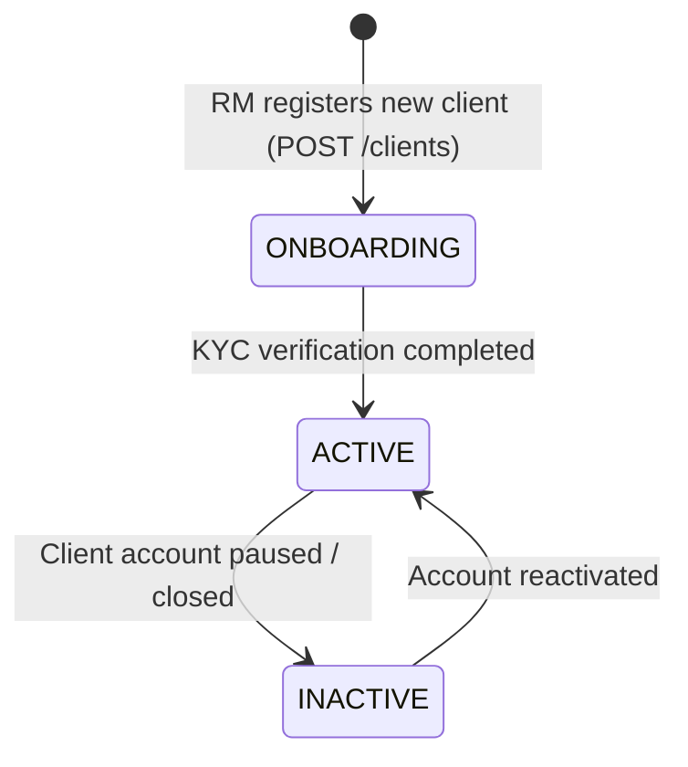
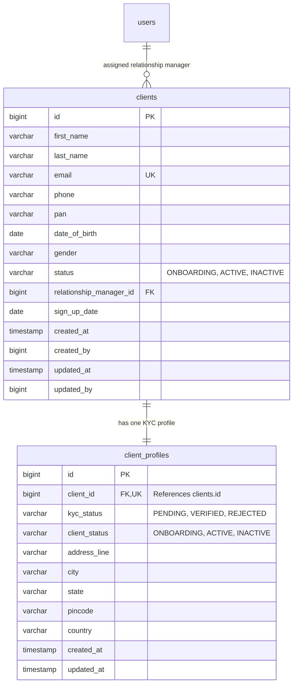

# Java Backend

## Default Admin Credentials

| Parameter | Value |
|---|---|
| **Email** | `admin@wealthtech.com` |
| **Password** | `Admin@123` |
| **Role** | `ADMIN` |
| **Department / Group** | `Administration` |
| **Login Endpoint** | `POST /java-wtc-api/v1/auth/login` (via Nginx proxy) or `POST /api/v1/auth/login` (direct) |
| **Source Seeder** | `backend-java/src/main/java/com/wealthtech/crm/modules/usermanager/service/AdminRoleSeeder.java` |

---

### Implementation

#### Authentication
1. Create User, Group, Permission, Role entities with relationships
2. Create user repository to fetch user by email, role and permissions for that user, and group for that role
3. Create a custom UserDetailsService which calls the userRepository `findByEmail` method, populates `authorities` with role and permission codenames and returns the user object with authorities
4. Create a JwtTokenProvider class which will generate JWT tokens for the user after successful login:
    - `generateToken(Authentication authentication)`: Takes the authenticated `UserDetails` principal, sets the subject of token as user's email (username is email) and issues the token with expiration time (15 minutes by default).
    - `getEmailFromJwt(String token)`: Parses and verifies the token's signature and then extracts the subject (email) from the token.
    - `validateToken(String token)`: Validates the token signature and catches specific JWT exceptions (malformed, expired, etc.) and returns false if validation fails.
5. Create a `JwtAuthenticationFilter` class extending `OncePerRequestFilter`:
    - Extends `OncePerRequestFilter` to guarantee token validation occurs exactly once per HTTP request dispatch.
    - `getJwtFromRequest(request)`: Extracts the raw JWT token from the `Authorization: Bearer <token>` HTTP header.
    - `doFilterInternal(...)`: Validates the token signature, extracts the user's email, loads `UserDetails` (with role & permissions), and sets the `UsernamePasswordAuthenticationToken` in Spring's `SecurityContextHolder`.
    - Invokes `filterChain.doFilter(request, response)` to pass the request down the security filter chain.
6. Security Configuration in `SecurityConfig.java`:
    - Configures BCryptPasswordEncoder as the password encoder.
    - Exposes AuthenticationManager Bean which is used by AuthService during login to set the security context.
    - Disables CSRF, sets session policy to STATELESS.
    - Sets public vs protected routes
    - Registers JwtAuthenticationFilter to intercept every request and validate token
7. Authentication API Layer (`AuthService.java` & `AuthController.java`):
    - `LoginDto`: Record validating `@NotBlank` email and password.
    - `AuthResponse`: Record returning `accessToken`, `tokenType`, `message`, user profile metadata (`email`), `role`, and `permissions` set.
    - `AuthService`: Handles `login()` (generates 15-min access token + sets 7-day `refreshToken` HttpOnly cookie directly on `HttpServletResponse`), `refreshAccessToken()`, and `logout()`.
    - `AuthController`:
        - `POST /java-wtc-api/v1/auth/login`: Accepts `@Valid @RequestBody LoginDto`, delegates cookie handling to `AuthService`, and returns `AuthResponse` in JSON body.
        - `POST /java-wtc-api/v1/auth/refresh`: Reads `@CookieValue(name = "refreshToken")` and issues a fresh `accessToken`.
        - `POST /java-wtc-api/v1/auth/logout`: Clears the `refreshToken` cookie via `AuthService`.


#### User Management
1. Creating the user:
   - Controller receives `CreateUserRequest` DTO.
   - Service checks if email is unique; if not, return `409 Conflict`.
   - Generate a default password, hash it with BCrypt, and store it in the `users.password` column.
   - `CustomUserDetailsService` reads the stored hash automatically — no extra wiring needed.
   - Return `UserResponse` with `password` excluded from JSON (`@JsonIgnore` on entity).

2. Get user by id:
   - If found, return `UserResponse` with joined `role`, `group`, and `reportsTo` using JPA `JOIN FETCH`.
   - If not found, return `404 Not Found`.

3. Update user by id:
   - If found, apply partial updates from `UpdateUserRequest` and return updated `UserResponse`.
   - If not found, return `404 Not Found`.

4. Get user list:
   - Return paginated results using **cursor-based pagination** (`?cursor=` / `?page_size=N`, default 50, max 1500).
   - Each item uses `DropdownOption<Long>` for `role`, `group`, and `reportsTo` so the frontend can render tables and dropdowns without extra lookups.

5. Creating the group:
   - Check if group **name** already exists; if yes, return `409 Conflict`.
   - Create empty group. Existing `roles` and `users` collections are inverse sides — they are populated automatically by JPA when related entities are saved.

6. Get group list:
   - Cursor-based pagination, same convention as user list.

7. Creating the role:
   - Enforce uniqueness of role **name within a group** (composite unique constraint on `group_id + name`, or service-layer check).
   - Save role with empty `permissions` initially; permissions are assigned later via `set-permissions` endpoint.

8. Dropdown APIs for cascading form behavior:
   - `GET /java-wtc-api/v1/groups/dropdown` → all groups as `DropdownOption<Long>`
   - `GET /java-wtc-api/v1/roles/dropdown?groupId=` → roles in the specified group, or `[]` if `groupId` is missing
   - `GET /java-wtc-api/v1/users/dropdown?groupId=&excludeUserId=` → users in the specified group, excluding the current user when editing; returns `[]` if `groupId` is missing
   - The Add/Edit User form uses these to enforce: Department must be selected before Role or Reports-To options become available.

9. Permissions:
   - Seed the `permissions` table at application startup with the full `PermissionsEnum` catalogue so authorization rules are available immediately.
   - `GET /permissions/` returns the full catalogue; the frontend groups them by `content_type` for the checkbox matrix UI.
   - `POST /roles/{id}/set-permissions/` assigns permissions to a role and invalidates the `AuthenticatedUser` cache so live sessions pick up permission changes.

---

#### Interview discussion: Delete operations and cascading
- **Current scope:** Delete endpoints are not implemented. The frontend does not expose delete UI for users, groups, roles, or permissions.
- **Why cascading deletes are dangerous in RBAC:**
  - Roles and groups are shared references. One role may be assigned to many users; one group may contain many roles and users.
  - Using `CascadeType.REMOVE` on `Group → Role` or `Role → User` would silently delete dependent records, potentially breaking authorization for active users.
  - Even without JPA cascade, a raw `DELETE FROM groups WHERE id = ?` would leave foreign keys dangling unless the DB enforces `ON DELETE RESTRICT`.
- What would be required if delete is ever added:
  - Soft-delete or explicit reassignment before hard delete.
  - Service-layer guards: `409 Conflict` if a group still has roles/users, or if a role still has users.
  - No JPA `CascadeType.REMOVE` on any RBAC relationship.

---

#### Portfolio Review & Recommendation

##### 1. Domain Entities & Database Schema

```mermaid
erDiagram
    portfolio_reviews ||--|{ portfolio_entries : "has many holdings"
    portfolio_reviews ||--o| portfolio_recommendations : "optional link (only for REPLACE_FUNDS)"
    portfolio_recommendations ||--|{ recommendation_fund_items : "has many fund line-items"
    eligible_funds ||--|{ recommendation_fund_items : "referenced fund"
    portfolio_entries ||--o| recommendation_fund_items : "optional replacement target"

    portfolio_reviews {
        bigint id PK
        bigint client_id
        varchar status
        numeric total_invested
    }

    portfolio_entries {
        bigint id PK
        bigint portfolio_review_id FK "References portfolio_reviews.id"
        varchar fund_name
        varchar action "HOLD or SELL"
    }

    eligible_funds {
        bigint id PK
        varchar fund_name
        varchar isin
        varchar score_category "MODERATE, AGGRESSIVE, etc."
    }

    portfolio_recommendations {
        bigint id PK
        bigint client_id
        bigint portfolio_review_id FK "Nullable! References portfolio_reviews.id"
        varchar flow_type "REPLACE_FUNDS or NEW_PORTFOLIO"
    }

    recommendation_fund_items {
        bigint id PK
        bigint recommendation_id FK "References portfolio_recommendations.id"
        bigint eligible_fund_id FK "References eligible_funds.id"
        bigint replaces_entry_id FK "Nullable! References portfolio_entries.id"
        numeric amount "e.g. 50000"
    }
```

##### 2. DTO & API Lifecycle Workflow

```mermaid
flowchart TD
    subgraph Review Flow
        A["eCAS Upload"] --> B["GET /portfolio-reviews/{id}"]
        B --> C["PortfolioReviewResponse (Header & Totals)"]
        C --> D["List of PortfolioEntryResponse (HOLD / SELL Holdings)"]
    end

    subgraph Recommendation Selection
        E["GET /eligible-funds?category={code}"] --> F["List of EligibleFundResponse (Dropdown Items)"]
    end

    subgraph Proposal Submission
        D -. "RM chooses replacements for SELL" .-> G["POST /portfolio-recommendations"]
        F -. "RM picks funds & amounts" .-> G
        G --> H["CreateRecommendationRequest"]
        H --> I["List of RfItemRequest"]
        I --> J["Saved in Database"]
        J --> K["Returns PortfolioRecommendationResponse"]
        K --> L["List of RfItemResponse"]
    end
```

##### 3. Recommendation Status & Async PDF Generation State Machine

```mermaid
stateDiagram-v2
    [*] --> SAVED : "POST /portfolio-recommendations (Proposal created, document URL is null)"

    SAVED --> SAVED : "POST /portfolio-recommendations/{id}/generate-pdf (HTTP 202 Accepted)"
    note right of SAVED
        Frontend polls GET /portfolio-recommendations/{id}
        every 2.5s with active loading spinner
    end note

    SAVED --> PDF_GENERATED : "OpenPDF worker completes & saves file to disk"
    SAVED --> PDF_FAILED : "Worker encounters exception (caught in try/catch)"

    PDF_FAILED --> SAVED : "RM clicks Retry (POST /portfolio-recommendations/{id}/generate-pdf)"

    PDF_GENERATED --> [*] : "Frontend polling terminates; Download PDF CTA enabled"
```

- **`SAVED`**: Initial state upon proposal creation (`POST /portfolio-recommendations`). `generated_document_url` is `null`. When `POST /portfolio-recommendations/{id}/generate-pdf` is called, the endpoint immediately returns `202 Accepted` and delegates execution to `@Async generatePdfAsync()`. The frontend UI runs a 2.5s polling loop on `GET /portfolio-recommendations/{id}`.
- **`PDF_GENERATED`**: The asynchronous OpenPDF worker finishes rendering tables, sums, and SEBI disclaimers to `uploads/recommendations/recommendation_{id}.pdf`, sets `generated_document_url`, and commits `PDF_GENERATED`. Frontend polling terminates upon seeing this state and reveals the download link.
- **`PDF_FAILED`**: If rendering or disk I/O throws an error, the async worker catches the exception and marks the status as `PDF_FAILED`. The frontend halts polling and renders a retry button allowing the RM to re-trigger generation.

##### 4. AI-Native RAG & Mutual Fund Grounding Engine (pgvector Hybrid Retrieval)

###### A. Architectural Motivation & Candidate Whitelisting
In wealth management, unconstrained RAG retrieval is high risk: a standard semantic vector query across generic mutual fund corpora could retrieve unauthorized or unsuitable funds for a client's risk appetite.
To guarantee regulatory compliance:
1. **Candidate Whitelisting**: The system queries `EligibleFundRepository.findByScoreCategoryAndIsActiveTrue(scoreCategory)` first to fetch only approved, active ISINs matching the investor's assessed risk category (`ScoreCategory`).
2. **Hard Candidate Pushdown**: The retrieved ISIN collection is passed into the hybrid retrieval query as a mandatory hard filter: `WHERE f.isin IN (:candidateIsins)`.

###### B. Database Schema & Tri-Factor Indexing
The grounding engine persists ingested regulatory documents (`FACTSHEET`, `SID`, `RISKOMETER`, `EXPENSE_DISCLOSURE`) in `fund_document_embeddings`:


```mermaid
erDiagram
    eligible_funds ||--o{ fund_document_embeddings : "candidate constraint by ISIN"

    fund_document_embeddings {
        bigint id PK
        varchar isin "12-char ISIN, B-Tree index"
        varchar fund_name
        varchar document_type "FACTSHEET, SID, RISKOMETER, EXPENSE_DISCLOSURE"
        varchar score_category "B-Tree index"
        varchar asset_class
        integer chunk_index
        text chunk_text "GIN tsvector index for full-text search"
        text metadata "JSON string (page, date, section, url)"
        vector embedding "1536-dim vector, HNSW cosine index"
        timestamp created_at
    }
```

* **B-Tree Indexing**: On `isin`, `score_category`, and `document_type` for rapid metadata filtering and candidate bounding.
* **HNSW Indexing (`pgvector`)**: Cosine distance operator (`<=>`) for 1536-dimensional semantic vector search (`(1.0 - (f.embedding <=> CAST(:queryEmbedding AS vector)))`).
* **GIN Indexing (`to_tsvector`)**: Lexical keyword matching via `ts_rank_cd(to_tsvector('english', f.chunk_text), plainto_tsquery('english', :queryText))` to catch specific fund names, ticker symbols, and exact numeric disclosures without hallucination.

###### C. Fused Hybrid Scoring & SQL Top-K Bounding
The retrieval query runs entirely inside PostgreSQL ACID storage with weighted linear fusion (`0.70 * semantic + 0.30 * lexical`), bounded strictly by `LIMIT :limit`:

```java
@Query(value = """
    SELECT 
        f.id AS id,
        f.isin AS isin,
        f.fund_name AS fundName,
        f.document_type AS documentType,
        f.score_category AS scoreCategory,
        f.asset_class AS assetClass,
        f.chunk_index AS chunkIndex,
        f.chunk_text AS chunkText,
        f.metadata AS metadata,
        f.created_at AS createdAt,
        (
            0.7 * (1.0 - (f.embedding <=> CAST(:queryEmbedding AS vector))) +
            0.3 * ts_rank_cd(to_tsvector('english', f.chunk_text), plainto_tsquery('english', :queryText))
        ) AS hybridScore
    FROM fund_document_embeddings f
    WHERE f.isin IN (:candidateIsins)
    ORDER BY hybridScore DESC
    LIMIT :limit
    """, nativeQuery = true)
List<FundDocumentEvidenceProjection> findTopKRelevantEvidence(
        @Param("candidateIsins") Collection<String> candidateIsins,
        @Param("queryEmbedding") String queryEmbedding,
        @Param("queryText") String queryText,
        @Param("limit") int limit);
```

The resulting `FundDocumentEvidenceProjection` records are evaluated against the Evidence Quality Gate (`rag_similarity_score` and `evidence_consistency_score`) before being synthesized into grounded recommendations.

---

#### Customer Management

##### 1. Business Rule & Lifecycle Architecture
> [!NOTE]
> **Client / Investor Assumption**: The system operates under the foundational business rule that any customer added to the database is an active client / investor. The concept of a separate `PROSPECT` stage and `client_type` bifurcation has been intentionally eliminated; every customer entity represents an active client/investor with an assigned Relationship Manager and an associated KYC profile.


```mermaid
stateDiagram-v2
    [*] --> ONBOARDING : RM registers new client (POST /clients)
    ONBOARDING --> ACTIVE : KYC verification completed
    ACTIVE --> INACTIVE : Client account paused / closed
    INACTIVE --> ACTIVE : Account reactivated
```

##### 2. Domain Schema

```mermaid
erDiagram
    users ||--o{ clients : "assigned relationship manager"
    clients ||--|| client_profiles : "has one KYC profile"

    clients {
        bigint id PK
        varchar first_name
        varchar last_name
        varchar email UK
        varchar phone
        varchar pan
        date date_of_birth
        varchar gender
        varchar status "ONBOARDING, ACTIVE, INACTIVE"
        bigint relationship_manager_id FK
        date sign_up_date
        timestamp created_at
        bigint created_by
        timestamp updated_at
        bigint updated_by
    }

    client_profiles {
        bigint id PK
        bigint client_id FK,UK "References clients.id"
        varchar kyc_status "PENDING, VERIFIED, REJECTED"
        varchar client_status "ONBOARDING, ACTIVE, INACTIVE"
        varchar address_line
        varchar city
        varchar state
        varchar pincode
        varchar country
        timestamp created_at
        timestamp updated_at
    }
```

---

#### 3. Database Architecture & Design Highlights
1. **1NF (Atomic Data)**: Every cell holds a single value—for example, addresses are split into separate `city`, `state`, and `pincode` columns instead of one long comma-separated string.
2. **2NF & 3NF (Clean Relationships)**: Data is stored in only one place—for example, users link to a `role`, which links to a `department`, so renaming a department updates just one row instead of thousands of users.
3. **Vertical Partitioning**: We split the client into two tables—frequently browsed info (name, email, status) lives in `clients`, while heavy KYC and address details live in `client_profiles` to keep client searches fast.
4. **Intentional Denormalization**: We freeze the mutual fund price on recommendation proposals like a printed store receipt, so if fund prices change tomorrow, past client proposals stay permanently accurate for audits.
5. **Smart Indexing**: Unique indexes block duplicate emails and PANs, while a composite index on `(status, rm_id, id)` lets the database jump straight to the next page of clients without scanning millions of rows.

---

#### 4. AWS S3 / LocalStack Storage & Pre-Signed URL Architecture
1. **Admin Role & Governance Bootstrap**:
   - `AdminRoleSeeder` runs on startup, ensures the `Administration` department/group exists, creates the `ADMIN` role with all platform permissions (including `masterfund:*`), and provisions the default system administrator (`admin@wealthtech.com` / `Admin@123`).
2. **Master Funds Ingestion**:
   - `POST /java-wtc-api/v1/admin/master-funds/upload`: Restricted to `ADMIN` role. Stores the uploaded `.xlsx` spreadsheet in S3 under `master-funds/`, parses fund records via Apache POI, upserts `EligibleFund` entities by ISIN, and returns a time-limited pre-signed download URL.
   - `GET /java-wtc-api/v1/admin/master-funds/template`: Downloads styled master funds Excel template.
3. **LocalStack Integration**:
   - `AwsS3Config` provisions `S3Client` and `S3Presigner` beans with `endpointOverride` (default `http://localhost:4566`), `pathStyleAccessEnabled: true`, and automatic bucket provisioning in `S3Service` upon first upload.
4. **Pre-Signed URL Cloud Pattern (Why Pre-Signed URLs)**:
   - **Zero Public Exposure**: S3 buckets block all public reads; files can only be accessed with a cryptographic HMAC-SHA256 signature generated by the backend.
   - **Time-Limited Expiration**: Pre-signed URLs expire after a configurable duration (default 60 minutes).
   - **Zero Backend Bandwidth Load**: Frontend browsers stream large PDF statements and bulk Excel sheets directly from S3/LocalStack storage, preventing Java heap exhaustion and thread starvation.
5. **Prospect & eCAS Storage Pipeline**:
   - **Bulk Prospect Upload** (`POST /java-wtc-api/v1/clients/bulk-upload`): Saves raw spreadsheet to `client-uploads/` in S3 and returns `file_url` (pre-signed URL) with `s3_key`.
   - **eCAS Electronic Statement Upload** (`POST /java-wtc-api/v1/portfolio-reviews/ecas/upload`): Stores client CAS statement directly in `ecas/{clientId}/` in S3 and returns `file_url` (pre-signed URL) with `s3_key`.

---

#### 5. AI-Native RAG Corpus Ingestion & pgvector Storage Architecture

1. **Multi-Document Corpus Taxonomy**:
   - The platform ingests four distinct mutual fund regulatory disclosure document types into a centralized vector store:
     - `FACTSHEET`: Monthly performance, fund manager commentary, sector allocations, and top 10 holdings.
     - `SID` (Scheme Information Document): Investment mandate, asset allocation ranges, benchmark index, and statutory rules.
     - `RISKOMETER`: SEBI product labeling, risk band evaluation, and suitability matrix.
     - `EXPENSE_DISCLOSURE`: Total Expense Ratios (TER), tracking error, portfolio turnover, and expense breakdowns.
   - Raw official documents reside under `assets/rag-sources/{factsheets,sids,riskometer,expenses}/`.

2. **Ingestion & Processing Pipeline**:
   - **PDF Text Extraction** (`PdfDocumentParserService`): Utilizes Apache PDFBox 3.x with a custom striping engine to extract clean per-page text blocks while preserving section headings and tabular line items.
   - **Semantic Boundary Chunking** (`DocumentChunkingService`): Splits page texts at natural paragraph and double-newline boundaries targeting ~1,200 characters per chunk with a 200-character overlapping sliding window. Metadata tags (`isin`, `fundName`, `pageNumber`, `sourceFile`) are appended as structured JSON headers.
   - **Dense Embedding Generation** (`GeminiEmbeddingService`): Produces normalized 768-dimensional dense vector embeddings using Google Gemini `text-embedding-004`. If offline or in air-gapped test environments, a deterministic 768-dimension hash fallback ensures uninterrupted local development.
   - **Strict Ingestion Idempotency** (`FundDocumentIngestionService`):
     - Every single PDF ingestion runs within an isolated `@Transactional` boundary.
     - Before batch-persisting new chunks via `FundDocumentEmbeddingRepository.saveAll(...)`, the service executes:
       ```java
       embeddingRepository.deleteByIsinAndDocumentType(meta.isin, docType);
       ```
     - This guarantees zero duplicate chunks across repeated or aborted ingestions.

3. **Hybrid Retrieval with Candidate Constraints**:
   - Rather than scanning millions of unrelated documents across all market funds, the retrieval engine uses **Candidate-Grounded Vector Filtering**:
     ```sql
     SELECT e.chunk_text, e.isin, e.fund_name, e.document_type,
            1 - (e.embedding <=> :queryEmbedding) AS similarity_score
     FROM fund_document_embeddings e
     WHERE e.isin IN (:candidateIsins)
       AND (1 - (e.embedding <=> :queryEmbedding)) >= :similarityThreshold
     ORDER BY similarity_score DESC
     LIMIT :topK;
     ```
   - This architectural filter eliminates hallucinations and guarantees that LLM copilot recommendations are exclusively grounded in authentic fund disclosures for eligible schemes.

---

#### 6. Enterprise Platform Resilience, Failure Handling & Telemetry Architecture

1. **Centralized Hierarchical Configuration (`ResilienceProperties`)**:
   - Resilience parameters are declared centrally under `resilience.defaults` and inherited by domain contexts (`gemini`, `s3`, `ingestion`) via Spring placeholder chaining:
     ```yaml
     resilience:
       defaults:
         max-retries: 3
         base-delay-ms: 500
         max-delay-ms: 5000
         jitter-percent: 20
         connect-timeout-ms: 15000
         request-timeout-ms: 30000
       gemini:
         max-retries: ${GEMINI_MAX_RETRIES:${resilience.defaults.max-retries}}
         base-delay-ms: ${GEMINI_BASE_DELAY_MS:${resilience.defaults.base-delay-ms}}
     ```
   - Any property can be dynamically tuned at container runtime via environment variables without recompiling application code.

2. **Bounded Retries with Exponential Backoff & Randomized Jitter**:
   - **Thundering Herd Defense**: When an external dependency (Gemini AI API, AWS S3/LocalStack) suffers a momentary outage, concurrent retrying clients can saturate and crash recovering services.
   - **The Jitter Algorithm**:
     $$\text{rawDelay} = \min(\text{maxDelay}, \text{baseDelay} \times 2^{\text{attempt}})$$
     $$\text{jitterFactor} = 1.0 + \text{random}(-\text{jitterPercent}, +\text{jitterPercent})$$
     $$\text{actualDelay} = \text{rawDelay} \times \text{jitterFactor}$$
   - **Operation Safety Rule**: Retries are permitted strictly for safe/idempotent read operations (embedding API calls, S3 uploads with deterministic keys, database reads). Retrying non-idempotent state mutations without an idempotency key is forbidden.

3. **Strict Network & Connection Timeouts**:
   - Unbounded network calls are prohibited across all tiers.
   - HTTP Client (`java.net.http.HttpClient`): Enforces explicit `connectTimeout(Duration.ofSeconds(15))` and `timeout(Duration.ofSeconds(30))`.
   - Database Connection Pool (`HikariCP`):
     - `connection-timeout: 15000` (15s maximum wait for pool connection before failing fast)
     - `validation-timeout: 5000` (5s connection health ping)
     - `maximum-pool-size: 10` (strictly bounds database connection resource consumption)
     - `leak-detection-threshold: 20000` (logs actionable stack traces if a connection is held > 20s)

4. **Defensive Boundaries & Logger-Before-Error Rule**:
   - Every exception caught at service and controller boundaries must execute structured logging with complete context (operation, parameters, error message) before throwing or returning error payloads.
   - Asynchronous tasks (such as background PDF generation in `PortfolioReviewService.generatePdfAsync`) trap runtime exceptions, log diagnostic traces, and update persistent entity status to `PDF_FAILED` to prevent silently stalled UI states.

5. **Concurrency & Duplicate Execution Protection**:
   - State-changing background workers check persistent state machines prior to invocation. For example, `PortfolioReviewService.triggerPdfGeneration` verifies if a proposal's status is already `GENERATING` or `PDF_GENERATED` before triggering `@Async` thread pool work, blocking duplicate concurrent rendering requests.

6. **Prometheus Telemetry & Latency Instrumentation**:
   - Exposed at `/actuator/prometheus` via Micrometer:
     - `rag_embedding_latency_seconds`: Latency histogram tagged by `status=success|fallback`.
     - `rag_embedding_calls_total`: Counter tracking successful vs failed Gemini API invocations.
     - `s3_operation_duration_seconds`: Latency histogram tagged by `operation=upload|presigned_url`.
     - `s3_operation_failures_total`: Counter tracking cloud storage errors.
     - `http_server_requests_seconds`: End-to-end HTTP request duration percentiles across all REST controllers.

