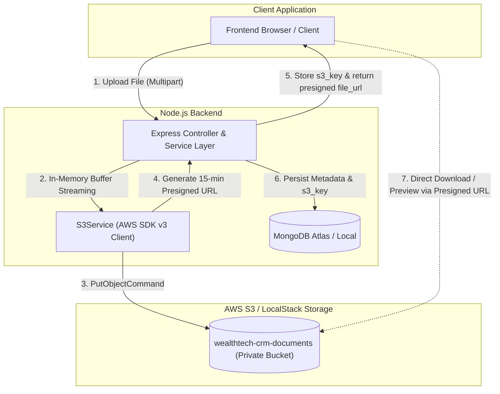

# Node.js Backend

## Architecture

### Client

In wealth management, the client lifecycle revolves around compliance (KYC) and relationship ownership (RM):

```
┌────────────────┐         KYC Verified           ┌──────────────┐
│   ONBOARDING   │ ─────────────────────────────▶ │    ACTIVE    │
└────────────────┘                                └──────────────┘
        │                                                 │
        │                   Manual Hold                   │
        └───────────────────────────────────────────────▶ │   INACTIVE   │
                                                          └──────────────┘
```

#### Key Business & System Design Rules in `clientService`:

1. **The KYC Approval Trigger**: When compliance verifies a client (`verifyKyc(clientId, KycStatus.VERIFIED)`), the service automatically promotes the client from `ONBOARDING` to `ACTIVE`.
2. **Automatic RM Fallback**: When a client is onboarded without explicitly choosing an RM, the service automatically assigns the currently logged-in employee (`currentUserId`) as the Relationship Manager.
3. **Duplicate Prevention**: Before creating a client, check uniqueness on email, phone, and PAN (logging a warning before throwing `AppError(..., 409)`).
4. **Two-Collection Mapping**: `mapToClientResponse` merges `Client` with `ClientProfile.kycStatus` and resolves `relationshipManager` into a `{ display_name, value }` `DropdownOption<string>`.
5. **Background Batch Ingestion (`processBulkUploadAsync`)**: Processes parsed Excel rows in the background, quietly skipping duplicates (email/phone/PAN) and logging batch summary metrics without blocking the HTTP response.

### Error Handling Pipeline

```
Service / Controller
  │
  ├─► throws new AppError("Client not found", 404)
  │
  ▼
asyncHandler (Promise.resolve(...).catch(next))
  │
  ├─► routes error to Express error chain via next(err)
  │
  ▼
errorHandler (Express 4-arg middleware)
  │
  ├─► Recognizes err instanceof AppError
  ├─► Extracts err.statusCode (404) and err.message
  ├─► Logs structured client warning: logger.warn(...)
  │
  ▼
HTTP JSON Response (res.status(statusCode).json(...))
```

1. **Throw (`AppError`)**: When a business rule fails, the service throws an `AppError` carrying a clear message and HTTP status code (e.g., 404).
2. **Catch (`asyncHandler`)**: Intercepts rejected promises from async controller methods and cleanly forwards them to Express via `next(err)`, avoiding unhandled crashes.
3. **Handle (`errorHandler`)**: The global error middleware recognizes `AppError`, logs a structured warning, and extracts the status code and message.
4. **Respond**: Formats and returns a uniform JSON response (`{ status: "fail", message }`) with the appropriate HTTP status code.

### AWS S3 Cloud Object Storage & Pre-Signed URL Architecture



#### 1. Admin Role & Master Fund Governance Bootstrap
- **Permissions Catalogue**: Idempotently seeds `eligiblefund:read`, `eligiblefund:create`, `eligiblefund:update`, `eligiblefund:delete`, and `eligiblefund:upload` permissions on startup.
- **Admin Seeder (`adminSeeder.ts`)**: Provisions the `Administration` Group, the `ADMIN` Role bound to all platform permissions, and bootstraps the default administrator account (`admin@wealthtech.com` / `Admin@123`).
- **Master Funds Ingestion (`eligibleFundExcelService.ts`)**:
  - `POST /nodejs-wtc-api/v1/eligible-funds/upload` (or `/admin/master-funds/upload`): Restricted to `eligiblefund:upload` (or `ADMIN`).
  - Archives raw spreadsheets to `master-funds/<timestamp>_<filename>` in S3.
  - Dynamically detects column headers, normalizes score categories across all 5 risk bands, and executes an **ISIN-based upsert** into MongoDB `EligibleFund`.
  - Preserves existing MongoDB `_id`s so historical portfolio recommendations referencing these funds remain intact.
  - Returns a summary of records processed, inserted, updated, and an S3 pre-signed URL.

#### 2. In-Memory Streaming & Zero Local Disk Footprint
- **Production Rationale**: In modern cloud deployments (Docker, ECS, Kubernetes), local container storage is ephemeral and is wiped on pod restarts or scaled instances. Writing files to local disk creates memory/disk leaks and broken file paths across distributed replicas.
- **Implementation**:
  - **Proposal PDFs (`portfolioPdfService.ts`)**: PDF generation runs completely in-memory using `PDFKit` event chunks (`Buffer.concat`). The compiled binary is uploaded directly to S3 (`recommendations/<id>/proposal_<timestamp>.pdf`), and zero files are written to container disk.
  - **Spreadsheet Templates**: Templates (`clients_bulk_template.xlsx` and `master_funds_template.xlsx`) are generated in-memory and synced to S3 under `templates/`. Endpoints support both binary attachment streaming and pre-signed URL retrieval (`?format=url`).

#### 3. Client Bulk Ingestion & eCAS Statements
- **Bulk Client Upload (`POST /clients/bulk-upload`)**: Persists raw uploaded spreadsheets to `client-uploads/<timestamp>_<filename>` in S3, returns a pre-signed download URL with `s3_key`, and initiates non-blocking background database ingestion.
- **eCAS Statement Storage (`POST /portfolio-reviews/ecas/upload`)**: Uploads electronic CAS statements directly to `ecas/<clientId>/<timestamp>_<filename>` in S3, binds the S3 key to `PortfolioReview.ecasFileKey`, and returns a pre-signed download URL.
- **eCAS URL Retrieval (`GET /portfolio-reviews/:id/ecas-url`)**: Generates fresh time-limited pre-signed download URLs on-demand for existing review records.

#### 4. Pre-Signed URL Security & Real-Time Auto-Refresh Pattern
- **Why Pre-Signed URLs**:
  - **100% Private S3 Buckets**: Public access is completely blocked. S3 objects can only be accessed using a cryptographic HMAC-SHA256 signature generated by the backend with temporary validity (15 minutes / 900 seconds).
  - **Zero Backend Bandwidth Bottleneck**: Frontends stream heavy PDF proposals and multi-megabyte statement files directly from S3/LocalStack, preventing Node.js event loop starvation.
- **Dynamic Auto-Refresh**: Storing static pre-signed URLs in the database leads to expiration after 15 minutes. To ensure clients never receive stale links, `mapToRecommendationResponse` and `mapToReviewResponse` inspect `documentS3Key` and `ecasFileKey` to dynamically generate a fresh pre-signed URL whenever a recommendation or review is retrieved via API.

---

## Decisions and Trade-Offs: 

### camelCase (Code) vs. snake_case (Wire API)

1. We use **Mongoose `toJSON`** as a mandatory data-sanitization layer to strip passwords and map `_id` to `id` on database documents (which middleware cannot safely know how to do).
2. We chose the **centralized response interceptor middleware** for global wire formatting because it automatically transforms all responses (including pagination envelopes) to snake_case without the maintenance fatigue of **40+ manual DTOs**, the decorator/reflection overhead of **`class-transformer`**, or the outbound redundancy of **Zod**.

### Slim vs. Fat JWT (Stateful DB Verification vs. Stateless Claims)

1. We use a **Slim JWT** containing only the user's `email` as the subject, keeping tokens minimal and matching the Spring Boot backend (`JwtTokenProvider.java`).
2. We rejected a **Fat JWT** (embedding permissions) because if an admin revokes access, a fat JWT still allows the user to access the application with old permissions for 15 minutes until the token expires.

### Controller vs. Service Layer Separation

1. Extracted database queries and business rules into dedicated services, keeping controllers strictly as thin HTTP transport adapters.
2. Decouples domain logic from Express `req`/`res`, enabling isolated unit testing and multi-transport reusability without HTTP mocking overhead.

### Why Customer has a DTO layer while User Manager doesn't

1. **User Manager**: User data lives in a single database table, and the API returns that record directly with passwords automatically hidden without needing separate DTOs.
2. **Customer**: Customer data is split across two tables (`Client` and `ClientProfile`), so DTOs are used to merge them (e.g. `ClientResponseDto` pulls personal details from `Client` and `kyc_status` from `ClientProfile` into one response for the table view).

---

## Libraries & Ecosystem Choices

| Library | Version | Core Use Case in this Application |
|---|---|---|
| **`@aws-sdk/client-s3` & `@aws-sdk/s3-request-presigner`** | `^3.1131.0` | **AWS S3 / LocalStack Cloud Object Storage (`s3Service.ts`)**: Manages in-memory file uploads and time-limited (15-min) cryptographic pre-signed URLs for master funds, prospect spreadsheets, eCAS statements, and recommendation PDFs. Configured with path-style access (`forcePathStyle: true`) and endpoint override for LocalStack parity. |
| **`pdfkit`** | `^0.15.0` | **In-Memory Client Proposal PDF Generation (`portfolioPdfService.ts`)**: Programmatically compiles vector-drawn, branded A4 investment recommendation proposals entirely in-memory (`Buffer.concat`) and streams directly to AWS S3 with zero local disk footprint. Renders metadata callout boxes, multi-column fund allocation tables with Indian currency formatting (`INR`), and mandatory SEBI regulatory risk disclaimers. |
| **`exceljs`** | `^4.4.0` | **Bulk Client Onboarding & Template Generation (`clientExcelService.ts`, `eligibleFundExcelService.ts`)**: Generates pre-formatted, styled `.xlsx` download templates with locked headers, custom widths, and cell formats. Ingests and parses multi-row spreadsheets from memory buffers with strict zero-`any` type narrowing, safe Date parsing, dynamic column detection, and batch ingestion resilience. |
| **`pino` & `pino-http`** | `^10.3.1` | **High-Throughput Structured JSON Logging (`logger.ts`)**: Fast, low-overhead logging engine enforcing the application-wide *logger-before-error* protocol. Enriches logs with HTTP request metadata (method, route, IP, user ID) and segregates operational warnings (`logger.warn`) from unhandled server exceptions (`logger.error`). |
| **`multer`** | `^1.4.5-lts.1` | **In-Memory File Upload Streaming (`clientRoutes.ts`, `portfolioRoutes.ts`)**: Multipart/form-data middleware configured with `memoryStorage()` (10MB/15MB payload constraints). Feeds uploaded Excel sheets and eCAS statements directly into RAM buffers for S3 streaming without creating temporary files on disk. |
| **`jsonwebtoken` & `bcryptjs`** | `^9.0.2` / `^2.4.3` | **Authentication & Password Security (`jwt.ts`, `authController.ts`)**: Manages one-way salted hashing for employee passwords and signs minimalist "Slim" JWTs (containing only email) to enforce real-time, stateful database permission checks on every protected request. |
| **`mongoose`** | `^8.3.4` | **Document Modeling & Subdocument Embedding**: Manages schema validation, compound indexing, and lifecycle timestamps. Leveraged for embedded document modeling (`PortfolioReview.entries`, `PortfolioRecommendation.funds`, `RiskAssessment.answers`) to enable atomic updates and eliminate SQL join overhead. Global `toJSON` hooks ensure automatic data sanitization (`_id` to `id`, password suppression). |
