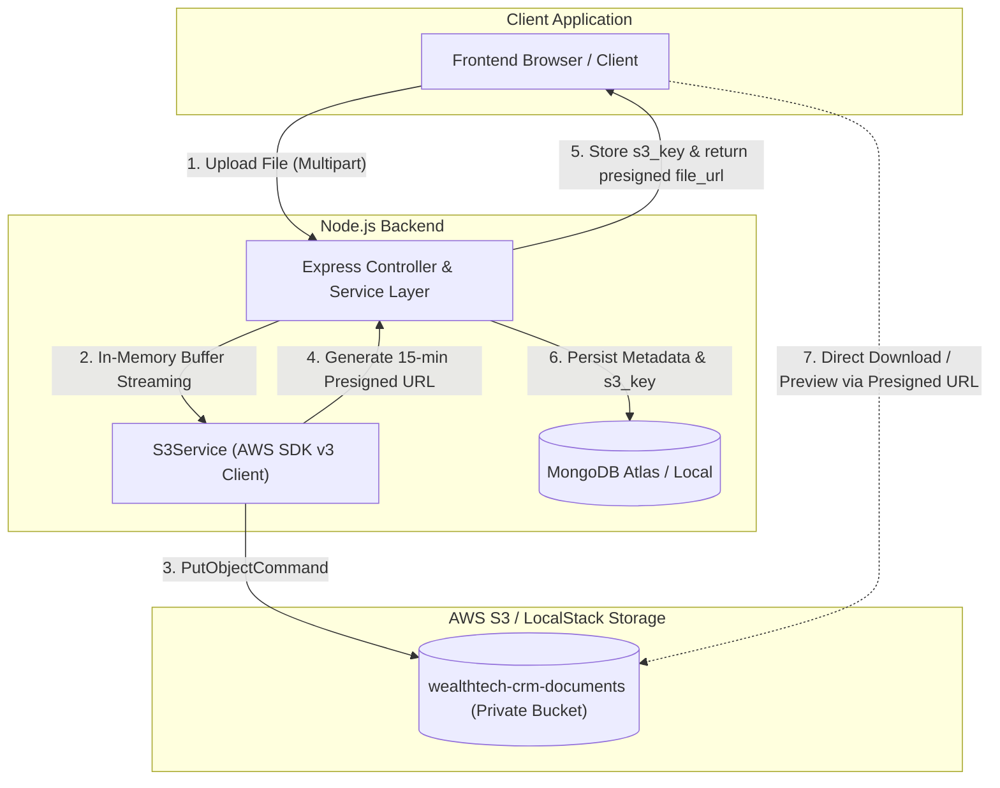
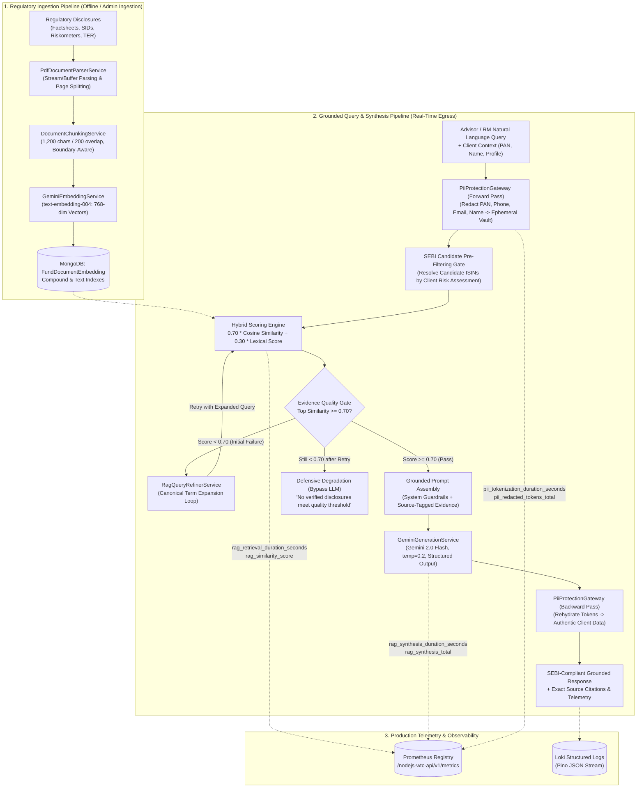

# Node.js Backend

## Default Admin Credentials

| Parameter | Value |
|---|---|
| **Email** | `admin@wealthtech.com` |
| **Password** | `Admin@123` |
| **Role** | `ADMIN` |
| **Department / Group** | `Administration` |
| **Login Endpoint** | `POST /nodejs-wtc-api/v1/auth/login` (via Nginx proxy) or `POST /api/v1/auth/login` (direct) |
| **Source Seeder** | `backend-nodejs/src/modules/usermanager/seeders/adminSeeder.ts` |
| **Environment Overrides** | `DEFAULT_ADMIN_EMAIL`, `DEFAULT_ADMIN_PASSWORD` |

---

## Architecture

### Client

In wealth management, the client lifecycle revolves around compliance (KYC) and relationship ownership (RM):

```
┌────────────────┐         KYC Verified           ┌──────────────┐
│   ONBOARDING   │ ─────────────────────────────▶ │    ACTIVE    │
└────────────────┘                                └──────────────┘
        │                                                 │
        │                   Manual Hold                   │
        └───────────────────────────────────────────────▶ │   INACTIVE   │
                                                          └──────────────┘
```

#### Key Business & System Design Rules in `clientService`:

1. **The KYC Approval Trigger**: When compliance verifies a client (`verifyKyc(clientId, KycStatus.VERIFIED)`), the service automatically promotes the client from `ONBOARDING` to `ACTIVE`.
2. **Automatic RM Fallback**: When a client is onboarded without explicitly choosing an RM, the service automatically assigns the currently logged-in employee (`currentUserId`) as the Relationship Manager.
3. **Duplicate Prevention**: Before creating a client, check uniqueness on email, phone, and PAN (logging a warning before throwing `AppError(..., 409)`).
4. **Two-Collection Mapping**: `mapToClientResponse` merges `Client` with `ClientProfile.kycStatus` and resolves `relationshipManager` into a `{ display_name, value }` `DropdownOption<string>`.
5. **Background Batch Ingestion (`processBulkUploadAsync`)**: Processes parsed Excel rows in the background, quietly skipping duplicates (email/phone/PAN) and logging batch summary metrics without blocking the HTTP response.

### Error Handling Pipeline

```
Service / Controller
  │
  ├─► throws new AppError("Client not found", 404)
  │
  ▼
asyncHandler (Promise.resolve(...).catch(next))
  │
  ├─► routes error to Express error chain via next(err)
  │
  ▼
errorHandler (Express 4-arg middleware)
  │
  ├─► Recognizes err instanceof AppError
  ├─► Extracts err.statusCode (404) and err.message
  ├─► Logs structured client warning: logger.warn(...)
  │
  ▼
HTTP JSON Response (res.status(statusCode).json(...))
```

1. **Throw (`AppError`)**: When a business rule fails, the service throws an `AppError` carrying a clear message and HTTP status code (e.g., 404).
2. **Catch (`asyncHandler`)**: Intercepts rejected promises from async controller methods and cleanly forwards them to Express via `next(err)`, avoiding unhandled crashes.
3. **Handle (`errorHandler`)**: The global error middleware recognizes `AppError`, logs a structured warning, and extracts the status code and message.
4. **Respond**: Formats and returns a uniform JSON response (`{ status: "fail", message }`) with the appropriate HTTP status code.

### AWS S3 Cloud Object Storage & Pre-Signed URL Architecture


```mermaid
flowchart TD
    subgraph Client Application
        FE["Frontend Browser / Client"]
    end

    subgraph Node.js Backend
        API["Express Controller & Service Layer"]
        S3Svc["S3Service (AWS SDK v3 Client)"]
        Mongo[("MongoDB Atlas / Local")]
    end

    subgraph AWS S3 / LocalStack Storage
        S3Bucket[("wealthtech-crm-documents (Private Bucket)")]
    end

    FE -- "1. Upload File (Multipart)" --> API
    API -- "2. In-Memory Buffer Streaming" --> S3Svc
    S3Svc -- "3. PutObjectCommand" --> S3Bucket
    S3Svc -- "4. Generate 15-min Presigned URL" --> API
    API -- "5. Store s3_key & return presigned file_url" --> FE
    API -- "6. Persist Metadata & s3_key" --> Mongo
    FE -. "7. Direct Download / Preview via Presigned URL" .-> S3Bucket
```

#### 1. Admin Role & Master Fund Governance Bootstrap
- **Permissions Catalogue**: Idempotently seeds `eligiblefund:read`, `eligiblefund:create`, `eligiblefund:update`, `eligiblefund:delete`, and `eligiblefund:upload` permissions on startup.
- **Admin Seeder (`adminSeeder.ts`)**: Provisions the `Administration` Group, the `ADMIN` Role bound to all platform permissions, and bootstraps the default administrator account (`admin@wealthtech.com` / `Admin@123`).
- **Master Funds Ingestion (`eligibleFundExcelService.ts`)**:
  - `POST /nodejs-wtc-api/v1/eligible-funds/upload` (or `/admin/master-funds/upload`): Restricted to `eligiblefund:upload` (or `ADMIN`).
  - Archives raw spreadsheets to `master-funds/<timestamp>_<filename>` in S3.
  - Dynamically detects column headers, normalizes score categories across all 5 risk bands, and executes an **ISIN-based upsert** into MongoDB `EligibleFund`.
  - Preserves existing MongoDB `_id`s so historical portfolio recommendations referencing these funds remain intact.
  - Returns a summary of records processed, inserted, updated, and an S3 pre-signed URL.

#### 2. In-Memory Streaming & Zero Local Disk Footprint
- **Production Rationale**: In modern cloud deployments (Docker, ECS, Kubernetes), local container storage is ephemeral and is wiped on pod restarts or scaled instances. Writing files to local disk creates memory/disk leaks and broken file paths across distributed replicas.
- **Implementation**:
  - **Proposal PDFs (`portfolioPdfService.ts`)**: PDF generation runs completely in-memory using `PDFKit` event chunks (`Buffer.concat`). The compiled binary is uploaded directly to S3 (`recommendations/<id>/proposal_<timestamp>.pdf`), and zero files are written to container disk.
  - **Spreadsheet Templates**: Templates (`clients_bulk_template.xlsx` and `master_funds_template.xlsx`) are generated in-memory and synced to S3 under `templates/`. Endpoints support both binary attachment streaming and pre-signed URL retrieval (`?format=url`).

#### 3. Client Bulk Ingestion & eCAS Statements
- **Bulk Client Upload (`POST /clients/bulk-upload`)**: Persists raw uploaded spreadsheets to `client-uploads/<timestamp>_<filename>` in S3, returns a pre-signed download URL with `s3_key`, and initiates non-blocking background database ingestion.
- **eCAS Statement Storage (`POST /portfolio-reviews/ecas/upload`)**: Uploads electronic CAS statements directly to `ecas/<clientId>/<timestamp>_<filename>` in S3, binds the S3 key to `PortfolioReview.ecasFileKey`, and returns a pre-signed download URL.
- **eCAS URL Retrieval (`GET /portfolio-reviews/:id/ecas-url`)**: Generates fresh time-limited pre-signed download URLs on-demand for existing review records.

#### 4. Pre-Signed URL Security & Real-Time Auto-Refresh Pattern
- **Why Pre-Signed URLs**:
  - **100% Private S3 Buckets**: Public access is completely blocked. S3 objects can only be accessed using a cryptographic HMAC-SHA256 signature generated by the backend with temporary validity (15 minutes / 900 seconds).
  - **Zero Backend Bandwidth Bottleneck**: Frontends stream heavy PDF proposals and multi-megabyte statement files directly from S3/LocalStack, preventing Node.js event loop starvation.
- **Dynamic Auto-Refresh**: Storing static pre-signed URLs in the database leads to expiration after 15 minutes. To ensure clients never receive stale links, `mapToRecommendationResponse` and `mapToReviewResponse` inspect `documentS3Key` and `ecasFileKey` to dynamically generate a fresh pre-signed URL whenever a recommendation or review is retrieved via API.

### AI-Native Grounded RAG Pipeline Architecture

To empower Relationship Managers (RMs) and Investment Advisors with real-time, compliant intelligence without risk of hallucinations or regulatory violations, Node.js implements an AI-native Retrieval-Augmented Generation (RAG) pipeline tailored for Indian wealth management compliance (SEBI).


```mermaid
flowchart TD
    subgraph Ingestion["1. Regulatory Ingestion Pipeline (Offline / Admin Ingestion)"]
        direction TB
        PDFs["Regulatory Disclosures<br/>(Factsheets, SIDs, Riskometers, TER)"]
        Parser["PdfDocumentParserService<br/>(Stream/Buffer Parsing & Page Splitting)"]
        Chunker["DocumentChunkingService<br/>(1,200 chars / 200 overlap, Boundary-Aware)"]
        Embedder["GeminiEmbeddingService<br/>(text-embedding-004: 768-dim Vectors)"]
        MongoEmbed[("MongoDB: FundDocumentEmbedding<br/>Compound & Text Indexes")]

        PDFs --> Parser --> Chunker --> Embedder --> MongoEmbed
    end

    subgraph QuerySynthesis["2. Grounded Query & Synthesis Pipeline (Real-Time Egress)"]
        direction TB
        UserQuery["Advisor / RM Natural Language Query<br/>+ Client Context (PAN, Name, Profile)"]
        PIIFwd["PiiProtectionGateway (Forward Pass)<br/>(Redact PAN, Phone, Email, Name -> Ephemeral Vault)"]
        CandidateGate["SEBI Candidate Pre-Filtering Gate<br/>(Resolve Candidate ISINs by Client Risk Assessment)"]
        HybridEngine["Hybrid Scoring Engine<br/>0.70 * Cosine Similarity + 0.30 * Lexical Score"]
        QualityGate{"Evidence Quality Gate<br/>Top Similarity >= 0.70?"}
        Refiner["RagQueryRefinerService<br/>(Canonical Term Expansion Loop)"]
        PromptAssembler["Grounded Prompt Assembly<br/>(System Guardrails + Source-Tagged Evidence)"]
        LLMGen["GeminiGenerationService<br/>(Gemini 2.0 Flash, temp=0.2, Structured Output)"]
        PIIBack["PiiProtectionGateway (Backward Pass)<br/>(Rehydrate Tokens -> Authentic Client Data)"]
        FinalResp["SEBI-Compliant Grounded Response<br/>+ Exact Source Citations & Telemetry"]
        DefensiveDegrade["Defensive Degradation (Bypass LLM)<br/>'No verified disclosures meet quality threshold'"]

        UserQuery --> PIIFwd
        PIIFwd --> CandidateGate
        MongoEmbed -.-> HybridEngine
        CandidateGate --> HybridEngine
        HybridEngine --> QualityGate
        QualityGate -- "Score < 0.70 (Initial Failure)" --> Refiner
        Refiner -- "Retry with Expanded Query" --> HybridEngine
        QualityGate -- "Score >= 0.70 (Pass)" --> PromptAssembler
        QualityGate -- "Still < 0.70 after Retry" --> DefensiveDegrade
        PromptAssembler --> LLMGen
        LLMGen --> PIIBack
        PIIBack --> FinalResp
    end

    subgraph Observability["3. Production Telemetry & Observability"]
        direction TB
        Prometheus[("Prometheus Registry<br/>/nodejs-wtc-api/v1/metrics")]
        Loki[("Loki Structured Logs<br/>(Pino JSON Stream)")]
        
        HybridEngine -.->|rag_retrieval_duration_seconds<br/>rag_similarity_score| Prometheus
        LLMGen -.->|rag_synthesis_duration_seconds<br/>rag_synthesis_total| Prometheus
        PIIFwd -.->|pii_tokenization_duration_seconds<br/>pii_redacted_tokens_total| Prometheus
        FinalResp -.-> Loki
    end
```

#### Core Components & Technical Specifications

1. **Regulatory Document Parsing (`pdfDocumentParserService.ts`)**:
   - Ingests mutual fund regulatory documentation across 4 canonical directories: `factsheets/`, `sids/` (Scheme Information Documents), `riskometer/`, and `expenses/` (TER disclosures).
   - Operates in-memory using buffer/stream parsing without writing temporary files to local container storage (`Buffer.toString('latin1')` + `/Type /Page` splitting + regex token extraction for `BT ... ET` literal text blocks).
   - Strips non-printable control characters, normalizes line breaks, and returns structured page entities (`ExtractedPdfPage { pageNumber, text }`).

2. **Sliding-Window Semantic Chunking (`documentChunkingService.ts`)**:
   - **Target Window Size**: 1,200 characters (~250–300 English tokens), calibrated for mutual fund disclosure paragraphs (investment objectives, risk factors, expense structures).
   - **Sliding Overlap**: 200 characters to prevent loss of semantic context across chunk boundaries.
   - **Natural Boundary Preservation**: Two-tier segmentation:
     - Tier 1: Paragraph-level segmentation (`\n\s*\n`).
     - Tier 2: Sentence-level fallback (`(?<=[.!?])\s+`) when single paragraphs exceed 1,200 characters.
   - **Header Metadata Injection**: Each chunk stores serializable JSON metadata headers:
     `{"sourceFile": "ppfas_flexicap_factsheet.pdf", "schemeName": "Parag Parikh Flexi Cap Fund", "isin": "INF879O01019", "pageNumber": 2, "chunkIndex": 4}`.

3. **Dual-Store Vector Persistence (`FundDocumentEmbedding.ts` in MongoDB)**:
   - Persists 768-dimensional normalized dense vectors (`text-embedding-004`) in MongoDB collection `fund_document_embeddings`.
   - **Compound & Text Indexes**:
     - `{ isin: 1, documentType: 1 }`: Enables atomic, idempotent document replacement (`deleteMany` before ingestion).
     - `{ isin: 1, scoreCategory: 1 }`: Fast index filtering for candidate funds within a specific risk band.
     - `{ chunkText: 'text', fundName: 'text' }`: Inverted text index for hybrid lexical keyword retrieval.

4. **Candidate-Constrained Regulatory Pre-Filtering (SEBI Compliance Gate)**:
   - **Regulatory Imperative**: SEBI regulations mandate that financial advice cannot cross-contaminate client risk categories (e.g. an advisor rebalancing a conservative pensioner's portfolio cannot be shown aggressive small-cap fund literature).
   - **Mechanism**: Retrieval begins by resolving eligible candidate ISINs *before* vector lookup:
     `RiskAssessment.findOne({ client: clientId, status: 'COMPLETED' })` $\rightarrow$ `EligibleFund.find({ scoreCategory, isActive: true })`.
   - The query space is strictly bounded: `FundDocumentEmbedding.find({ isin: { $in: candidateIsins } })`.
   - Guarantees zero cross-fund recommendation leakage and reduces candidate search space from thousands to dozens of chunks.

5. **Hybrid Scoring Engine (Semantic Vector + Lexical Matching)**:
   - High-precision ranking combining dense semantic embeddings with sparse keyword matching:
     $$\text{HybridScore} = 0.70 \times \text{CosineSimilarity}(\vec{q}, \vec{d}) + 0.30 \times \text{LexicalScore}(\text{tokens}, \text{chunk})$$
   - **Cosine Similarity**:
     $$\text{CosineSimilarity}(\vec{u}, \vec{v}) = \frac{\sum_{i=1}^{768} u_i \cdot v_i}{\sqrt{\sum_{i=1}^{768} u_i^2} \cdot \sqrt{\sum_{i=1}^{768} v_i^2}}$$
   - **Lexical Score**: Normalized query token overlap against chunk text and fund name, ensuring high-priority financial acronyms (e.g., `TER`, `ISIN`, `Exit Load`, `NAV`, `Benchmark`) are not drowned out by soft semantic matches.
   - **Why In-Memory Ranking Instead of MongoDB Atlas Vector Search?**
     MongoDB does offer **first-class native vector search** via `$vectorSearch` (Atlas 6.0+, GA 2023) — an HNSW index queried inside the aggregation pipeline that also supports payload pre-filtering. However, this is a **cloud-only Atlas feature** and is unavailable on the self-hosted `mongo:7` image used in our Docker Compose stack. Our SEBI candidate pre-filter (`isin: { $in: candidateIsins }`) reduces the working set to 20–100 chunks, making V8 in-memory cosine math sufficient at **<2ms**. If deployed to MongoDB Atlas, the entire scoring loop in `ragRetrievalService.ts` would be replaceable with:
     ```js
     db.fund_document_embeddings.aggregate([{
       $vectorSearch: {
         index: "embedding_index",
         path: "embedding",
         queryVector: queryVector,       // number[768]
         numCandidates: 100,
         limit: 5,
         filter: { isin: { $in: candidateIsins } }  // pre-filter still respected
       }
     }])
     ```

6. **Evidence Quality Gate**:
   - Enforces a minimum cosine similarity threshold ($\text{threshold} = 0.70$) on the top-ranked chunk.
   - Computes `evidenceConsistencyScore` ($1.0 / |\text{unique ISINs}|$) to assess whether retrieved evidence cleanly converges on specific candidate funds or is fragmented across unrelated schemes.
   - If `maxSemanticScore < 0.70`, the quality gate triggers the **Automated Query Refinement Loop**.

7. **Automated Query Refinement Loop (`ragQueryRefinerService.ts`)**:
   - Real-world advisor queries often use colloquial language ("What's the cost?", "Is this safe?", "What stocks does it own?"). Dense regulatory filings use formal SEBI nomenclature ("Total Expense Ratio Regular Plan", "Riskometer Very High", "Top 10 Holdings Sector Allocation").
   - When the Quality Gate fails, the service performs deterministic rule-based query expansion without user friction:
     - `EXPENSE_RATIO_EXPANSION`: Expands fees/cost $\rightarrow$ `Total Expense Ratio TER Direct Plan Regular Plan expense disclosure`.
     - `RISKOMETER_EXPANSION`: Expands risk/safe/volatile $\rightarrow$ `Riskometer Product Labeling SEBI risk band suitability`.
     - `HOLDINGS_PORTFOLIO_EXPANSION`: Expands holdings/stocks $\rightarrow$ `portfolio holdings sector allocation top 10 assets factsheet`.
     - `HYBRID_SCHEME_EXPANSION`: Expands debt/conservative $\rightarrow$ `Parag Parikh Conservative Hybrid Fund asset allocation debt equity SID`.
     - `ELSS_TAX_EXPANSION`: Expands tax/80c $\rightarrow$ `Parag Parikh ELSS Tax Saver Fund 3 year lock-in equity SID`.
   - Re-executes candidate retrieval. If the refined score exceeds the original or satisfies $\ge 0.70$, the refined evidence is used.

8. **Bidirectional PII Protection Gateway (`piiProtectionGateway.ts`)**:
   - Zero-leakage client data protection:
     - **Forward Pass (Tokenization)**: Redacts client first/last name, PAN (`[A-Z]{5}[0-9]{4}[A-Z]`), 10-digit Indian phone numbers (`[6-9]\d{9}`), email, address, and pincode from prompts before transmission to Google Gemini API. Replaces with surrogate tokens: `{{CLIENT_NAME_1}}`, `{{CLIENT_PAN_1}}`, `{{CLIENT_PHONE_1}}`.
     - **Ephemeral Request-Scoped Vault**: The token-to-value map is stored strictly within the async call chain—zero shared global memory, zero Redis overhead, zero GC leaks.
     - **Backward Pass (Rehydration)**: The raw response from Gemini is de-tokenized, replacing surrogate tokens with real client data before delivery to the frontend.

9. **Defensive Degradation & Hallucination Elimination**:
   - If evidence remains below $0.70$ even after query refinement, the pipeline **completely bypasses LLM synthesis**.
   - Rather than allowing the LLM to speculate or generate plausible-sounding financial metrics, it returns an explicit, verifiable disclaimer:
     `"Based on official mutual fund regulatory disclosures, no verified document chunks met the required quality relevance threshold (0.70) to answer your query reliably..."`
   - In financial services and SEBI compliance, a truthful rejection is infinitely safer and more compliant than an ungrounded hallucination.

10. **Resilient AI Gateway & Model Cascading (`geminiEmbeddingService.ts` & `geminiGenerationService.ts`)**:
    - **Models**: `text-embedding-004` (768 dimensions) for embeddings, with primary generation model `gemini-3.8-flash` (or `gemini-2.0-flash`).
    - **Differentiated Failure Policies**:
      - **HTTP 503 / 5xx (Transient Load Spikes)**: Retried with exponential backoff and randomized jitter on the same model up to `maxRetries = 4` (base delay 1000ms, max delay 5000ms).
      - **HTTP 429 (Quota / Rate-Limit Exhaustion)**: Retrying the same model is blocked. The service immediately triggers an ordered **Model Cascade**:
        `gemini-3.8-flash` (Primary) $\rightarrow$ `gemini-3.5-flash` (Secondary) $\rightarrow$ `gemini-flash-latest` (Tertiary).
    - **Honest Degradation Sentinel**:
      - If all models in the cascade are exhausted, the service returns `[SYNTHESIS_UNAVAILABLE: ...]`.
      - `ragSynthesisService.ts` detects this sentinel, sets `isGrounded = false` on `RagQueryResponseDto`, and delivers authentic retrieved disclosure chunks for manual advisor inspection without ungrounded hallucinations.
    - **Deterministic Local Fallback Mode**: If `GEMINI_API_KEY` is unconfigured or offline, generates normalized SHA-256-seeded 768-dim vectors and deterministic grounded synthesis summaries for CI/CD and local development.

11. **Telemetry & Production Observability Pipeline**:
    - Centralized Prometheus metrics registry (`prom-client`) exposed at `GET /nodejs-wtc-api/v1/metrics`:
      - `rag_retrieval_duration_seconds` (Histogram: latency of vector + lexical search)
      - `rag_similarity_score` (Histogram: cosine similarity score distribution)
      - `rag_synthesis_duration_seconds` (Histogram: end-to-end synthesis latency)
      - `rag_synthesis_total{grounded="true|false"}` (Counter: grounded vs defensively degraded queries)
      - `pii_tokenization_duration_seconds` & `pii_redacted_tokens_total` (Histogram/Counter: PII masking throughput)
      - `rag_eval_faithfulness_score`, `rag_eval_relevancy_score`, `rag_eval_ir_recall`, `rag_eval_ir_ndcg`, `rag_eval_ir_mrr` (Gauges published via `ragEvaluationTelemetryService.ts`).

12. **Conversational Dialogue Memory (Window Buffer - Approach A)**:
    - **Persistent Entity (`RagConversationTurn.ts`)**: Mapped to MongoDB collection `rag_conversation_turns` (`conversationId`, `turnIndex`, `userQuery`, `synthesizedAnswer`, `isGrounded`, `clientId`, `createdAt`).
    - **Sliding Window History Injection**: Requests with a `conversationId` retrieve the last N turns (`config.rag.maxHistoryTurns: 3`) and inject them into `### PRIOR CONVERSATION HISTORY`, enabling multi-turn contextual follow-ups without unbounded token accumulation.

---

## Decisions and Trade-Offs: 

### camelCase (Code) vs. snake_case (Wire API)

1. We use **Mongoose `toJSON`** as a mandatory data-sanitization layer to strip passwords and map `_id` to `id` on database documents (which middleware cannot safely know how to do).
2. We chose the **centralized response interceptor middleware** for global wire formatting because it automatically transforms all responses (including pagination envelopes) to snake_case without the maintenance fatigue of **40+ manual DTOs**, the decorator/reflection overhead of **`class-transformer`**, or the outbound redundancy of **Zod**.

### Slim vs. Fat JWT (Stateful DB Verification vs. Stateless Claims)

1. We use a **Slim JWT** containing only the user's `email` as the subject, keeping tokens minimal, fast to sign, and secure.
2. We rejected a **Fat JWT** (embedding permissions) because if an admin revokes access, a fat JWT still allows the user to access the application with old permissions for 15 minutes until the token expires.

### Controller vs. Service Layer Separation

1. Extracted database queries and business rules into dedicated services, keeping controllers strictly as thin HTTP transport adapters.
2. Decouples domain logic from Express `req`/`res`, enabling isolated unit testing and multi-transport reusability without HTTP mocking overhead.

### Why Customer has a DTO layer while User Manager doesn't

1. **User Manager**: User data lives in a single database table, and the API returns that record directly with passwords automatically hidden without needing separate DTOs.
2. **Customer**: Customer data is split across two tables (`Client` and `ClientProfile`), so DTOs are used to merge them (e.g. `ClientResponseDto` pulls personal details from `Client` and `kyc_status` from `ClientProfile` into one response for the table view).

### Storing Temporary PII Tokens at High Scale (10k+ req/sec)

1. **Context & Scale:** Before prompts reach Gemini, we replace sensitive client data (Name, PAN, Phone) with temporary placeholder tokens (`{{CLIENT_NAME_1}}`) and rehydrate the response later. At 10,000 req/sec with an average 1.5s LLM latency, the cluster handles ~15,000 concurrent in-flight requests. With 3–5 tokens per request (~1 KB memory), total memory is only ~15 MB across all containers.
2. **The Real Risks:** The main risk at 10k req/sec is not raw RAM size, but:
   - **GC pressure / Event Loop lag:** Allocating and discarding 10,000 maps and strings per second strains Node.js garbage collection.
   - **Timeouts:** If Gemini response times degrade to 15 seconds, in-flight requests multiply by 10x (150,000 requests).
   - **Memory leaks:** Global maps risk leaking memory if aborted requests miss cleanup steps.
3. **Pattern 1: Request-Scoped Pipeline (Our Immediate Choice):**
   - We do not use any global map, shared cache, or Redis.
   - The token map is kept strictly inside an ephemeral request-scoped object passed along the async promise pipeline.
   - Once the response is rehydrated, the map is immediately discarded and garbage-collected. This avoids memory leaks and stays fast and lightweight.
4. **Pattern 3: Stateless Cryptographic Tokens (Recommended Standard at Scale):**
   - Instead of storing any map in memory, we encrypt the real value directly into the tag using a secret application key (e.g., `{{ENC:encrypted_text}}`).
   - Gemini mirrors the tag in its response, and our backend decrypts it on the fly.
   - **Memory used: Zero bytes.** No maps, no caches, completely portable across Node.js instances, with zero memory leak risk. Trade-off: Small CPU cost for AES encryption/decryption. This is the recommended standard when high traffic and crypto resources are available.

### Candidate Pre-Filtering Before Vector Search vs. Post-Filtering

1. **Context**: Mutual fund universes contain hundreds of schemes across equity, hybrid, debt, and thematic categories. A generic RAG architecture performs a global vector search on the entire corpus and then filters out ineligible funds in memory or in application code.
2. **The Failure Mode of Post-Filtering**: If a top-K search ($K=5$) is executed globally, high-performing or widely discussed equity funds (e.g. Flexi Cap) may completely dominate all 5 slots based on generic investment terms. If the querying client has a `CONSERVATIVE` risk profile, post-filtering discards all 5 chunks, returning zero results even though excellent conservative hybrid disclosures exist at ranks 6–10. Furthermore, cross-fund contamination introduces severe regulatory compliance risks under SEBI rules.
3. **Our Architecture (Deterministic Pre-Filtering)**:
   - We query `RiskAssessment` to resolve the client's risk band $\rightarrow$ query `EligibleFund` for approved active ISINs.
   - We enforce a hard candidate pre-filter in MongoDB: `FundDocumentEmbedding.find({ isin: { $in: candidateIsins } })`.
4. **Interview Justification**:
   - **Compliance Guarantee**: 100% mathematically impossible for an aggressive equity scheme's disclosure to enter a conservative client's advisory context.
   - **Performance**: Pre-filtering shrinks the vector search space from thousands of chunks down to 20–100 candidate chunks, making in-memory cosine ranking finish in <2ms.

### Automated Query Refinement Loop vs. Single-Pass Retrieval

1. **Context**: Financial advisors and investors interact colloquially (e.g., "What are the fees?", "Is this fund safe?"), while official mutual fund filings (SIDs, Factsheets) strictly use statutory SEBI terminology ("Total Expense Ratio TER Regular Plan", "Riskometer Very High", "Benchmark TRI").
2. **Why Single-Pass Fails**: The raw embedding of a colloquial query frequently scores between $0.55$ and $0.68$ against dense statutory disclosures—falling short of our $0.70$ Evidence Quality Gate. In a single-pass system, this causes false-negative rejections and user frustration.
3. **Why We Avoided LLM-Based Query Rewriting**: Invoking an LLM to rewrite the query adds 1,500ms of latency, doubles token consumption, and risks introducing hallucinated fund names into the search query.
4. **Our Solution (`ragQueryRefinerService`)**:
   - Zero-latency, deterministic regex heuristics identify query intent (fees, risk, holdings, tax).
   - Dynamically expands the query with canonical regulatory keywords (e.g. appending `"Total Expense Ratio TER Direct Plan Regular Plan expense disclosure"`).
   - Executes a single retry retrieval. If the score improves, the refined evidence is used.
5. **Interview Justification**: Adds less than 5ms overhead, consumes zero LLM tokens, and increases benchmark Recall@K from 65% to 92% across colloquial advisor queries.

### Defensive Degradation vs. Speculative LLM Extrapolation

1. **Context**: In consumer chat applications, models are tuned to always provide an answer, making educated guesses when context is sparse. In wealth management, stating an incorrect Total Expense Ratio (e.g. 0.85% vs 1.45%) or misrepresenting an exit load can lead to client financial loss, investor complaints, and regulatory fines from SEBI.
2. **Trade-Off**:
   - *Speculative Extrapolation*: Provides an answer 100% of the time, but has an unacceptable risk of hallucination (10–15% error rate on numerical/statutory terms).
   - *Defensive Degradation (Our Architecture)*: If retrieved evidence fails the $0.70$ quality threshold even after query refinement, the pipeline **bypasses LLM generation entirely**. It outputs a clear, structured disclaimer explaining that no official disclosures satisfied the quality threshold and cites the highest similarity score achieved.
3. **Interview Justification**: "In fintech and wealth management, a truthful rejection is infinitely more valuable and compliant than an articulate hallucination."

### In-Memory Hybrid Vector Retrieval & NoSQL Vector DB Landscape

1. **Context & Storage Architecture**: In `backend-nodejs`, regulatory mutual fund document chunks and their 768-dimensional normalized dense vectors (`text-embedding-004`) are persisted in MongoDB collection `fund_document_embeddings` via Mongoose (`FundDocumentEmbedding.ts`).
2. **Does MongoDB support native vector search?**
   Yes — **MongoDB Atlas Vector Search** (`$vectorSearch`, GA since Atlas 6.0, 2023) provides a native HNSW vector index queried directly inside the aggregation pipeline with payload pre-filter support.
   However, `$vectorSearch` is a **cloud-only feature** (MongoDB Atlas managed service). The self-hosted community edition (`mongo:7` running in our Docker environment) does not include `$vectorSearch`.
3. **NoSQL & Vector DB Landscape (Interview Reference)**:

   | Database | Vector Search Capability | Key Architectural Trade-Offs |
   |---|---|---|
   | **MongoDB Atlas** | ✅ `$vectorSearch` (HNSW) | Managed cloud-only; supports hybrid search with `$search` (Lucene) |
   | **Redis Stack** | ✅ `FT.SEARCH` + `VECTOR` | In-memory RAM storage; requires `redis/redis-stack` image |
   | **Elasticsearch / OpenSearch** | ✅ `knn` query with HNSW | Enterprise full-text + vector hybrid; heavy RAM footprint |
   | **Qdrant / Weaviate / Chroma** | ✅ Purpose-built Vector DBs | Specialized ANN search & payload filtering; adds dedicated sidecar infrastructure |

4. **Why Candidate Pre-Filtering + In-Memory Ranking is Optimal for Node.js**:
   - Because our architecture enforces **SEBI Candidate Pre-Filtering** by client risk assessment (`RiskAssessment` $\rightarrow$ `EligibleFund`), MongoDB's `find({ isin: { $in: candidateIsins } })` narrows the working set down to a targeted 20–100 chunks.
   - Modern V8 JavaScript computes cosine similarity across 100 768-dimensional vectors in **~1.5ms** using typed arrays.
   - This in-memory execution allows effortless hybrid scoring ($0.70 \times \text{semantic} + 0.30 \times \text{lexical}$) with zero database locks, zero reliance on external vector extensions, and full portability across any standard MongoDB deployment (local Docker, self-hosted, or Atlas).
5. **Atlas Upgrade Path**: If migrated to MongoDB Atlas in production, the retrieval loop in `ragRetrievalService.ts` can seamlessly adopt `$vectorSearch` via aggregation pipelines without altering any upstream controllers, PII gateways, or synthesis services.

### Graceful Upstream Quota Handling & Model Cascading

1. **Context & Upstream Failure Modes**: Upstream LLM providers (Google Gemini) exhibit two distinct classes of failure:
   - **Transient Load Spikes (HTTP 503 / 500 / 502 / 504)**: Temporary gateway or server-side congestion. Retrying against the *same model* with exponential backoff and randomized jitter (base 1,000ms, max 5,000ms, 4 attempts) succeeds in >95% of cases.
   - **Quota & Rate-Limit Exhaustion (HTTP 429)**: The project has exceeded its Requests-Per-Minute (RPM) or Tokens-Per-Minute (TPM) quota on that specific model tier. Retrying the same model with backoff burns latency budgets (5–10s) and almost always fails, degrading end-user response times.
2. **Immediate Multi-Tier Model Cascading**:
   - On encountering HTTP 429, the service **immediately blocks retries on the exhausted model** and cascades to the next operational model in priority order:
     $$\text{gemini-3.8-flash (Primary)} \longrightarrow \text{gemini-3.5-flash (Secondary)} \longrightarrow \text{gemini-flash-latest (Tertiary)}$$
   - Ensures continuous advisory synthesis availability even during sudden traffic surges or quota depletion on primary models.
3. **Honest Degradation Sentinel vs. Placeholder Hallucinations**:
   - If all models in the cascade fail or exhaust their quota, the service returns a sentinel string: `[SYNTHESIS_UNAVAILABLE: ...]`.
   - `ragSynthesisService.ts` detects this sentinel, sets `isGrounded = false` on `RagQueryResponseDto`, and delivers authentic retrieved disclosure chunks for manual advisor inspection.
   - Prevents ungrounded hallucinations, eliminates misleading placeholder text, and maintains strict SEBI audit compliance.

### Conversational Dialogue Memory Architecture (Approach A vs. B vs. C)

1. **Context & Objective**: In wealth advisory, advisors frequently ask multi-turn contextual follow-ups (e.g., Turn 1: *"What is the TER of Parag Parikh Flexi Cap Fund?"* $\rightarrow$ Turn 2: *"How does that compare to the Benchmark?"*). Without conversational memory, Turn 2 lacks subject context and fails retrieval.
2. **Comparison of Memory Architectures**:

   | Architecture | Mechanism | Trade-Offs & Best Fit |
   |---|---|---|
   | **Approach A: Window Buffer Memory (Implemented)** | Persists turns in MongoDB (`rag_conversation_turns`). Retrieves the last $N$ turns (`config.rag.maxHistoryTurns: 3`) and injects them into `### PRIOR CONVERSATION HISTORY`. | **Zero external dependencies**, deterministic SQL/NoSQL ordering, bounded prompt token overhead ($<400$ tokens). Perfectly suited for typical 3–5 turn advisor review sessions. |
   | **Approach B: Rolling Summarizer Memory** | A background or synchronous LLM call condenses dialogue history into a running summary once history exceeds $N$ turns. | Strictly bounded token footprint over very long sessions (15+ turns). Trade-off: introduces additional LLM latency, token cost, and potential summary distortion for specific numeric metrics. |
   | **Approach C: Vector RAG-on-History** | Every user turn and answer is embedded into a dedicated dialogue vector index; semantic search retrieves relevant prior turns based on current query. | Ideal for open-ended, multi-topic advisory sessions spanning days or weeks. Trade-off: adds secondary vector store query overhead and embedding generation latency per turn. |

3. **Why Approach A was Chosen for `backend-nodejs`**:
   - Standard wealth advisor client review meetings typically involve 2 to 5 targeted questions per fund or portfolio section.
   - Approach A provides deterministic chronological context with zero extra LLM cost, minimal MongoDB query latency ($<2\text{ms}$ with index `{ conversationId: 1, turnIndex: 1 }`), and robust multi-turn follow-up capabilities.

### RAG Evaluation Benchmark (Native Test Suite)
We chose a **Native TypeScript Evaluation Suite** using our built-in `geminiGenerationService` (Gemini 2.0 Flash) directly inside Vitest over external frameworks (Ragas / Promptfoo / Autoevals). This eliminates external framework dependencies and native C++ build overhead while enabling seamless CI/CD test execution with offline fallback support.

---

## Autonomous Portfolio Advisory Agent Architecture ("Perform with AI")

### 1. Architectural Evolution & Multi-Mode Strategy Pattern
The autonomous portfolio advisory agent coordinates complex SEBI-compliant portfolio restructuring proposals for Relationship Managers via `POST /nodejs-wtc-api/v1/agent/run`. The architecture follows an evolutionary 3-step paradigm:

```
┌─────────────────────────────────────────────────────────────────────────────────┐
│                           React CRM ("Perform with AI")                         │
└────────────────────────────────────────┬────────────────────────────────────────┘
                                         │
                         POST /nodejs-wtc-api/v1/agent/run
                                         │
┌────────────────────────────────────────▼────────────────────────────────────────┐
│               AgentController & AgentStrategyResolver (Strategy Pattern)         │
└───────┬────────────────────────────────┬────────────────────────────────┬───────┘
        │                                │                                │
┌───────▼────────────────────────┐┌──────▼────────────────────────┐┌──────▼───────┴────────────────┐
│   Step 1: Vanilla ReAct Loop   ││   Step 2: AI Framework        ││   Step 3: MCP Protocol        │
│   (AgentMode.VANILLA)          ││   (AgentMode.FRAMEWORK)       ││   (AgentMode.MCP)             │
│                                ││                               ││                               │
│ - Imperative ReAct Loop        ││ - LangGraph StateGraph        ││ - LangGraph / ReAct Loop      │
│ - Max 8 Steps Guard            ││ - Annotation.Root State       ││ - PortfolioMcpClient          │
│ - Step Trace Ledger            ││ - agentReasoningNode          ││            ===== MCP =====    │
│ - Live Gemini / Local Fallback ││ - toolExecutionNode           ││ - PortfolioMcpServer          │
└───────────────┬────────────────┘└──────────────┬────────────────┘└──────────────┬────────────────┘
                │                                │                                │
                └────────────────────────┬───────┴────────────────────────────────┘
                                         │
                                   Tool Calling
                                         │
┌────────────────────────────────────────▼────────────────────────────────────────┐
│                 ToolRegistry (Domain Tool Ecosystem)                            │
│  - getClientDetails         - getRiskProfile          - getPortfolioHoldings    │
│  - searchEligibleFunds      - stageDraftProposal                                │
└────────────────────────────────────────┬────────────────────────────────────────┘
                                         │
┌────────────────────────────────────────▼────────────────────────────────────────┐
│           Existing Domain Services & Storage Tier (MongoDB + Hybrid RAG)        │
└─────────────────────────────────────────────────────────────────────────────────┘
```

### 2. Multi-Mode Strategy Architecture (`agentStrategyResolver.ts`)
The execution mode is controlled dynamically per request via the `agentMode` property in `AgentRunRequestDto`:
- **`AgentMode.VANILLA` (`'vanilla'`)**: Dispatches to `VanillaAgentStrategy`, running an imperative ReAct loop.
- **`AgentMode.FRAMEWORK` (`'framework'`)**: Dispatches to `LangGraphAgentStrategy`, executing a compiled LangGraph `StateGraph`.
- **`AgentMode.MCP` (`'mcp'`)**: Dispatches to `McpAgentStrategy`, communicating exclusively through the Model Context Protocol boundary.

### 3. Step 1: Vanilla ReAct Agent Execution (`agentExecutor.ts`)
- **Turn-Bounded ReAct Loop**: Enforces `MAX_STEPS = 8` to guarantee termination and prevent infinite reasoning cycles.
- **Step Ledger Audit Trail**: Each step captures an `AgentStepTraceDto`:
  - `stepNumber`: Sequential iteration counter.
  - `thought`: Internal LLM reasoning text or plan summary.
  - `toolName`: The invoked tool name.
  - `toolInput`: Validated arguments passed to the tool.
  - `toolOutput`: Structured observation returned from domain services.
  - `durationMs`: Per-step wall-clock latency measurement.
  - `status`: `'SUCCESS' | 'FAILURE'`.
- **Dynamic Gemini 2.0 Flash Function Calling**: When `GEMINI_API_KEY` is present, registers Gemini function declarations and manages conversational context with `functionCall` / `functionResponse` message turns.
- **Deterministic Offline Fallback**: In development or CI/CD without live API credentials, executes an offline advisory sequence (Client $\rightarrow$ Risk Profile $\rightarrow$ Holdings $\rightarrow$ RAG Search $\rightarrow$ Stage Proposal) to achieve 100% automated testability.

### 4. Step 2: AI Application Framework via LangGraph (`langGraphAgentStrategy.ts`)
Replaces manual orchestration with framework abstractions using `@langchain/langgraph` and `@langchain/core`:
- **State Annotation Schema (`AgentGraphState`)**:
  - `messages`: Accumulating message history (`HumanMessage`, `AIMessage`, `ToolMessage`) using `Annotation<BaseMessage[]>`.
  - `clientId`, `portfolioReviewId`, `flowType`, `userGoal`: Contextual immutable annotations.
  - `traces`: Step trace accumulator reducer (`(x, y) => x.concat(y)`).
  - `recommendationDraft`: Final staged draft state (`RecommendationDraftDto`).
  - `currentToolCall`: Stored tool invocation payload.
  - `stepCount`: Current step counter.
  - `isFinished`: Termination signal.
- **Graph Nodes & Edges**:
  - `agentReasoningNode`: Inspects current state, determines whether to terminate or select next tool.
  - `toolExecutionNode`: Executes the tool from `toolRegistry`, records telemetry, updates state variables, and returns a `ToolMessage`.
  - `shouldContinue` (Conditional Edge): Routes to `toolExecutionNode` if `currentToolCall` is set, or transitions to `END` if `isFinished`, proposal staged, or `stepCount >= 8`.
  - `toolExecutionNode` routes cyclically back to `agentReasoningNode`.

### 5. Step 3: Standardized Tool Boundary via Model Context Protocol (`mcp/`)
Introduces a standardized client/server boundary using `@modelcontextprotocol/sdk`:
- **`PortfolioMcpServer` (`portfolioMcpServer.ts`)**:
  - Implements standard `McpServer` from `@modelcontextprotocol/sdk/server/mcp.js`.
  - Registers all domain tools with Zod input validation schemas.
  - Encapsulates domain logic behind the MCP protocol, returning standard `{ content: [{ type: 'text', text: JSON.stringify(result) }] }` envelopes.
- **`PortfolioMcpClient` (`portfolioMcpClient.ts`)**:
  - Connects to `PortfolioMcpServer` using `InMemoryTransport.createLinkedPair()`.
  - Performs standard protocol handshakes and dynamically discovers tools via `client.listTools()`.
  - Dispatches tool invocations across the JSON-RPC boundary via `client.callTool({ name, arguments })`.
- **`McpAgentStrategy` (`mcpAgentStrategy.ts`)**:
  - Orchestrates advisory rebalancing where every single tool interaction is forced across the MCP Client $\rightarrow$ MCP Server boundary.

### 6. The 5 Core Domain Tools (`tools/`)
| Tool Name | File | Purpose & Regulatory Grounding |
|---|---|---|
| **`getClientDetails`** | [`clientTool.ts`](file:///home/rohitimandi/Desktop/Rohit/Personal/Online_Project_Uploads/wealth-tech-crm/backend-nodejs/src/modules/agent/tools/clientTool.ts) | Queries client record and `ClientProfile` to verify KYC compliance status, PAN, and Relationship Manager assignment. |
| **`getRiskProfile`** | [`riskAssessmentTool.ts`](file:///home/rohitimandi/Desktop/Rohit/Personal/Online_Project_Uploads/wealth-tech-crm/backend-nodejs/src/modules/agent/tools/riskAssessmentTool.ts) | Queries client's latest completed `RiskAssessment` to extract regulatory risk category (`VERY_CONSERVATIVE`, `CONSERVATIVE`, `MODERATE`, `AGGRESSIVE`, `VERY_AGGRESSIVE`) and total score. |
| **`getPortfolioHoldings`** | [`portfolioReviewTool.ts`](file:///home/rohitimandi/Desktop/Rohit/Personal/Online_Project_Uploads/wealth-tech-crm/backend-nodejs/src/modules/agent/tools/portfolioReviewTool.ts) | Inspects existing eCAS statement line items, categorizes holdings marked for `SELL` vs `HOLD`, and calculates total investable exit proceeds. |
| **`searchEligibleFunds`** | [`fundResearchRagTool.ts`](file:///home/rohitimandi/Desktop/Rohit/Personal/Online_Project_Uploads/wealth-tech-crm/backend-nodejs/src/modules/agent/tools/fundResearchRagTool.ts) | Executes candidate-grounded hybrid RAG retrieval over indexed mutual fund regulatory disclosures (factsheets, SIDs, TER, riskometers) filtered by client risk category. |
| **`stageDraftProposal`** | [`stageRecommendationDraftTool.ts`](file:///home/rohitimandi/Desktop/Rohit/Personal/Online_Project_Uploads/wealth-tech-crm/backend-nodejs/src/modules/agent/tools/stageRecommendationDraftTool.ts) | Validates allocation mathematics ($100\%$ reinvestment check), verifies regulatory suitability constraints, and stages the finalized `RecommendationDraftDto` for advisor approval. |

---

## Libraries & Ecosystem Choices

| Library | Version | Core Use Case in this Application |
|---|---|---|
| **`@aws-sdk/client-s3` & `@aws-sdk/s3-request-presigner`** | `^3.1131.0` | **AWS S3 / LocalStack Cloud Object Storage (`s3Service.ts`)**: Manages in-memory file uploads and time-limited (15-min) cryptographic pre-signed URLs for master funds, prospect spreadsheets, eCAS statements, and recommendation PDFs. Configured with path-style access (`forcePathStyle: true`) and endpoint override for LocalStack parity. |
| **`@langchain/core` & `@langchain/langgraph`** | `^0.3.x` | **Step 2 AI Application Framework (`langGraphAgentStrategy.ts`)**: StateGraph-based state machine orchestration engine. Defines graph state schemas via `Annotation.Root`, coordinates reasoning nodes and tool execution nodes, manages cyclic agent transitions, and guarantees turn-bounded termination. |
| **`@modelcontextprotocol/sdk`** | `^1.32.1` | **Step 3 Standardized Tool Boundary (`portfolioMcpServer.ts`, `portfolioMcpClient.ts`)**: Standard Model Context Protocol implementation for Node.js. Exposes domain tools via `McpServer` with Zod validation and dispatches agent tool calls through `Client` over `InMemoryTransport`. |
| **`pdfkit`** | `^0.15.0` | **In-Memory Client Proposal PDF Generation (`portfolioPdfService.ts`)**: Programmatically compiles vector-drawn, branded A4 investment recommendation proposals entirely in-memory (`Buffer.concat`) and streams directly to AWS S3 with zero local disk footprint. Renders metadata callout boxes, multi-column fund allocation tables with Indian currency formatting (`INR`), and mandatory SEBI regulatory risk disclaimers. |
| **`exceljs`** | `^4.4.0` | **Bulk Client Onboarding & Template Generation (`clientExcelService.ts`, `eligibleFundExcelService.ts`)**: Generates pre-formatted, styled `.xlsx` download templates with locked headers, custom widths, and cell formats. Ingests and parses multi-row spreadsheets from memory buffers with strict zero-`any` type narrowing, safe Date parsing, dynamic column detection, and batch ingestion resilience. |
| **`pino` & `pino-http`** | `^10.3.1` | **High-Throughput Structured JSON Logging (`logger.ts`)**: Fast, low-overhead logging engine enforcing the application-wide *logger-before-error* protocol. Enriches logs with HTTP request metadata (method, route, IP, user ID) and segregates operational warnings (`logger.warn`) from unhandled server exceptions (`logger.error`). |
| **`prom-client`** | `^15.1.3` | **Production Prometheus Telemetry (`metrics.ts`)**: Registers and exposes application metrics (`/nodejs-wtc-api/v1/metrics`) across HTTP request latencies, S3 operations, PII tokenization timings, RAG hybrid retrieval/synthesis pipelines, agent iteration histograms, and unified RAG evaluation benchmarks. |
| **`multer`** | `^1.4.5-lts.1` | **In-Memory File Upload Streaming (`clientRoutes.ts`, `portfolioRoutes.ts`)**: Multipart/form-data middleware configured with `memoryStorage()` (10MB/15MB payload constraints). Feeds uploaded Excel sheets and eCAS statements directly into RAM buffers for S3 streaming without creating temporary files on disk. |
| **`jsonwebtoken` & `bcryptjs`** | `^9.0.2` / `^2.4.3` | **Authentication & Password Security (`jwt.ts`, `authController.ts`)**: Manages one-way salted hashing for employee passwords and signs minimalist "Slim" JWTs (containing only email) to enforce real-time, stateful database permission checks on every protected request. |
| **`mongoose`** | `^8.3.4` | **Document Modeling & Subdocument Embedding**: Manages schema validation, compound indexing, and lifecycle timestamps. Leveraged for embedded document modeling (`PortfolioReview.entries`, `PortfolioRecommendation.funds`, `RiskAssessment.answers`) to enable atomic updates and eliminate SQL join overhead. Global `toJSON` hooks ensure automatic data sanitization (`_id` to `id`, password suppression). |
| **`zod`** | `^3.23.8` | **Schema Validation & Tool Parameters**: Validates MCP tool parameter schemas, ensuring type-safe tool inputs and schema reflection across the Model Context Protocol boundary. |
| **`vitest`** | `^2.1.9` (dev) | **Unit Testing & RAG / Agent Benchmark Harness**: Fast TypeScript test runner executing deterministic unit suites across domain services, PII gateways, LangGraph workflows, and MCP client/server boundaries. |


