# System Architecture & UML Diagrams

---

## Java UML Diagrams

### 1. High-Level Component & Layered Architecture

> [!TIP]
> **How to view these diagrams comfortably:**
> - **In-Editor / Browser**: Use browser zoom (`Ctrl` + `+` / `Cmd` + `+`).
> - **Mermaid Live Editor**: Copy any ````mermaid` block into [mermaid.live](https://mermaid.live) for interactive panning, infinite zoom, and high-resolution SVG/PNG exports.
> - **Modular Breakdowns**: Section 1 is broken down below into a **Macro 5-Tier Overview** followed by **3 focused Subsystem Diagrams** (Security Pipeline, Web & Domain Services, and Data Storage) rendered at large, easily readable font sizes.

#### 1.1 Macro Layered Architecture (Overview)
A high-level view of the 5 primary architectural tiers in `backend-java`:

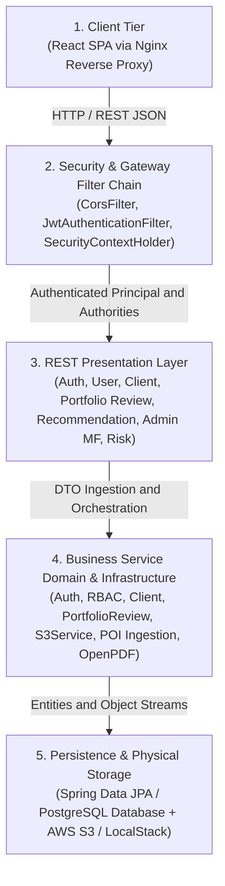
```mermaid
flowchart TD
    Client["1. Client Tier<br/>(React SPA via Nginx Reverse Proxy)"]
    Sec["2. Security & Gateway Filter Chain<br/>(CorsFilter, JwtAuthenticationFilter, SecurityContextHolder)"]
    Web["3. REST Presentation Layer<br/>(Auth, User, Client, Portfolio Review, Recommendation, Admin MF, Risk)"]
    Service["4. Business Service Domain & Infrastructure<br/>(Auth, RBAC, Client, PortfolioReview, S3Service, POI Ingestion, OpenPDF)"]
    Storage["5. Persistence & Physical Storage<br/>(Spring Data JPA / PostgreSQL Database + AWS S3 / LocalStack)"]

    Client -->|"HTTP / REST JSON"| Sec
    Sec -->|"Authenticated Principal and Authorities"| Web
    Web -->|"DTO Ingestion and Orchestration"| Service
    Service -->|"Entities and Object Streams"| Storage
```

#### 1.2 Subsystem A: Security & Authentication Request Pipeline
Illustrates request ingress from the browser through Nginx, CORS, JWT extraction, user detail loading, and authorization context setup.

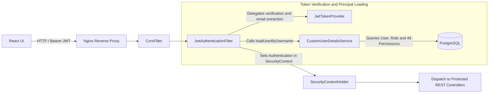
```mermaid
flowchart LR
    Client["React UI"] -->|"HTTP / Bearer JWT"| Nginx["Nginx Reverse Proxy"]
    Nginx --> Cors["CorsFilter"]
    Cors --> JwtFilter["JwtAuthenticationFilter"]
    
    subgraph TokenAuth["Token Verification and Principal Loading"]
        JwtFilter -->|"Delegates verification and email extraction"| Provider["JwtTokenProvider"]
        JwtFilter -->|"Calls loadUserByUsername"| UDS["CustomUserDetailsService"]
        UDS -->|"Queries User, Role and 49 Permissions"| DB[("PostgreSQL")]
    end
    
    JwtFilter -->|"Sets Authentication in SecurityContext"| SecContext["SecurityContextHolder"]
    SecContext --> Dispatch["Dispatch to Protected REST Controllers"]
```

#### 1.3 Subsystem B: Presentation Controllers & Service Domain Mapping
Maps each REST controller to its backing domain services and specialized infrastructure workers.

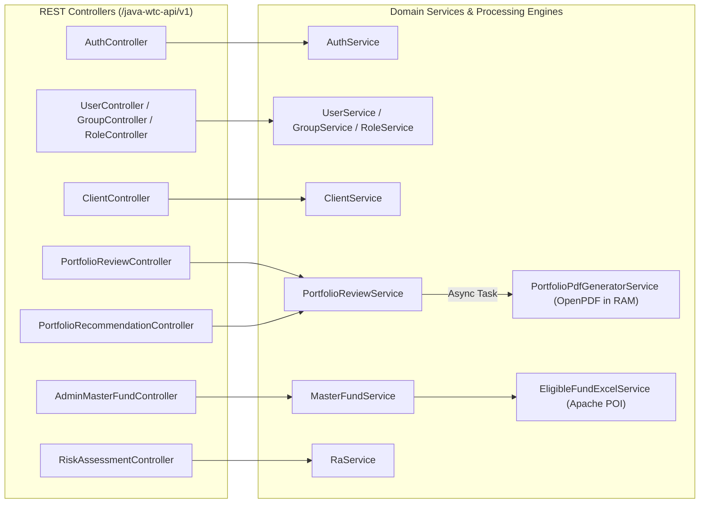
```mermaid
flowchart LR
    subgraph Controllers["REST Controllers (/java-wtc-api/v1)"]
        AC["AuthController"]
        UC["UserController / GroupController / RoleController"]
        CC["ClientController"]
        PRC["PortfolioReviewController"]
        REC["PortfolioRecommendationController"]
        MFC["AdminMasterFundController"]
        RC["RiskAssessmentController"]
    end

    subgraph Services["Domain Services & Processing Engines"]
        AS["AuthService"]
        US["UserService / GroupService / RoleService"]
        CS["ClientService"]
        PRS["PortfolioReviewService"]
        PDF["PortfolioPdfGeneratorService (OpenPDF in RAM)"]
        MFS["MasterFundService"]
        POI["EligibleFundExcelService (Apache POI)"]
        RS["RaService"]
    end

    AC --> AS
    UC --> US
    CC --> CS
    PRC --> PRS
    REC --> PRS
    PRS -->|Async Task| PDF
    MFC --> MFS
    MFS --> POI
    RC --> RS
```

#### 1.4 Subsystem C: Persistence, AWS S3 & Physical Storage Tier
Illustrates the routing of transactional relational data to PostgreSQL and binary document/spreadsheet storage to AWS S3 / LocalStack.

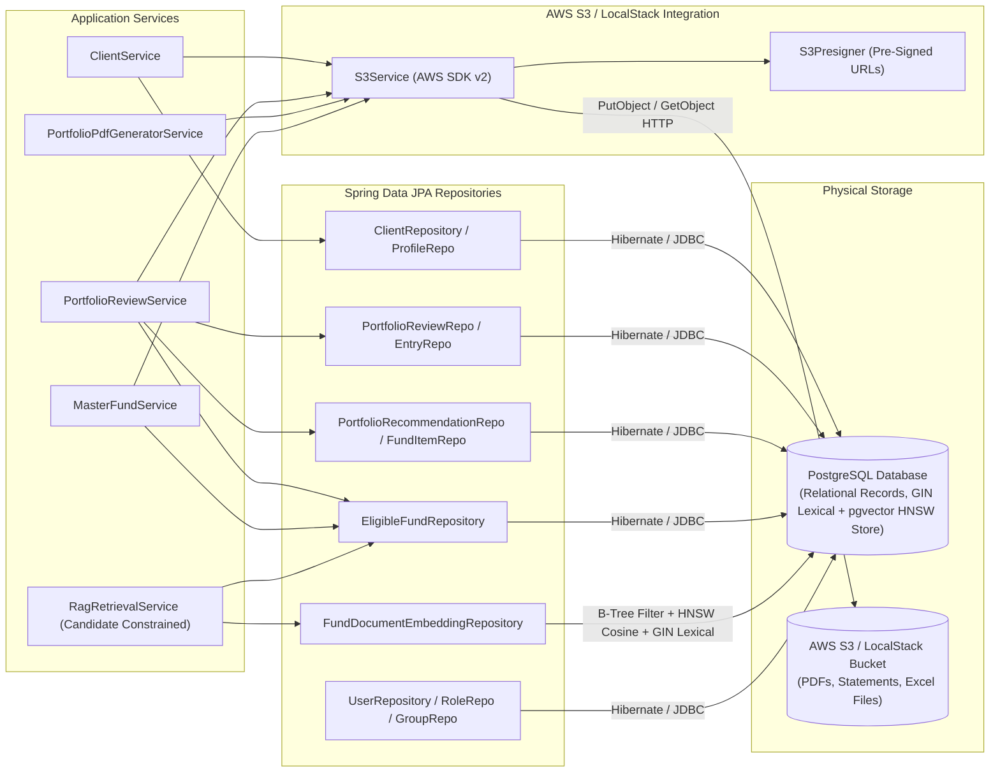
```mermaid
flowchart LR
    subgraph Services["Application Services"]
        CS["ClientService"]
        PRS["PortfolioReviewService"]
        PDF["PortfolioPdfGeneratorService"]
        MFS["MasterFundService"]
        RAG["RagRetrievalService (Candidate Constrained)"]
    end

    subgraph Repos["Spring Data JPA Repositories"]
        CR["ClientRepository / ProfileRepo"]
        PRR["PortfolioReviewRepo / EntryRepo"]
        RR["PortfolioRecommendationRepo / FundItemRepo"]
        EFR["EligibleFundRepository"]
        FDER["FundDocumentEmbeddingRepository"]
        UR["UserRepository / RoleRepo / GroupRepo"]
    end

    subgraph CloudInfra["AWS S3 / LocalStack Integration"]
        S3S["S3Service (AWS SDK v2)"]
        Presigner["S3Presigner (Pre-Signed URLs)"]
    end

    subgraph Storage["Physical Storage"]
        Postgres[("PostgreSQL Database<br/>(Relational Records, GIN Lexical + pgvector HNSW Store)")]
        S3Bucket[("AWS S3 / LocalStack Bucket<br/>(PDFs, Statements, Excel Files)")]
    end

    CS --> CR
    CS --> S3S
    PRS --> PRR
    PRS --> RR
    PRS --> EFR
    PRS --> S3S
    PDF --> S3S
    MFS --> EFR
    MFS --> S3S
    RAG --> EFR
    RAG --> FDER
    S3S --> Presigner

    CR -->|"Hibernate / JDBC"| Postgres
    PRR -->|"Hibernate / JDBC"| Postgres
    RR -->|"Hibernate / JDBC"| Postgres
    EFR -->|"Hibernate / JDBC"| Postgres
    FDER -->|"B-Tree Filter + HNSW Cosine + GIN Lexical"| Postgres
    UR -->|"Hibernate / JDBC"| Postgres
    S3S -->|"PutObject / GetObject HTTP"| S3Bucket
```

##### S3 Storage Integration Summary:
* **`ClientService` $\rightarrow$ `S3Service`**: Archives raw client spreadsheets from bulk prospect uploads (`client-uploads/`) to S3 and returns a pre-signed URL for tracking.
* **`PortfolioReviewService` $\rightarrow$ `S3Service`**: Stores uploaded client electronic CAS statements directly in S3 (`ecas/{clientId}/`) and issues a secure pre-signed download URL.
* **`PortfolioPdfGeneratorService` $\rightarrow$ `S3Service`**: Compiles recommendation proposal PDFs in-memory (RAM) and uploads the binary to S3 (`recommendations/{id}/`) with zero local disk usage.
* **`MasterFundService` $\rightarrow$ `S3Service`**: Archives administrator-uploaded master fund spreadsheets (`master-funds/`) to S3 before parsing and upserting into the database.

#### 1.5 Tier Responsibilities & Structural Summary
| Architectural Tier | Primary Packages & Components | Core Responsibilities |
|---|---|---|
| **Client & Ingress** | React Frontend, Nginx Reverse Proxy | Static UI serving, path routing (`/java-wtc-api/v1/*`), SSL termination. |
| **Security & Gateway** | `security.JwtAuthenticationFilter`, `security.SecurityConfig`, `CustomUserDetailsService` | Stateless JWT validation, `SecurityContext` establishment, RBAC authority resolution. |
| **REST Controllers** | `modules.*.controller.*`, `common.exception.GlobalExceptionHandler` | HTTP contract exposure, payload validation (`@Valid`), HTTP status mapping. |
| **Domain Services** | `modules.*.service.*` | Business transactions (`@Transactional`), business rules, scoring calculations. |
| **Async & Document Engines** | `PortfolioPdfGeneratorService`, `EligibleFundExcelService` | In-memory OpenPDF rendering via `ByteArrayOutputStream`, Apache POI streaming. |
| **Cloud & Object Storage** | `infrastructure.s3.S3Service`, `infrastructure.s3.AwsS3Config` | AWS S3 / LocalStack object uploads, HMAC-SHA256 pre-signed GET URL issuance. |
| **Data Persistence** | `modules.*.repository.*`, Spring Data JPA, Hibernate | Typed repository queries, pagination cursors, entity lifecycle mapping to PostgreSQL. |

---

### 2. Domain Model & Class Diagrams (Source-Verified)

#### 2.1 User Management & Role-Based Access Control (RBAC)
The RBAC module models departments (`Group`), granular privileges (`Permission`), and composite authorizations (`Role`) attached to users. `Permission` directly implements Spring Security's `GrantedAuthority`.

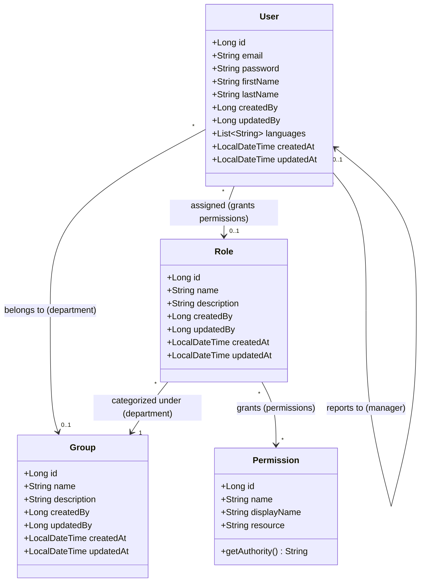
```mermaid
classDiagram
    class User {
        +Long id
        +String email
        +String password
        +String firstName
        +String lastName
        +Long createdBy
        +Long updatedBy
        +List~String~ languages
        +LocalDateTime createdAt
        +LocalDateTime updatedAt
    }

    class Group {
        +Long id
        +String name
        +String description
        +Long createdBy
        +Long updatedBy
        +LocalDateTime createdAt
        +LocalDateTime updatedAt
    }

    class Role {
        +Long id
        +String name
        +String description
        +Long createdBy
        +Long updatedBy
        +LocalDateTime createdAt
        +LocalDateTime updatedAt
    }

    class Permission {
        +Long id
        +String name
        +String displayName
        +String resource
        +getAuthority() String
    }

    User "*" --> "0..1" Role : assigned (grants permissions)
    User "*" --> "0..1" Group : belongs to (department)
    User "*" --> "0..1" User : reports to (manager)
    Role "*" --> "1" Group : categorized under (department)
    Role "*" --> "*" Permission : grants (permissions)
```

#### 2.2 Customer & KYC Management
Customer management decouples frequently queried identity attributes from deeper KYC compliance data via a vertical table partitioning pattern (`Client` $\rightarrow$ `ClientProfile`).

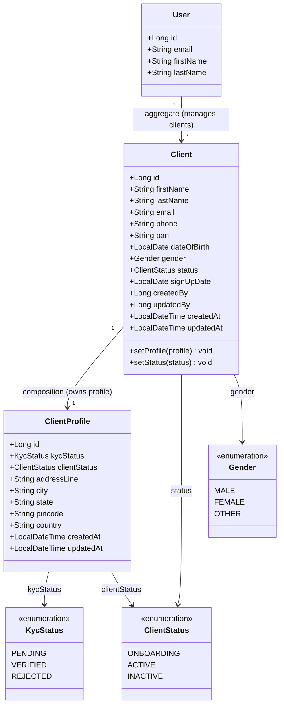
```mermaid
classDiagram
    class Client {
        +Long id
        +String firstName
        +String lastName
        +String email
        +String phone
        +String pan
        +LocalDate dateOfBirth
        +Gender gender
        +ClientStatus status
        +LocalDate signUpDate
        +Long createdBy
        +Long updatedBy
        +LocalDateTime createdAt
        +LocalDateTime updatedAt
        +setProfile(profile) void
        +setStatus(status) void
    }

    class ClientProfile {
        +Long id
        +KycStatus kycStatus
        +ClientStatus clientStatus
        +String addressLine
        +String city
        +String state
        +String pincode
        +String country
        +LocalDateTime createdAt
        +LocalDateTime updatedAt
    }

    class ClientStatus {
        <<enumeration>>
        ONBOARDING
        ACTIVE
        INACTIVE
    }

    class KycStatus {
        <<enumeration>>
        PENDING
        VERIFIED
        REJECTED
    }

    class Gender {
        <<enumeration>>
        MALE
        FEMALE
        OTHER
    }

    class User {
        +Long id
        +String email
        +String firstName
        +String lastName
    }

    Client "1" --> "1" ClientProfile : composition (owns profile)
    User "1" --> "*" Client : aggregate (manages clients)
    Client --> ClientStatus : status
    Client --> Gender : gender
    ClientProfile --> KycStatus : kycStatus
    ClientProfile --> ClientStatus : clientStatus
```

#### 2.3 Portfolio Review, Holdings & Recommendation Proposals
This domain model governs the client's mutual fund portfolio review, hold/sell classifications, eligible fund universe filtering, and final PDF proposal recommendations.

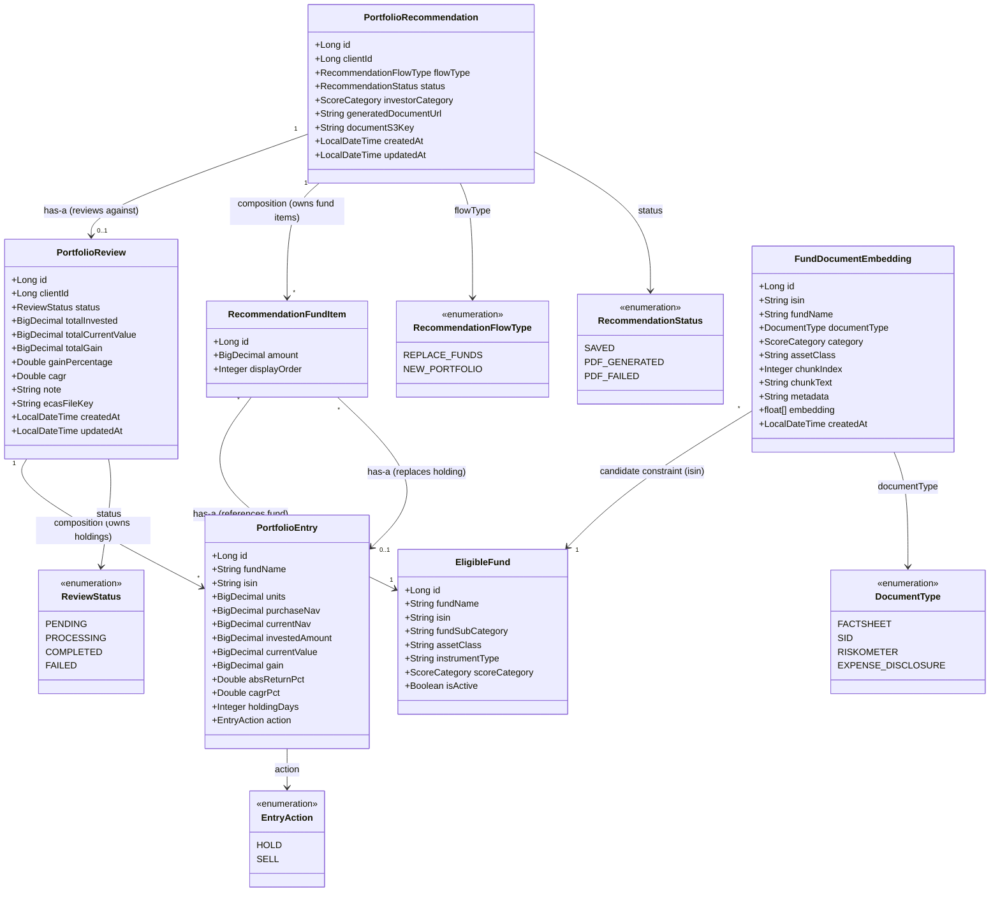
```mermaid
classDiagram
    class PortfolioReview {
        +Long id
        +Long clientId
        +ReviewStatus status
        +BigDecimal totalInvested
        +BigDecimal totalCurrentValue
        +BigDecimal totalGain
        +Double gainPercentage
        +Double cagr
        +String note
        +String ecasFileKey
        +LocalDateTime createdAt
        +LocalDateTime updatedAt
    }

    class PortfolioEntry {
        +Long id
        +String fundName
        +String isin
        +BigDecimal units
        +BigDecimal purchaseNav
        +BigDecimal currentNav
        +BigDecimal investedAmount
        +BigDecimal currentValue
        +BigDecimal gain
        +Double absReturnPct
        +Double cagrPct
        +Integer holdingDays
        +EntryAction action
    }

    class PortfolioRecommendation {
        +Long id
        +Long clientId
        +RecommendationFlowType flowType
        +RecommendationStatus status
        +ScoreCategory investorCategory
        +String generatedDocumentUrl
        +String documentS3Key
        +LocalDateTime createdAt
        +LocalDateTime updatedAt
    }

    class RecommendationFundItem {
        +Long id
        +BigDecimal amount
        +Integer displayOrder
    }

    class EligibleFund {
        +Long id
        +String fundName
        +String isin
        +String fundSubCategory
        +String assetClass
        +String instrumentType
        +ScoreCategory scoreCategory
        +Boolean isActive
    }

    class ReviewStatus {
        <<enumeration>>
        PENDING
        PROCESSING
        COMPLETED
        FAILED
    }

    class EntryAction {
        <<enumeration>>
        HOLD
        SELL
    }

    class RecommendationFlowType {
        <<enumeration>>
        REPLACE_FUNDS
        NEW_PORTFOLIO
    }

    class RecommendationStatus {
        <<enumeration>>
        SAVED
        PDF_GENERATED
        PDF_FAILED
    }

    class FundDocumentEmbedding {
        +Long id
        +String isin
        +String fundName
        +DocumentType documentType
        +ScoreCategory category
        +String assetClass
        +Integer chunkIndex
        +String chunkText
        +String metadata
        +float[] embedding
        +LocalDateTime createdAt
    }

    class DocumentType {
        <<enumeration>>
        FACTSHEET
        SID
        RISKOMETER
        EXPENSE_DISCLOSURE
    }

    PortfolioReview "1" --> "*" PortfolioEntry : composition (owns holdings)
    PortfolioRecommendation "1" --> "0..1" PortfolioReview : has-a (reviews against)
    PortfolioRecommendation "1" --> "*" RecommendationFundItem : composition (owns fund items)
    RecommendationFundItem "*" --> "1" EligibleFund : has-a (references fund)
    RecommendationFundItem "*" --> "0..1" PortfolioEntry : has-a (replaces holding)
    FundDocumentEmbedding "*" --> "1" EligibleFund : candidate constraint (isin)
    FundDocumentEmbedding --> DocumentType : documentType
    PortfolioEntry --> EntryAction : action
    PortfolioRecommendation --> RecommendationFlowType : flowType
    PortfolioRecommendation --> RecommendationStatus : status
    PortfolioReview --> ReviewStatus : status
```

#### 2.4 Risk Assessment & Suitability Engine
Calculates the client's risk profile to ensure regulatory suitability before mutual fund proposals are generated.

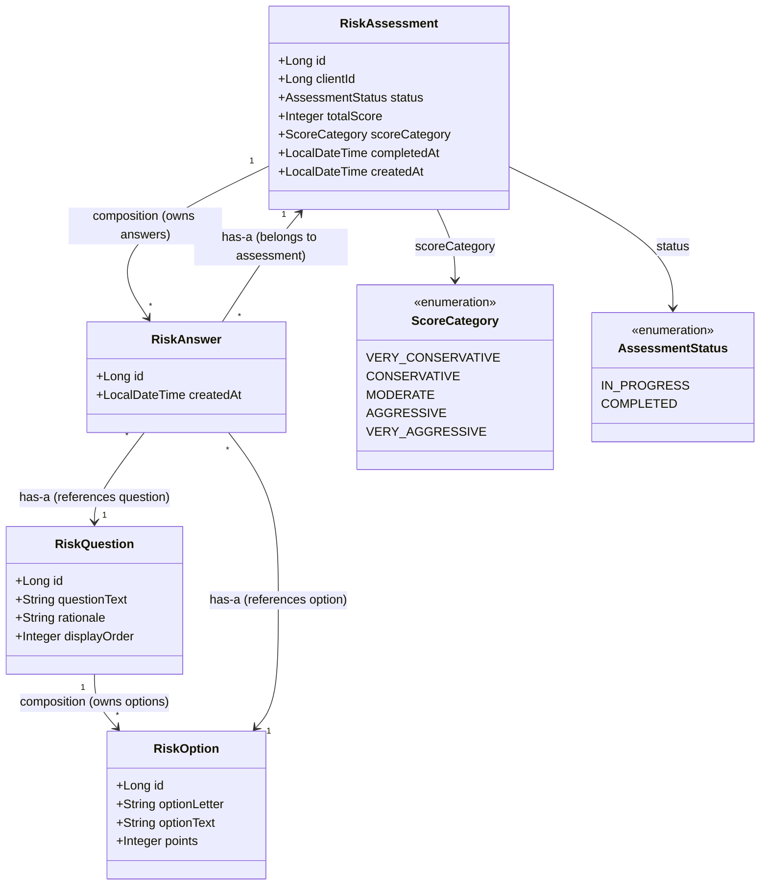
```mermaid
classDiagram
    class RiskAssessment {
        +Long id
        +Long clientId
        +AssessmentStatus status
        +Integer totalScore
        +ScoreCategory scoreCategory
        +LocalDateTime completedAt
        +LocalDateTime createdAt
    }

    class RiskQuestion {
        +Long id
        +String questionText
        +String rationale
        +Integer displayOrder
    }

    class RiskOption {
        +Long id
        +String optionLetter
        +String optionText
        +Integer points
    }

    class RiskAnswer {
        +Long id
        +LocalDateTime createdAt
    }

    class ScoreCategory {
        <<enumeration>>
        VERY_CONSERVATIVE
        CONSERVATIVE
        MODERATE
        AGGRESSIVE
        VERY_AGGRESSIVE
    }

    class AssessmentStatus {
        <<enumeration>>
        IN_PROGRESS
        COMPLETED
    }

    RiskAssessment "1" --> "*" RiskAnswer : composition (owns answers)
    RiskQuestion "1" --> "*" RiskOption : composition (owns options)
    RiskAnswer "*" --> "1" RiskQuestion : has-a (references question)
    RiskAnswer "*" --> "1" RiskOption : has-a (references option)
    RiskAnswer "*" --> "1" RiskAssessment : has-a (belongs to assessment)
    RiskAssessment --> ScoreCategory : scoreCategory
    RiskAssessment --> AssessmentStatus : status
```

#### 2.5 AI-Native RAG & Grounded Retrieval Engine
Models the persistence, metadata indexing, and Spring Data JPA hybrid retrieval contracts powering grounded mutual fund research and compliance verification.

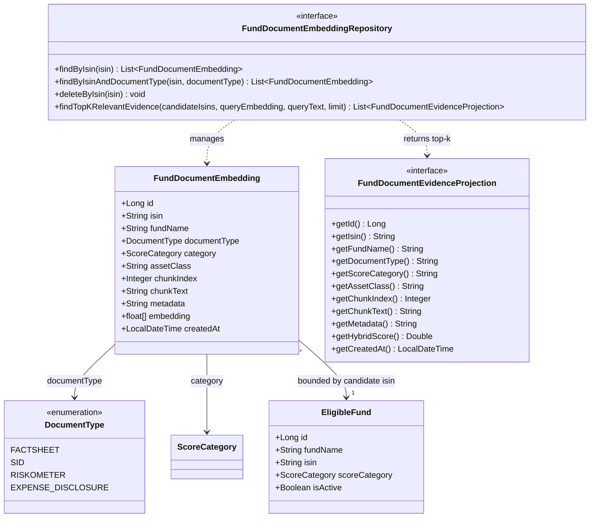
```mermaid
classDiagram
    class FundDocumentEmbedding {
        +Long id
        +String isin
        +String fundName
        +DocumentType documentType
        +ScoreCategory category
        +String assetClass
        +Integer chunkIndex
        +String chunkText
        +String metadata
        +float[] embedding
        +LocalDateTime createdAt
    }

    class FundDocumentEvidenceProjection {
        <<interface>>
        +getId() Long
        +getIsin() String
        +getFundName() String
        +getDocumentType() String
        +getScoreCategory() String
        +getAssetClass() String
        +getChunkIndex() Integer
        +getChunkText() String
        +getMetadata() String
        +getHybridScore() Double
        +getCreatedAt() LocalDateTime
    }

    class FundDocumentEmbeddingRepository {
        <<interface>>
        +findByIsin(isin) List~FundDocumentEmbedding~
        +findByIsinAndDocumentType(isin, documentType) List~FundDocumentEmbedding~
        +deleteByIsin(isin) void
        +findTopKRelevantEvidence(candidateIsins, queryEmbedding, queryText, limit) List~FundDocumentEvidenceProjection~
    }

    class DocumentType {
        <<enumeration>>
        FACTSHEET
        SID
        RISKOMETER
        EXPENSE_DISCLOSURE
    }

    class EligibleFund {
        +Long id
        +String fundName
        +String isin
        +ScoreCategory scoreCategory
        +Boolean isActive
    }

    FundDocumentEmbeddingRepository ..> FundDocumentEmbedding : manages
    FundDocumentEmbeddingRepository ..> FundDocumentEvidenceProjection : returns top-k
    FundDocumentEmbedding --> DocumentType : documentType
    FundDocumentEmbedding --> ScoreCategory : category
    FundDocumentEmbedding "*" --> "1" EligibleFund : bounded by candidate isin
```

---

### 3. Core Sequence Diagrams

#### 3.1 JWT Authentication & RBAC Security Filter Chain
Illustrates request interception, stateless token verification, role/permission principal construction, and endpoint dispatch.

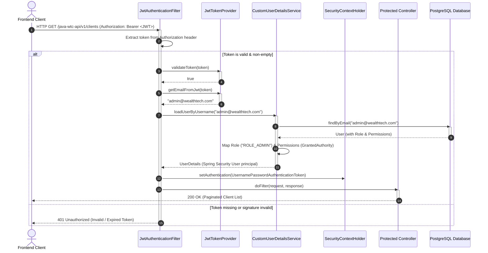
```mermaid
sequenceDiagram
    autonumber
    actor Client as Frontend Client
    participant Filter as JwtAuthenticationFilter
    participant Provider as JwtTokenProvider
    participant UserDetailsSvc as CustomUserDetailsService
    participant SecContext as SecurityContextHolder
    participant Controller as Protected Controller
    participant DB as PostgreSQL Database

    Client->>Filter: HTTP GET /java-wtc-api/v1/clients (Authorization: Bearer <JWT>)
    activate Filter
    Filter->>Filter: Extract token from Authorization header

    alt Token is valid & non-empty
        Filter->>Provider: validateToken(token)
        activate Provider
        Provider-->>Filter: true
        deactivate Provider

        Filter->>Provider: getEmailFromJwt(token)
        activate Provider
        Provider-->>Filter: "admin@wealthtech.com"
        deactivate Provider

        Filter->>UserDetailsSvc: loadUserByUsername("admin@wealthtech.com")
        activate UserDetailsSvc
        UserDetailsSvc->>DB: findByEmail("admin@wealthtech.com")
        activate DB
        DB-->>UserDetailsSvc: User (with Role & Permissions)
        deactivate DB
        UserDetailsSvc->>UserDetailsSvc: Map Role ("ROLE_ADMIN") & Permissions (GrantedAuthority)
        UserDetailsSvc-->>Filter: UserDetails (Spring Security User principal)
        deactivate UserDetailsSvc

        Filter->>SecContext: setAuthentication(UsernamePasswordAuthenticationToken)
        Filter->>Controller: doFilter(request, response)
        activate Controller
        Controller-->>Client: 200 OK (Paginated Client List)
        deactivate Controller
    else Token missing or signature invalid
        Filter-->>Client: 401 Unauthorized (Invalid / Expired Token)
    end
    deactivate Filter
```

#### 3.2 Two-Step Recommendation Lifecycle: Proposal Creation & Asynchronous PDF Generation
The recommendation proposal engine intentionally decouples proposal creation from PDF document generation into a high-performance, resilient **two-step process**:

1. **Step 1: Synchronous Proposal Submission & Validation (`POST /portfolio-recommendations`)**:
   - The advisor selects fund allocations from either the **Replace Funds** (`REPLACE_FUNDS`) or **New Portfolio** (`NEW_PORTFOLIO`) flow.
   - The backend validates suitability against the investor's latest risk profile, validates that replaced holdings are marked as `SELL` (for `REPLACE_FUNDS`), and enforces business rules.
   - It persists the `PortfolioRecommendation` with status `SAVED` and creates the child `RecommendationFundItem` line items.
   - It returns `HTTP 201 Created` immediately with the assigned `{id}` (`generated_document_url = null`).
2. **Step 2: Asynchronous In-Memory PDF Compilation & S3 Archival (`POST /portfolio-recommendations/{id}/generate-pdf`)**:
   - The client takes the `{id}` from Step 1 and invokes this endpoint to trigger document rendering.
   - The controller returns `HTTP 202 Accepted` immediately so the user interface never freezes.
   - In the background (`@Async`), OpenPDF compiles the branded proposal **100% in RAM** via `ByteArrayOutputStream` (zero local disk footprint), streams the binary directly to AWS S3 / LocalStack under `recommendations/{id}/recommendation_{id}.pdf`, and updates the database status to `PDF_GENERATED`.
   - The frontend polls `GET /portfolio-recommendations/{id}` every 2.5s until `PDF_GENERATED` is returned, then allows the client to download the PDF directly from S3 using the pre-signed URL.
   - If rendering or S3 network transfer throws an exception, status transitions to `PDF_FAILED`, and calling this endpoint again acts as the **Retry** mechanism.

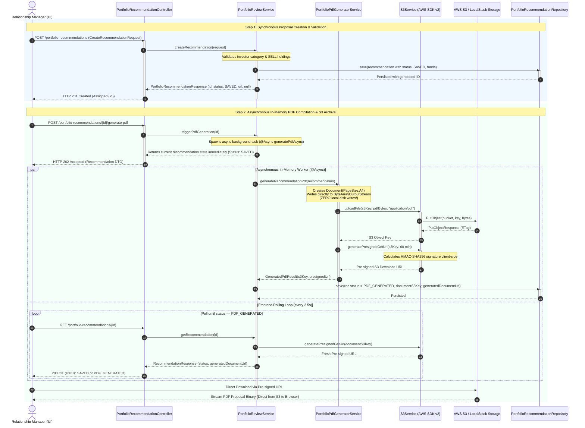
```mermaid
sequenceDiagram
    autonumber
    actor RM as Relationship Manager (UI)
    participant Ctrl as PortfolioRecommendationController
    participant Svc as PortfolioReviewService
    participant PdfGen as PortfolioPdfGeneratorService
    participant S3 as S3Service (AWS SDK v2)
    participant S3Storage as AWS S3 / LocalStack Storage
    participant Repo as PortfolioRecommendationRepository

    rect rgb(240, 248, 255)
    Note over RM,Repo: Step 1: Synchronous Proposal Creation & Validation
    RM->>Ctrl: POST /portfolio-recommendations (CreateRecommendationRequest)
    activate Ctrl
    Ctrl->>Svc: createRecommendation(request)
    activate Svc
    Note over Svc: Validates investor category & SELL holdings
    Svc->>Repo: save(recommendation with status: SAVED, funds)
    activate Repo
    Repo-->>Svc: Persisted with generated ID
    deactivate Repo
    Svc-->>Ctrl: PortfolioRecommendationResponse (id, status: SAVED, url: null)
    Ctrl-->>RM: HTTP 201 Created (Assigned {id})
    deactivate Svc
    deactivate Ctrl
    end

    rect rgb(245, 255, 250)
    Note over RM,Repo: Step 2: Asynchronous In-Memory PDF Compilation & S3 Archival
    RM->>Ctrl: POST /portfolio-recommendations/{id}/generate-pdf
    activate Ctrl
    Ctrl->>Svc: triggerPdfGeneration(id)
    activate Svc
    Note over Svc: Spawns async background task (@Async generatePdfAsync)
    Svc-->>Ctrl: Returns current recommendation state immediately (Status: SAVED)
    Ctrl-->>RM: HTTP 202 Accepted (Recommendation DTO)
    deactivate Ctrl

    par Asynchronous In-Memory Worker (@Async)
        Svc->>PdfGen: generateRecommendationPdf(recommendation)
        activate PdfGen
        Note over PdfGen: Creates Document(PageSize.A4)<br/>Writes directly to ByteArrayOutputStream<br/>(ZERO local disk writes!)
        PdfGen->>S3: uploadFile(s3Key, pdfBytes, "application/pdf")
        activate S3
        S3->>S3Storage: PutObject(bucket, key, bytes)
        S3Storage-->>S3: PutObjectResponse (ETag)
        S3-->>PdfGen: S3 Object Key
        deactivate S3

        PdfGen->>S3: generatePresignedGetUrl(s3Key, 60 min)
        activate S3
        Note over S3: Calculates HMAC-SHA256 signature client-side
        S3-->>PdfGen: Pre-signed S3 Download URL
        deactivate S3

        PdfGen-->>Svc: GeneratedPdfResult(s3Key, presignedUrl)
        deactivate PdfGen

        Svc->>Repo: save(rec.status = PDF_GENERATED, documentS3Key, generatedDocumentUrl)
        activate Repo
        Repo-->>Svc: Persisted
        deactivate Repo
    and Frontend Polling Loop (every 2.5s)
        loop Poll until status == PDF_GENERATED
            RM->>Ctrl: GET /portfolio-recommendations/{id}
            Ctrl->>Svc: getRecommendation(id)
            Svc->>S3: generatePresignedGetUrl(documentS3Key)
            S3-->>Svc: Fresh Pre-signed URL
            Svc-->>Ctrl: RecommendationResponse (status, generatedDocumentUrl)
            Ctrl-->>RM: 200 OK (status: SAVED or PDF_GENERATED)
        end
    end

    RM->>S3Storage: Direct Download via Pre-signed URL
    S3Storage-->>RM: Stream PDF Proposal Binary (Direct from S3 to Browser)
    deactivate Svc
    end
```

#### 3.3 Master Funds Admin Excel Ingestion & S3 Upsert Pipeline
The mutual fund universe pipeline automates the ingestion, validation, and synchronization of eligible investment funds from administrator-uploaded spreadsheets (`.xlsx` / `.xls`). The process combines object storage archival in AWS S3 with atomic database upserts via Spring Data JPA:

1. **Step 1: Admin Upload & Security Ingress (`POST /java-wtc-api/v1/admin/master-funds/upload`)**:
   - The System Administrator uploads a spreadsheet file via multipart form-data (`file`).
   - Spring Security enforces role-based access control via `@PreAuthorize("hasRole('ADMIN') or hasAuthority('masterfund:create')")`.
   - The service validates that the file is non-empty, checks for a valid `.xlsx` / `.xls` extension, and sanitizes the filename to prevent directory traversal.

2. **Step 2: Object Storage Archival & Pre-Signed URL Issuance (AWS S3 / LocalStack)**:
   - A unique S3 object key is generated: `master-funds/{timestamp}_{safeFilename}`.
   - The raw spreadsheet binary is uploaded to the S3 bucket via `S3Service.uploadFile(...)`.
   - A time-limited (60-minute) HMAC-SHA256 pre-signed GET URL is generated for auditing and verification.
   - *Fault tolerance*: If S3 or LocalStack is unreachable, the service logs a warning and proceeds with database ingestion to ensure platform availability.

3. **Step 3: Streaming In-Memory Spreadsheet Parsing (Apache POI)**:
   - The file input stream is passed to `EligibleFundExcelService.parseMasterFundsExcel(inputStream)`.
   - Apache POI validates the workbook schema and required column headers: *Fund Name, ISIN, Score Category, Sub Category, Asset Class, Instrument Type, Active*.
   - Rows are parsed starting at index 1 (skipping header) into typed `List<MasterFundRowDto>`. If no valid rows exist, a `400 Bad Request` is thrown.

4. **Step 4: Atomic Transactional Upsert by ISIN (`eligible_funds` Table)**:
   - The operation executes within a `@Transactional` boundary for data consistency.
   - The service iterates over each `MasterFundRowDto`:
     - Queries `EligibleFundRepository.findByIsin(row.isin())`.
     - **Update Branch (ISIN Exists)**: Mutates the existing entity's properties (`fundName`, `fundSubCategory`, `assetClass`, `instrumentType`, `scoreCategory`, `isActive`), saves it, and increments `updatedCount`.
     - **Insert Branch (New ISIN)**: Builds a new `EligibleFund` entity with Lombok builder, saves it, and increments `insertedCount`.

5. **Step 5: Audit Confirmation & Metrics Response**:
   - The controller returns `HTTP 200 OK` with a structured `MasterFundUploadResponse` payload containing:
     - `status`: `"SUCCESS"`
     - `message`: Summary with exact counts (e.g., `"Master funds processed successfully (15 inserted, 3 updated)"`)
     - `filename`, `s3Key`, and `presignedUrl` for audit download
     - Summary counters: `totalRows`, `inserted`, `updated`.

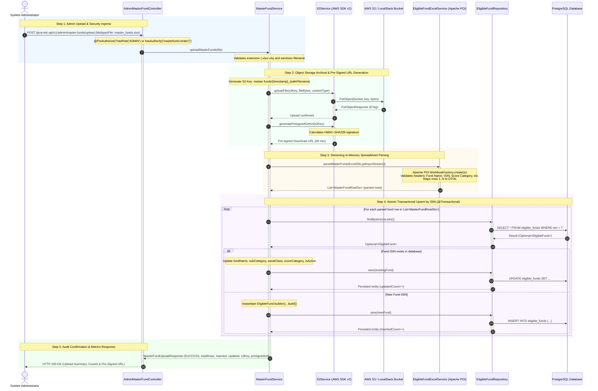
```mermaid
sequenceDiagram
    autonumber
    actor Admin as System Administrator
    participant Ctrl as AdminMasterFundController
    participant Svc as MasterFundService
    participant S3 as S3Service (AWS SDK v2)
    participant S3Storage as AWS S3 / LocalStack Bucket
    participant Excel as EligibleFundExcelService (Apache POI)
    participant Repo as EligibleFundRepository
    participant DB as PostgreSQL Database

    rect rgb(240, 248, 255)
    Note over Admin,Ctrl: Step 1: Admin Upload & Security Ingress
    Admin->>Ctrl: POST /java-wtc-api/v1/admin/master-funds/upload (MultipartFile: master_funds.xlsx)
    activate Ctrl
    Note over Ctrl: @PreAuthorize("hasRole('ADMIN') or hasAuthority('masterfund:create')")
    Ctrl->>Svc: uploadMasterFunds(file)
    activate Svc
    Note over Svc: Validates extension (.xlsx/.xls) and sanitizes filename
    end

    rect rgb(245, 255, 250)
    Note over Svc,S3Storage: Step 2: Object Storage Archival & Pre-Signed URL Generation
    Note over Svc: Generate S3 Key: master-funds/{timestamp}_{safeFilename}
    Svc->>S3: uploadFile(s3Key, fileBytes, contentType)
    activate S3
    S3->>S3Storage: PutObject(bucket, key, bytes)
    S3Storage-->>S3: PutObjectResponse (ETag)
    S3-->>Svc: Upload confirmed
    deactivate S3

    Svc->>S3: generatePresignedGetUrl(s3Key)
    activate S3
    Note over S3: Calculates HMAC-SHA256 signature
    S3-->>Svc: Pre-signed Download URL (60 min)
    deactivate S3
    end

    rect rgb(255, 250, 240)
    Note over Svc,Excel: Step 3: Streaming In-Memory Spreadsheet Parsing
    Svc->>Excel: parseMasterFundsExcel(file.getInputStream())
    activate Excel
    Note over Excel: Apache POI WorkbookFactory.create(is)<br/>Validates headers: Fund Name, ISIN, Score Category, etc.<br/>Maps rows 1..N to DTOs
    Excel-->>Svc: List<MasterFundRowDto> (parsed rows)
    deactivate Excel
    end

    rect rgb(250, 245, 255)
    Note over Svc,DB: Step 4: Atomic Transactional Upsert by ISIN (@Transactional)
    loop For each parsed fund row in List<MasterFundRowDto>
        Svc->>Repo: findByIsin(row.isin())
        activate Repo
        Repo->>DB: SELECT * FROM eligible_funds WHERE isin = ?
        DB-->>Repo: Result (Optional<EligibleFund>)
        Repo-->>Svc: Optional<EligibleFund>
        deactivate Repo

        alt Fund ISIN exists in database
            Note over Svc: Update fundName, subCategory, assetClass, scoreCategory, isActive
            Svc->>Repo: save(existingFund)
            activate Repo
            Repo->>DB: UPDATE eligible_funds SET ...
            Repo-->>Svc: Persisted entity (updatedCount++)
            deactivate Repo
        else New Fund ISIN
            Note over Svc: Instantiate EligibleFund.builder()...build()
            Svc->>Repo: save(newFund)
            activate Repo
            Repo->>DB: INSERT INTO eligible_funds (...)
            Repo-->>Svc: Persisted entity (insertedCount++)
            deactivate Repo
        end
    end
    end

    rect rgb(240, 255, 240)
    Note over Admin,Ctrl: Step 5: Audit Confirmation & Metrics Response
    Svc-->>Ctrl: MasterFundUploadResponse (SUCCESS, totalRows, inserted, updated, s3Key, presignedUrl)
    deactivate Svc
    Ctrl-->>Admin: HTTP 200 OK (Upload Summary, Counts & Pre-Signed URL)
    deactivate Ctrl
    end
```

#### 3.4 eCAS Electronic Statement Upload Flow
Captures how client portfolio statements are ingested, stored in S3, and assigned pre-signed download URLs for advisor review.

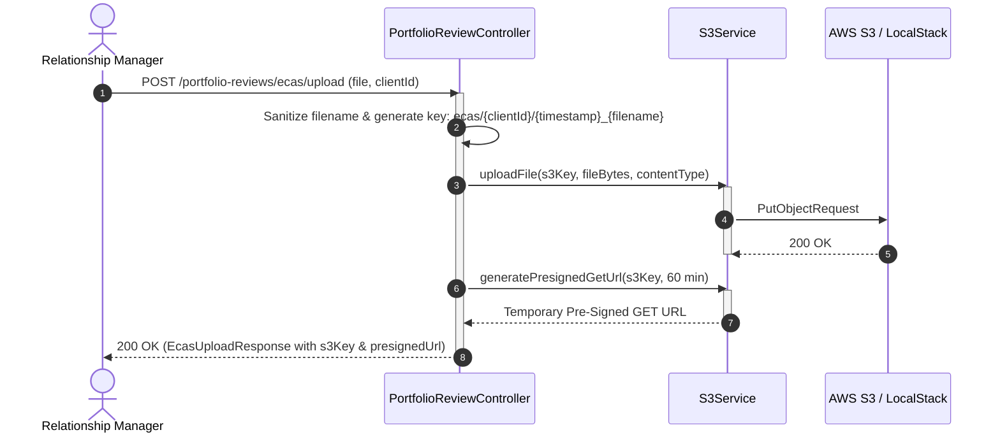
```mermaid
sequenceDiagram
    autonumber
    actor Advisor as Relationship Manager
    participant Ctrl as PortfolioReviewController
    participant S3 as S3Service
    participant S3Store as AWS S3 / LocalStack

    Advisor->>Ctrl: POST /portfolio-reviews/ecas/upload (file, clientId)
    activate Ctrl
    Ctrl->>Ctrl: Sanitize filename & generate key: ecas/{clientId}/{timestamp}_{filename}
    Ctrl->>S3: uploadFile(s3Key, fileBytes, contentType)
    activate S3
    S3->>S3Store: PutObjectRequest
    S3Store-->>S3: 200 OK
    deactivate S3

    Ctrl->>S3: generatePresignedGetUrl(s3Key, 60 min)
    activate S3
    S3-->>Ctrl: Temporary Pre-Signed GET URL
    deactivate S3

    Ctrl-->>Advisor: 200 OK (EcasUploadResponse with s3Key & presignedUrl)
    deactivate Ctrl
```

#### 3.5 AI-Native Grounded RAG Retrieval Pipeline (Candidate-Constrained Hybrid Search)
Illustrates end-to-end question processing, candidate whitelist extraction from relational storage, PostgreSQL tri-factor hybrid search, evidence quality validation, and grounded LLM synthesis.

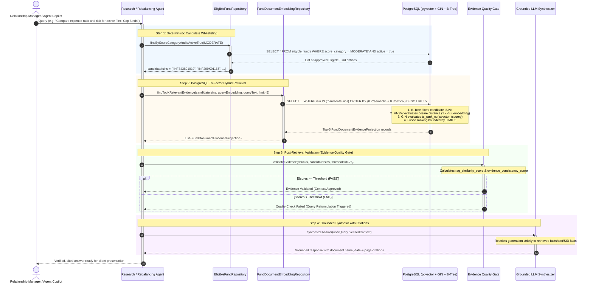
```mermaid
sequenceDiagram
    autonumber
    actor RM as Relationship Manager / Agent Copilot
    participant Agent as Research / Rebalancing Agent
    participant EFRepo as EligibleFundRepository
    participant RAGRepo as FundDocumentEmbeddingRepository
    participant DB as PostgreSQL (pgvector + GIN + B-Tree)
    participant Gate as Evidence Quality Gate
    participant LLM as Grounded LLM Synthesizer

    RM->>Agent: Query (e.g. "Compare expense ratio and risk for active Flexi Cap funds")
    activate Agent

    rect rgb(240, 248, 255)
    Note over Agent,EFRepo: Step 1: Deterministic Candidate Whitelisting
    Agent->>EFRepo: findByScoreCategoryAndIsActiveTrue(MODERATE)
    activate EFRepo
    EFRepo->>DB: SELECT * FROM eligible_funds WHERE score_category = 'MODERATE' AND active = true
    DB-->>EFRepo: List of approved EligibleFund entities
    EFRepo-->>Agent: candidateIsins = ["INF843801019", "INF209K01165", ...]
    deactivate EFRepo
    end

    rect rgb(255, 250, 240)
    Note over Agent,RAGRepo: Step 2: PostgreSQL Tri-Factor Hybrid Retrieval
    Agent->>RAGRepo: findTopKRelevantEvidence(candidateIsins, queryEmbedding, queryText, limit=5)
    activate RAGRepo
    RAGRepo->>DB: SELECT ... WHERE isin IN (:candidateIsins) ORDER BY (0.7*semantic + 0.3*lexical) DESC LIMIT 5
    activate DB
    Note over DB: 1. B-Tree filters candidate ISINs<br/>2. HNSW evaluates cosine distance (1 - <=> embedding)<br/>3. GIN evaluates ts_rank_cd(tsvector, tsquery)<br/>4. Fused ranking bounded by LIMIT 5
    DB-->>RAGRepo: Top-5 FundDocumentEvidenceProjection records
    deactivate DB
    RAGRepo-->>Agent: List~FundDocumentEvidenceProjection~
    deactivate RAGRepo
    end

    rect rgb(245, 255, 245)
    Note over Agent,Gate: Step 3: Post-Retrieval Validation (Evidence Quality Gate)
    Agent->>Gate: validateEvidence(chunks, candidateIsins, threshold=0.75)
    activate Gate
    Note over Gate: Calculates rag_similarity_score & evidence_consistency_score
    alt Scores >= Threshold (PASS)
        Gate-->>Agent: Evidence Validated (Context Approved)
    else Scores < Threshold (FAIL)
        Gate-->>Agent: Quality Check Failed (Query Reformulation Triggered)
    end
    deactivate Gate
    end

    rect rgb(250, 240, 255)
    Note over Agent,LLM: Step 4: Grounded Synthesis with Citations
    Agent->>LLM: synthesizeAnswer(userQuery, verifiedContext)
    activate LLM
    Note over LLM: Restricts generation strictly to retrieved factsheet/SID facts
    LLM-->>Agent: Grounded response with document name, date & page citations
    deactivate LLM
    end

    Agent-->>RM: Verified, cited answer ready for client presentation
    deactivate Agent
```

---

### 4. State Machine Diagrams

#### 4.1 Recommendation Proposal & PDF Generation State Machine
Models the lifecycle states of an investment recommendation proposal from draft creation through async rendering to final distribution.

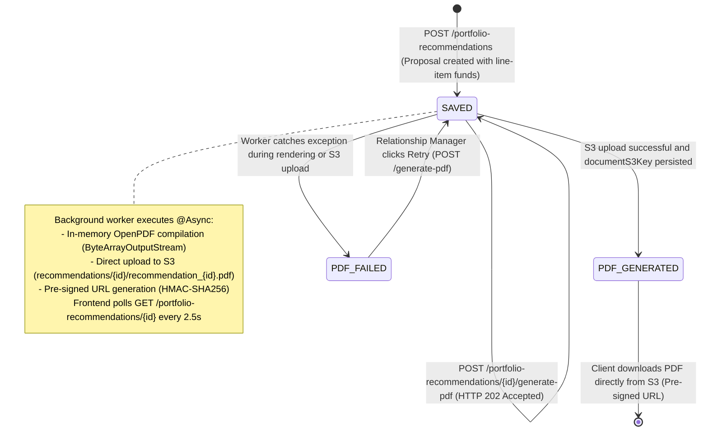
```mermaid
stateDiagram-v2
    [*] --> SAVED : POST /portfolio-recommendations (Proposal created with line-item funds)

    SAVED --> SAVED : POST /portfolio-recommendations/{id}/generate-pdf (HTTP 202 Accepted)
    note right of SAVED
        Background worker executes @Async:
        - In-memory OpenPDF compilation (ByteArrayOutputStream)
        - Direct upload to S3 (recommendations/{id}/recommendation_{id}.pdf)
        - Pre-signed URL generation (HMAC-SHA256)
        Frontend polls GET /portfolio-recommendations/{id} every 2.5s
    end note

    SAVED --> PDF_GENERATED : S3 upload successful and documentS3Key persisted
    SAVED --> PDF_FAILED : Worker catches exception during rendering or S3 upload

    PDF_FAILED --> SAVED : Relationship Manager clicks Retry (POST /generate-pdf)

    PDF_GENERATED --> [*] : Client downloads PDF directly from S3 (Pre-signed URL)
```

#### 4.2 Client Account & KYC Compliance Lifecycle
Models client progression and KYC verification status.

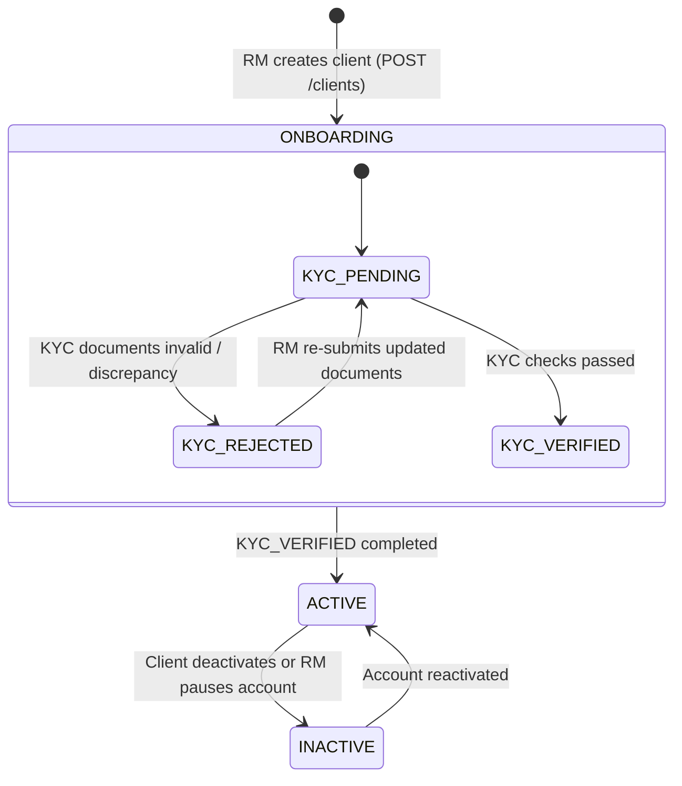
```mermaid
stateDiagram-v2
    [*] --> ONBOARDING : RM creates client (POST /clients)
    
    state ONBOARDING {
        [*] --> KYC_PENDING
        KYC_PENDING --> KYC_REJECTED : KYC documents invalid / discrepancy
        KYC_REJECTED --> KYC_PENDING : RM re-submits updated documents
        KYC_PENDING --> KYC_VERIFIED : KYC checks passed
    }

    ONBOARDING --> ACTIVE : KYC_VERIFIED completed
    ACTIVE --> INACTIVE : Client deactivates or RM pauses account
    INACTIVE --> ACTIVE : Account reactivated
```

---

### 5. Fault Tolerance & Storage Resilience Architecture
External object storage (AWS S3 / LocalStack) integration is engineered with multi-tier fault tolerance, graceful degradation, and recovery strategies across all ingestion, generation, and retrieval paths:

#### 5.1 Storage Fault-Tolerance Matrix
| Workflow | Failure Condition | Resilience & Fallback Strategy | Resulting System State |
|---|---|---|---|
| **Master Funds Upload** | S3 network timeout or LocalStack unavailable | **Soft Degradation**: Caught with `log.warn` in `MasterFundService.java`. Proceeds with Apache POI spreadsheet streaming and database upserts. | Database updated (`eligible_funds`); `presignedUrl = null`. Zero HTTP 500. |
| **Bulk Client Upload** | S3 upload failure | **Soft Degradation & Async Decoupling**: Caught with `log.warn` in `ClientController.java`. In-memory byte array is immediately dispatched to `ClientService.java` (`processBulkUploadAsync`). | Batch prospect onboarding continues uninterrupted; zero HTTP 500. |
| **eCAS Upload** | S3 upload exception | **Non-Fatal Upload**: Exception trapped with `log.warn` in `PortfolioReviewController.java`. Client-side HMAC-SHA256 signature creates URL without network dependency. | Endpoint returns HTTP 200 OK without failing client statement session. |
| **Proposal PDF Generation** | S3 upload or OpenPDF rendering error | **State Machine Trapping (`PDF_FAILED`)**: Caught in `@Async` worker in `PortfolioReviewService.java`. Persists status as `PDF_FAILED`. | Server thread pool protected. Advisor can click **Retry** (`POST /generate-pdf`). |
| **Proposal PDF Download** | S3 object missing or bucket outage | **Dual-Tier Fallback**: Handled in `PortfolioRecommendationController.java`. Queries S3 first; if absent, inspects legacy local filesystem (`uploads/recommendations/`), streams binary, and immediately deletes local file. | Client receives PDF document; local disk is purged on the fly. |
| **Infrastructure Tier** | Target S3 bucket not yet created (cold restart) | **Self-Healing Auto-Provisioning**: `S3Service.java` (`ensureBucketExists()`) catches `NoSuchBucketException` / 404 and creates bucket dynamically via AWS SDK v2. | Subsequent uploads succeed without administrative intervention. |

#### 5.2 Fault-Tolerant Ingestion Pipeline
Demonstrates how raw file ingestion pipelines maintain zero downtime and uninterrupted database ingestion even during S3 outages:

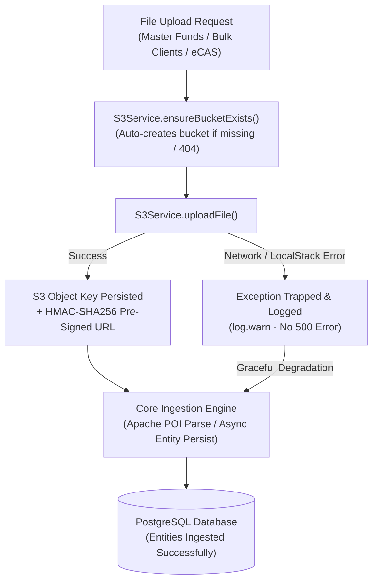
```mermaid
flowchart TD
    Req["File Upload Request<br/>(Master Funds / Bulk Clients / eCAS)"]
    Ensure["S3Service.ensureBucketExists()<br/>(Auto-creates bucket if missing / 404)"]
    S3Upload["S3Service.uploadFile()"]

    Req --> Ensure --> S3Upload

    S3Upload -->|Success| S3Ok["S3 Object Key Persisted<br/>+ HMAC-SHA256 Pre-Signed URL"]
    S3Upload -->|Network / LocalStack Error| S3Err["Exception Trapped & Logged<br/>(log.warn - No 500 Error)"]

    S3Ok --> Ingestion["Core Ingestion Engine<br/>(Apache POI Parse / Async Entity Persist)"]
    S3Err -->|Graceful Degradation| Ingestion

    Ingestion --> DB[("PostgreSQL Database<br/>(Entities Ingested Successfully)")]
```

---

## NodeJs UML Diagrams

### 1. High-Level Component & Layered Architecture

> [!TIP]
> **How to view these diagrams comfortably:**
> - **In-Editor / Browser**: Use browser zoom (`Ctrl` + `+` / `Cmd` + `+`).
> - **Mermaid Live Editor**: Copy any ````mermaid` block into [mermaid.live](https://mermaid.live) for interactive panning, infinite zoom, and high-resolution SVG/PNG exports.
> - **Modular Breakdowns**: Section 1 is broken down below into a **Macro 5-Tier Overview** followed by **3 focused Subsystem Diagrams** (Security & Middleware Pipeline, Web & Domain Services, and Data Storage) rendered at large, easily readable font sizes.

#### 1.1 Macro Layered Architecture (Overview)
A high-level view of the 5 primary architectural tiers in `backend-nodejs`:

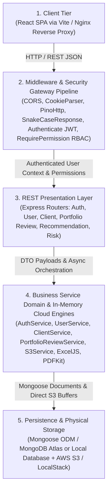
```mermaid
flowchart TD
    Client["1. Client Tier<br/>(React SPA via Vite / Nginx Reverse Proxy)"]
    Sec["2. Middleware & Security Gateway Pipeline<br/>(CORS, CookieParser, PinoHttp, SnakeCaseResponse, Authenticate JWT, RequirePermission RBAC)"]
    Web["3. REST Presentation Layer<br/>(Express Routers: Auth, User, Client, Portfolio Review, Recommendation, Risk)"]
    Service["4. Business Service Domain & In-Memory Cloud Engines<br/>(AuthService, UserService, ClientService, PortfolioReviewService, S3Service, ExcelJS, PDFKit)"]
    Storage["5. Persistence & Physical Storage<br/>(Mongoose ODM / MongoDB Atlas or Local Database + AWS S3 / LocalStack)"]

    Client -->|HTTP / REST JSON| Sec
    Sec -->|Authenticated User Context & Permissions| Web
    Web -->|DTO Payloads & Async Orchestration| Service
    Service -->|Mongoose Documents & Direct S3 Buffers| Storage
```

#### 1.2 Subsystem A: Security & Middleware Request Pipeline
Illustrates request ingress from the browser through Nginx, cookie/header extraction, JWT cryptographic verification, user & permission hydration from MongoDB, and endpoint permission authorization.

```mermaid
flowchart LR
    Client["React UI"] -->|HTTP / Bearer JWT or Cookie| Nginx["Nginx Reverse Proxy"]
    Nginx --> Cors["cors()"]
    Cors --> Cookies["cookieParser()"]
    Cookies --> Snake["snakeCaseResponse (Outbound Interceptor)"]
    Snake --> AuthMiddleware["authenticate()"]

    subgraph TokenAuth["Token Verification & Hydration"]
        AuthMiddleware -->|jwt.verify(token, secret)| JwtVerif["JWT Verification Engine"]
        JwtVerif -->|Query User by ID + Populate Role & Permissions| MongoUser[("MongoDB: users & roles")]
        MongoUser -->|Assign req.user| ReqUser["req.user Context"]
    end

    AuthMiddleware --> RequirePerm["requirePermission(codename)"]
    RequirePerm -->|Authorized| Dispatch["Dispatch to Express Controllers"]
    RequirePerm -->|403 Forbidden| Err["errorHandler Middleware"]
```

#### 1.3 Subsystem B: Presentation Controllers & Service Domain Mapping
Maps each Express router (`/nodejs-wtc-api/v1`) to its controller handlers and backing domain services.

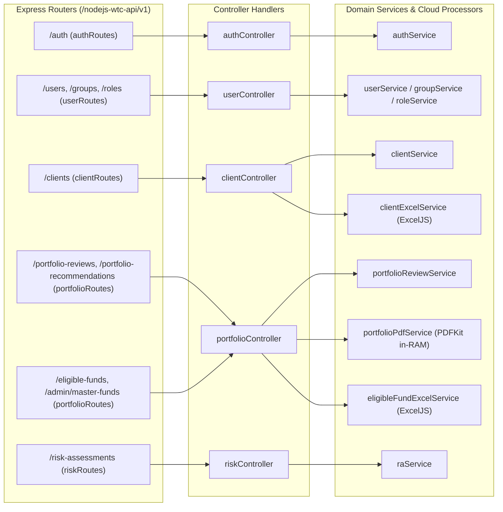
```mermaid
flowchart LR
    subgraph Routes["Express Routers (/nodejs-wtc-api/v1)"]
        AR["/auth (authRoutes)"]
        UR["/users, /groups, /roles (userRoutes)"]
        CR["/clients (clientRoutes)"]
        PR["/portfolio-reviews, /portfolio-recommendations (portfolioRoutes)"]
        EF["/eligible-funds, /admin/master-funds (portfolioRoutes)"]
        RR["/risk-assessments (riskRoutes)"]
    end

    subgraph Controllers["Controller Handlers"]
        AC["authController"]
        UC["userController"]
        CC["clientController"]
        PC["portfolioController"]
        RC["riskController"]
    end

    subgraph Services["Domain Services & Cloud Processors"]
        AS["authService"]
        US["userService / groupService / roleService"]
        CS["clientService"]
        CES["clientExcelService (ExcelJS)"]
        PRS["portfolioReviewService"]
        PDS["portfolioPdfService (PDFKit in-RAM)"]
        EFS["eligibleFundExcelService (ExcelJS)"]
        RAS["raService"]
    end

    AR --> AC --> AS
    UR --> UC --> US
    CR --> CC --> CS & CES
    PR --> PC --> PRS & PDS
    EF --> PC --> EFS
    RR --> RC --> RAS
```

#### 1.4 Subsystem C: Persistence, AWS S3 & Physical Storage Tier
Illustrates the routing of schema-validated JSON documents to MongoDB and in-memory binary streams to AWS S3 / LocalStack with zero container disk footprints.

```mermaid
flowchart LR
    subgraph Services["Application Domain Services"]
        CS["clientService"]
        CES["clientExcelService"]
        PRS["portfolioReviewService"]
        PDS["portfolioPdfService"]
        EFS["eligibleFundExcelService"]
    end

    subgraph Models["Mongoose Models & Schemas"]
        CM["Client / ClientProfile"]
        PRM["PortfolioReview (Embedded Entries)"]
        PRCM["PortfolioRecommendation (Embedded Fund Items)"]
        EFM["EligibleFund"]
        UM["User / Role / Group / Permission"]
        RAM["RiskAssessment / RiskQuestion"]
    end

    subgraph CloudInfra["AWS S3 / LocalStack Integration"]
        S3S["S3Service (@aws-sdk/client-s3)"]
        Presigner["@aws-sdk/s3-request-presigner (getSignedUrl)"]
    end

    subgraph Storage["Physical Storage"]
        MongoDB[("MongoDB Database<br/>(BSON Documents & Embedded Subdocuments)")]
        S3Bucket[("AWS S3 / LocalStack Bucket<br/>(PDFs, Statements, Excel Snapshots)")]
    end

    CS --> CM
    CES --> S3S
    PRS --> PRM & PRCM & EFM & S3S
    PDS --> S3S
    EFS --> EFM & S3S
    S3S --> Presigner

    CM & PRM & PRCM & EFM & UM & RAM -->|Mongoose Driver / TCP 27017| MongoDB
    S3S -->|PutObjectCommand / GetObjectCommand| S3Bucket
```

#### 1.5 Tier Responsibilities & Structural Summary
| Architectural Tier | Primary Components & Files | Core Responsibilities |
|---|---|---|
| **Client & Ingress** | React Frontend, Vite Dev Server / Nginx | Static asset delivery, reverse proxying to `/nodejs-wtc-api/v1/*`. |
| **Security & Middleware** | `authMiddleware.ts`, `snakeCaseResponse.ts`, `errorHandler.ts` | JWT cookie/bearer validation, RBAC enforcement, snake_case wire serialization, centralized logging. |
| **REST Presentation** | `modules.*.controllers.*`, Express Routers | Express route binding, async error wrapping via `asyncHandler`, HTTP request/response mapping. |
| **Domain Services** | `modules.*.services.*` | Core business rules, validation, scoring calculations, transaction emulation. |
| **Async & Document Engines** | `portfolioPdfService.ts`, `eligibleFundExcelService.ts`, `clientExcelService.ts` | 100% in-memory vector PDF generation (`PDFKit`), Excel parsing & generation (`ExcelJS`) with zero local disk writes. |
| **Cloud & Object Storage** | `common.services.s3Service.ts`, AWS SDK v3 | Direct RAM buffer uploads to S3, time-limited HMAC-SHA256 pre-signed download URLs, LocalStack auto-bucket provisioning. |
| **Data Persistence** | `modules.*.models.*`, Mongoose ODM | Schema enforcement, embedded subdocuments, compound indexing, lifecycle timestamps, `toJSON` sanitization. |

---

### 2. Domain Model & Class Diagrams (Source-Verified for Mongoose & TypeScript)

#### 2.1 User Management & Role-Based Access Control (RBAC)
Models organizational departments (`Group`), granular security capabilities (`Permission`), and composite roles (`Role`) assigned to users.

```mermaid
classDiagram
    class User {
        +ObjectId _id
        +String email
        +String password
        +String fullName
        +ObjectId group
        +ObjectId role
        +ObjectId reportsTo
        +List~String~ languages
        +Date createdAt
        +Date updatedAt
        +comparePassword(candidate) Promise~Boolean~
    }

    class Group {
        +ObjectId _id
        +String name
        +String description
        +Date createdAt
        +Date updatedAt
    }

    class Role {
        +ObjectId _id
        +String name
        +String description
        +ObjectId group
        +List~ObjectId~ permissions
        +Date createdAt
        +Date updatedAt
    }

    class Permission {
        +ObjectId _id
        +String codename
        +String name
        +String contentType
        +Date createdAt
        +Date updatedAt
    }

    User "*" --> "1" Group : belongs to (ref)
    User "*" --> "1" Role : assigned (ref)
    User "*" --> "0..1" User : reports to (ref)
    Role "*" --> "1" Group : categorized under (ref)
    Role "*" --> "*" Permission : references permissions
```

#### 2.2 Customer & KYC Management
Customer management separates frequently searched client identity attributes from detailed compliance KYC address information using Mongoose 1-to-1 document references (`Client` $\rightarrow$ `ClientProfile`).

```mermaid
classDiagram
    class Client {
        +ObjectId _id
        +String firstName
        +String lastName
        +String fullName
        +String email
        +String phone
        +String pan
        +Date dateOfBirth
        +Gender gender
        +ClientStatus status
        +ObjectId relationshipManager
        +Date signUpDate
        +ObjectId createdBy
        +Date createdAt
        +Date updatedAt
    }

    class ClientProfile {
        +ObjectId _id
        +ObjectId client
        +KycStatus kycStatus
        +ClientStatus clientStatus
        +String addressLine
        +String city
        +String state
        +String pincode
        +String country
        +Date createdAt
        +Date updatedAt
    }

    class ClientStatus {
        <<enumeration>>
        ONBOARDING
        ACTIVE
        INACTIVE
    }

    class KycStatus {
        <<enumeration>>
        PENDING
        VERIFIED
        REJECTED
    }

    class Gender {
        <<enumeration>>
        MALE
        FEMALE
        OTHER
    }

    class User {
        +ObjectId _id
        +String email
        +String fullName
    }

    Client "1" <-- "1" ClientProfile : references client (1-to-1)
    User "1" <-- "*" Client : managed by RM (ref)
    Client --> ClientStatus : status
    Client --> Gender : gender
    ClientProfile --> KycStatus : kycStatus
    ClientProfile --> ClientStatus : clientStatus
```

#### 2.3 Portfolio Review, Holdings & Recommendation Proposals
Illustrates the MongoDB document architecture: holding entries (`IPortfolioEntry`) are **embedded subdocuments** within `PortfolioReview`, and proposed fund items (`IRecommendationFundItem`) are **embedded subdocuments** within `PortfolioRecommendation`.

```mermaid
classDiagram
    class PortfolioReview {
        +ObjectId _id
        +ObjectId client
        +ReviewStatus status
        +Number totalInvested
        +Number totalCurrentValue
        +Number totalGain
        +Number gainPercentage
        +Number cagr
        +String note
        +String ecasFileKey
        +List~IPortfolioEntry~ entries
        +Date createdAt
        +Date updatedAt
    }

    class IPortfolioEntry {
        <<embedded subdocument>>
        +ObjectId _id
        +String fundName
        +String isin
        +Number units
        +Number purchaseNav
        +Number currentNav
        +Number investedAmount
        +Number currentValue
        +Number absReturnPct
        +Number gain
        +Number cagrPct
        +Number holdingDays
        +EntryAction action
    }

    class PortfolioRecommendation {
        +ObjectId _id
        +ObjectId client
        +ObjectId portfolioReview
        +RecommendationFlowType flowType
        +RecommendationStatus status
        +ScoreCategoryCode investorCategory
        +String generatedDocumentUrl
        +String documentS3Key
        +List~IRecommendationFundItem~ funds
        +Date createdAt
        +Date updatedAt
    }

    class IRecommendationFundItem {
        <<embedded subdocument>>
        +ObjectId _id
        +ObjectId eligibleFund
        +Number amount
        +ObjectId replacesEntryId
        +Number displayOrder
    }

    class EligibleFund {
        +ObjectId _id
        +String fundName
        +String isin
        +String fundSubCategory
        +String assetClass
        +String instrumentType
        +ScoreCategoryCode scoreCategory
        +Boolean isActive
        +Date createdAt
        +Date updatedAt
    }

    class ReviewStatus {
        <<enumeration>>
        PENDING
        COMPLETED
        FAILED
    }

    class EntryAction {
        <<enumeration>>
        HOLD
        SELL
    }

    class RecommendationFlowType {
        <<enumeration>>
        REPLACE_FUNDS
        NEW_PORTFOLIO
    }

    class RecommendationStatus {
        <<enumeration>>
        SAVED
        PDF_GENERATED
        PDF_FAILED
    }

    class ScoreCategoryCode {
        <<enumeration>>
        very_conservative
        conservative
        moderate
        aggressive
        very_aggressive
    }

    PortfolioReview "1" *-- "*" IPortfolioEntry : embeds entries subdocs
    PortfolioReview "0..1" <-- "1" PortfolioRecommendation : references (optional)
    PortfolioRecommendation "1" *-- "*" IRecommendationFundItem : embeds funds subdocs
    IRecommendationFundItem "*" --> "1" EligibleFund : references fund
    IRecommendationFundItem "*" --> "0..1" IPortfolioEntry : references replaced holding
    IPortfolioEntry --> EntryAction : action
    PortfolioRecommendation --> RecommendationFlowType : flowType
    PortfolioRecommendation --> RecommendationStatus : status
    PortfolioRecommendation --> ScoreCategoryCode : investorCategory
    PortfolioReview --> ReviewStatus : status
```

#### 2.4 Risk Assessment & Suitability Engine
Calculates the investor's regulatory suitability profile. Questions embed option choices, and assessments embed recorded client answers.

```mermaid
classDiagram
    class RiskAssessment {
        +ObjectId _id
        +ObjectId client
        +AssessmentStatus status
        +List~IRiskAnswer~ answers
        +Number totalScore
        +IScoreCategoryInfo scoreCategory
        +Date completedAt
        +Date createdAt
        +Date updatedAt
    }

    class IRiskAnswer {
        <<embedded subdocument>>
        +ObjectId question
        +ObjectId selectedOption
        +Number points
        +Date answeredAt
    }

    class RiskQuestion {
        +ObjectId _id
        +String questionText
        +String rationale
        +Number displayOrder
        +List~IRiskOption~ options
        +Date createdAt
        +Date updatedAt
    }

    class IRiskOption {
        <<embedded subdocument>>
        +ObjectId _id
        +String optionLetter
        +String optionText
        +Number points
    }

    class AssessmentStatus {
        <<enumeration>>
        IN_PROGRESS
        COMPLETED
    }

    class ScoreCategoryCode {
        <<enumeration>>
        very_conservative
        conservative
        moderate
        aggressive
        very_aggressive
    }

    RiskAssessment "1" *-- "*" IRiskAnswer : embeds answers subdocs
    RiskQuestion "1" *-- "*" IRiskOption : embeds options subdocs
    IRiskAnswer "*" --> "1" RiskQuestion : references question
    IRiskAnswer "*" --> "1" IRiskOption : references selectedOption
    RiskAssessment --> AssessmentStatus : status
```

---

### 3. Core Sequence Diagrams

#### 3.1 JWT Authentication & RBAC Middleware Pipeline
Illustrates request interception, stateless token verification, user & permission hydration, and permission checking in the Node.js Express chain.

```mermaid
sequenceDiagram
    autonumber
    actor Client as Frontend Client
    participant Express as Express Pipeline
    participant AuthMW as authMiddleware (authenticate)
    participant JwtUtil as jwt (jsonwebtoken)
    participant UserMod as User Model (Mongoose)
    participant PermMW as requirePermission("client:read")
    participant Ctrl as clientController
    participant SnakeMW as snakeCaseResponse

    Client->>Express: HTTP GET /nodejs-wtc-api/v1/clients (Cookie: accessToken OR Bearer header)
    activate Express
    Express->>AuthMW: authenticate(req, res, next)
    activate AuthMW

    AuthMW->>JwtUtil: verify(token, config.jwtSecret)
    activate JwtUtil
    JwtUtil-->>AuthMW: decoded payload ({ email: "admin@wealthtech.com" })
    deactivate JwtUtil

    AuthMW->>UserMod: findOne({ email }).populate("group").populate({ path: "role", populate: "permissions" })
    activate UserMod
    UserMod-->>AuthMW: userDoc (hydrated with Role and all Permission codenames)
    deactivate UserMod

    AuthMW->>AuthMW: Attach userDoc to req.user
    AuthMW->>PermMW: next() -> requirePermission("client:read")
    deactivate AuthMW
    activate PermMW

    alt req.user has "client:read" OR role is "ADMIN"
        PermMW->>Ctrl: next() -> getClients(req, res)
        activate Ctrl
        Ctrl-->>SnakeMW: res.status(200).json(clientsData)
        deactivate Ctrl
        activate SnakeMW
        SnakeMW->>SnakeMW: transformKeysToSnakeCase(body)
        SnakeMW-->>Client: 200 OK (snake_case JSON response)
        deactivate SnakeMW
    else Lacks permission
        PermMW-->>Client: 403 Forbidden (Insufficient permissions)
    end
    deactivate PermMW
    deactivate Express
```

#### 3.2 Asynchronous In-Memory PDF Generation & S3 Direct Pre-Signed Retrieval
Demonstrates non-blocking proposal PDF generation rendered **100% in RAM** via `PDFKit` (`Buffer.concat`), direct persistence to AWS S3 / LocalStack, and time-limited pre-signed URL retrieval with **zero local disk footprint**.

```mermaid
sequenceDiagram
    autonumber
    actor RM as Relationship Manager (UI)
    participant Ctrl as portfolioController
    participant Svc as portfolioReviewService
    participant PdfGen as portfolioPdfService (PDFKit in-memory)
    participant S3 as s3Service (@aws-sdk/client-s3)
    participant S3Storage as AWS S3 / LocalStack Bucket
    participant Mongo as MongoDB (PortfolioRecommendation)

    RM->>Ctrl: POST /portfolio-recommendations/:id/generate-pdf
    activate Ctrl
    Ctrl->>Svc: triggerPdfGeneration(recommendationId)
    activate Svc
    Note over Svc: Spawns non-blocking async worker (this.generatePdfAsync)
    Svc-->>Ctrl: Returns current recommendation DTO immediately (Status: SAVED)
    Ctrl-->>RM: HTTP 202 Accepted (Recommendation DTO)
    deactivate Ctrl

    par Asynchronous In-Memory Worker (generatePdfAsync)
        Svc->>PdfGen: generateRecommendationPdf(recommendation)
        activate PdfGen
        Note over PdfGen: Creates new PDFDocument()<br/>Buffers stream chunks via doc.on("data", chunk)<br/>(ZERO local disk writes!)
        PdfGen->>S3: uploadFile({ key: s3Key, buffer: pdfBuffer, contentType: "application/pdf" })
        activate S3
        S3->>S3Storage: PutObjectCommand(Bucket, Key, Body)
        S3Storage-->>S3: PutObjectCommandOutput (ETag)
        S3-->>PdfGen: { key, bucket }
        deactivate S3

        PdfGen->>S3: getPresignedDownloadUrl(s3Key, 900s)
        activate S3
        Note over S3: Calculates HMAC-SHA256 signature client-side
        S3-->>PdfGen: 15-minute Pre-signed Download URL
        deactivate S3

        PdfGen-->>Svc: { s3Key, presignedUrl }
        deactivate PdfGen

        Svc->>Mongo: findByIdAndUpdate(id, { status: "PDF_GENERATED", documentS3Key, generatedDocumentUrl })
        activate Mongo
        Mongo-->>Svc: Persisted
        deactivate Mongo
    and Frontend Polling Loop (every 2.5s)
        loop Poll until status == PDF_GENERATED
            RM->>Ctrl: GET /portfolio-recommendations/:id
            Ctrl->>Svc: getRecommendation(id)
            Svc->>S3: getPresignedDownloadUrl(rec.documentS3Key)
            S3-->>Svc: Fresh Pre-signed URL (15-min TTL)
            Svc-->>Ctrl: Recommendation DTO (status, generated_document_url)
            Ctrl-->>RM: 200 OK (status: SAVED or PDF_GENERATED)
        end
    end

    RM->>S3Storage: Direct Download via Pre-signed URL
    S3Storage-->>RM: Stream PDF Proposal Binary (Direct from S3 to Browser)
    deactivate Svc
```

#### 3.3 Master Funds Admin Excel Ingestion & S3 Upsert Pipeline
Illustrates the administrative workflow for uploading mutual fund universe spreadsheets, streaming through ExcelJS in RAM, and performing atomic database upserts by ISIN code.

```mermaid
sequenceDiagram
    autonumber
    actor Admin as System Administrator
    participant Ctrl as portfolioController
    participant Svc as eligibleFundExcelService
    participant S3 as s3Service
    participant Excel as ExcelJS Engine
    participant Model as EligibleFund Model
    participant Mongo as MongoDB

    Admin->>Ctrl: POST /eligible-funds/upload (Multipart: master_funds.xlsx)
    activate Ctrl
    Ctrl->>Svc: processUpload(req.file.buffer, originalFilename)
    activate Svc

    Note over Svc: Generate S3 Key: master-funds/{timestamp}_{filename}
    Svc->>S3: uploadFile({ key: s3Key, buffer, contentType })
    activate S3
    S3-->>Svc: S3 upload confirmed
    S3->>S3: getPresignedDownloadUrl(s3Key, 900s)
    S3-->>Svc: presignedDownloadUrl
    deactivate S3

    Svc->>Excel: workbook.xlsx.load(buffer)
    activate Excel
    Note over Excel: Dynamically scans row 1 headers<br/>Detects ISIN, Fund Name, Category, Asset Class
    Excel-->>Svc: Parsed fund rows array
    deactivate Excel

    loop For each parsed fund row
        Svc->>Model: updateOne({ isin: fund.isin }, { $set: fund }, { upsert: true })
        activate Model
        Model->>Mongo: Atomic Upsert (Preserves existing _id)
        Mongo-->>Model: { matchedCount, modifiedCount, upsertedCount }
        Model-->>Svc: Result (inserted vs updated counter)
        deactivate Model
    end

    Svc-->>Ctrl: MasterFundUploadResponseDto (SUCCESS, totalRecords, insertedRecords, updatedRecords, fileUrl)
    deactivate Svc
    Ctrl-->>Admin: 200 OK (Upload Summary & Audit Details)
    deactivate Ctrl
```

#### 3.4 eCAS Electronic Statement Upload Flow
Captures how client portfolio statements are ingested into memory, stored in S3, and assigned pre-signed download URLs for advisor review.

```mermaid
sequenceDiagram
    autonumber
    actor Advisor as Relationship Manager
    participant Ctrl as portfolioController
    participant Svc as portfolioReviewService
    participant S3 as s3Service
    participant S3Store as AWS S3 / LocalStack Bucket

    Advisor->>Ctrl: POST /portfolio-reviews/ecas/upload (file, clientId)
    activate Ctrl
    Ctrl->>Svc: uploadEcasStatement({ buffer, originalFilename, clientId, contentType })
    activate Svc
    Note over Svc: Sanitize filename & generate key: ecas/{clientId}/{timestamp}_{filename}
    Svc->>S3: uploadFile({ key: s3Key, buffer, contentType })
    activate S3
    S3->>S3Store: PutObjectCommand
    S3Store-->>S3: 200 OK
    deactivate S3

    Svc->>S3: getPresignedDownloadUrl(s3Key, 900s)
    activate S3
    S3-->>Svc: Temporary Pre-Signed GET URL
    deactivate S3

    Svc-->>Ctrl: EcasUploadResponseDto (SUCCESS, clientId, filename, s3Key, fileUrl)
    deactivate Svc
    Ctrl-->>Advisor: 200 OK (eCAS Upload Summary)
    deactivate Ctrl
```

#### 3.5 Bulk Client Upload & Template S3 Sync Flow
Illustrates client spreadsheet onboarding, S3 raw file archival, async background parsing, and template S3 synchronization.

```mermaid
sequenceDiagram
    autonumber
    actor RM as Relationship Manager
    participant Ctrl as clientController
    participant CSvc as clientService
    participant CESvc as clientExcelService
    participant S3 as s3Service
    participant S3Store as AWS S3 / LocalStack Bucket
    participant Mongo as MongoDB (Client & ClientProfile)

    alt Download Spreadsheet Template
        RM->>Ctrl: GET /clients/bulk-template (?format=url)
        activate Ctrl
        Ctrl->>CESvc: generateClientBulkTemplate()
        activate CESvc
        CESvc-->>Ctrl: ExcelJS Buffer
        deactivate CESvc
        Ctrl->>S3: uploadFile("templates/clients_bulk_template.xlsx", buffer)
        Ctrl->>S3: getPresignedDownloadUrl("templates/clients_bulk_template.xlsx")
        S3-->>Ctrl: presignedUrl
        Ctrl-->>RM: 200 OK ({ s3Key, fileUrl } OR attachment stream)
        deactivate Ctrl
    else Upload Spreadsheet for Batch Ingestion
        RM->>Ctrl: POST /clients/bulk-upload (file)
        activate Ctrl
        Ctrl->>S3: uploadFile("client-uploads/{timestamp}_{filename}", buffer)
        Ctrl->>S3: getPresignedDownloadUrl(s3Key)
        S3-->>Ctrl: presignedUrl
        Ctrl->>CSvc: processBulkUploadAsync(buffer, currentUserId)
        Ctrl-->>RM: HTTP 202 Accepted ({ status: "PROCESSING", s3Key, fileUrl })
        deactivate Ctrl

        Note over CSvc: Async background processing:<br/>- Parses rows via ExcelJS<br/>- Skips duplicate PAN / Email / Phone<br/>- Inserts Client & ClientProfile atomically
        CSvc->>Mongo: Client.create() & ClientProfile.create()
    end
```

---

### 4. State Machine Diagrams

#### 4.1 Recommendation Proposal & PDF Generation State Machine
Models the lifecycle states of an investment recommendation proposal from draft creation through async rendering to final distribution.

```mermaid
stateDiagram-v2
    [*] --> SAVED : POST /portfolio-recommendations (Proposal created with line-item funds)

    SAVED --> SAVED : POST /portfolio-recommendations/:id/generate-pdf (HTTP 202 Accepted)
    note right of SAVED
        Background worker executes async:
        - In-memory PDFKit compilation (Buffer.concat)
        - Direct upload to S3 (recommendations/:id/proposal_:ts.pdf)
        - Pre-signed URL generation (HMAC-SHA256, 15 min TTL)
        Frontend polls GET /portfolio-recommendations/:id every 2.5s
    end note

    SAVED --> PDF_GENERATED : S3 upload successful & documentS3Key persisted
    SAVED --> PDF_FAILED : Worker catches exception during rendering or S3 upload

    PDF_FAILED --> SAVED : Relationship Manager clicks Retry (POST /generate-pdf)

    PDF_GENERATED --> [*] : Client downloads PDF directly from S3 (Pre-signed URL)
```

#### 4.2 Client Account & KYC Compliance Lifecycle
Models client progression and KYC verification status.

```mermaid
stateDiagram-v2
    [*] --> ONBOARDING : RM creates client (POST /clients)
    
    state ONBOARDING {
        [*] --> KYC_PENDING
        KYC_PENDING --> KYC_REJECTED : KYC documents invalid / discrepancy
        KYC_REJECTED --> KYC_PENDING : RM re-submits updated documents
        KYC_PENDING --> KYC_VERIFIED : Compliance verification passed
    }

    ONBOARDING --> ACTIVE : KYC_VERIFIED completed
    ACTIVE --> INACTIVE : Client deactivates or RM pauses account
    INACTIVE --> ACTIVE : Account reactivated
```

---

### 5. AI-Native RAG Ingestion & Hybrid Retrieval Architecture

#### 5.1 Sequence Diagram: RAG Document Ingestion & Idempotent pgvector Storage
Illustrates the end-to-end ingestion pipeline: parsing multi-document PDFs, semantic chunking, Gemini dense vector generation with retry/jitter, and transactional chunk replacement in PostgreSQL `pgvector`.

```mermaid
sequenceDiagram
    autonumber
    actor Admin as System Administrator / CLI
    participant Ctrl as RagIngestionController
    participant IngestSvc as FundDocumentIngestionService
    participant Parser as PdfDocumentParserService (PDFBox 3.x)
    participant Chunker as DocumentChunkingService
    participant EmbedSvc as GeminiEmbeddingService
    participant GeminiAPI as Google Gemini API (text-embedding-004)
    participant Repo as FundDocumentEmbeddingRepository
    participant PG as PostgreSQL (pgvector)

    Admin->>Ctrl: POST /java-wtc-api/v1/rag/ingest/corpus
    activate Ctrl
    Ctrl->>IngestSvc: ingestCorpusDirectory()
    activate IngestSvc

    loop For each PDF in assets/rag-sources/{factsheets, sids, riskometer, expenses}
        IngestSvc->>Parser: extractPages(pdfFile)
        activate Parser
        Parser-->>IngestSvc: List<ExtractedPdfPage> (pageNumber, cleanText)
        deactivate Parser

        IngestSvc->>Chunker: chunkDocumentPages(pages, filename, fundName, isin)
        activate Chunker
        Note over Chunker: Splits at natural paragraphs (~1,200 chars)<br/>with 200 char overlapping sliding window
        Chunker-->>IngestSvc: List<ProcessedChunk> (text, index, metadataJson)
        deactivate Chunker

        loop For each ProcessedChunk
            IngestSvc->>EmbedSvc: getEmbedding(chunkText)
            activate EmbedSvc
            EmbedSvc->>GeminiAPI: POST /models/text-embedding-004:embedContent
            activate GeminiAPI
            alt HTTP 200 OK
                GeminiAPI-->>EmbedSvc: float[768] vector
            else HTTP 429 Rate Limit / 5xx Server Error
                Note over EmbedSvc: Retry with exponential backoff & randomized jitter (±20%)
                EmbedSvc->>GeminiAPI: Retry attempt
                GeminiAPI-->>EmbedSvc: float[768] vector
            else Offline / Unconfigured Key
                Note over EmbedSvc: Fallback to deterministic normalized 768-dim hash vector
                EmbedSvc-->>EmbedSvc: generateDeterministicEmbedding(chunkText)
            end
            deactivate GeminiAPI
            EmbedSvc-->>IngestSvc: float[768] embedding
            deactivate EmbedSvc
        end

        Note over IngestSvc,PG: Enforce Idempotency in @Transactional Scope
        IngestSvc->>Repo: deleteByIsinAndDocumentType(isin, docType)
        Repo->>PG: DELETE FROM fund_document_embeddings WHERE isin = ? AND document_type = ?
        IngestSvc->>Repo: saveAll(entities)
        Repo->>PG: INSERT INTO fund_document_embeddings (isin, chunk_text, embedding, ...)
    end

    IngestSvc-->>Ctrl: IngestionSummary (filesProcessed, totalChunks, durationMs)
    deactivate IngestSvc
    Ctrl-->>Admin: HTTP 200 OK (IngestionSummary JSON)
    deactivate Ctrl
```

#### 5.2 Flowchart: Candidate-Grounded Hybrid Retrieval Pipeline
Illustrates the candidate-constrained vector retrieval flow, preventing LLM hallucinations by restricting searches exclusively to portfolio-eligible schemes.

```mermaid
flowchart TD
    UserQuery["User Investment Query / Portfolio Rebalancing Context"] --> FilterCandidates["1. Candidate Fund Filtering<br/>(Extract ISINs from Eligible Funds in Client Risk Category)"]
    
    FilterCandidates --> EmbedQuery["2. Query Vector Generation<br/>(Gemini text-embedding-004: 768 Dimensions)"]
    
    EmbedQuery --> VectorSearch["3. Candidate-Constrained pgvector Search<br/>WHERE isin IN (candidateIsins)"]
    
    VectorSearch --> CosineSim["4. Cosine Similarity Calculation<br/>1 - (chunk_embedding <=> query_embedding)"]
    
    CosineSim --> QualityGate{"5. Quality Gate<br/>Similarity >= 0.65?"}
    
    QualityGate -- "Yes (High Relevance)" --> GroundedContext["6. Build Grounded LLM Prompt<br/>(Top-K Authentic Factsheet/SID Excerpts + ISIN Citations)"]
    QualityGate -- "No (Low Relevance / Empty)" --> FallbackNotice["6. Defensive Degradation<br/>(Inform user: 'No sufficiently relevant fund disclosures found')"]
    
    GroundedContext --> CopilotReasoning["7. Multi-Agent Copilot Synthesis<br/>(Strictly Fact-Grounded Recommendation Proposal)"]
```

---

### 6. Platform Resilience, Retries with Jitter & Telemetry Architecture

#### 6.1 Sequence Diagram: Bounded Exponential Backoff with Randomized Jitter
Models client-side retry mechanics across upstream dependencies (AWS S3, Gemini AI API) to prevent the thundering herd effect.

```mermaid
sequenceDiagram
    autonumber
    participant Caller as Domain Service (S3Service / GeminiEmbeddingService)
    participant ResProps as ResilienceProperties / resilienceConfig
    participant Target as Upstream API (AWS S3 / Gemini API)

    Caller->>Target: Initial Invocation (Attempt 0)
    activate Target
    Target-->>Caller: 429 Too Many Requests / 503 Service Unavailable
    deactivate Target

    Note over Caller: Check operation idempotency & retryable status
    Caller->>ResProps: calculateBackoffWithJitter(attempt=0, policy)
    activate ResProps
    Note over ResProps: rawDelay = min(maxDelay, baseDelay * 2^0)<br/>jitterFactor = 1.0 + random(-jitterPct, +jitterPct)<br/>delay = rawDelay * jitterFactor
    ResProps-->>Caller: delayMs (e.g. 480ms)
    deactivate ResProps

    Note over Caller: Non-blocking sleep for delayMs

    Caller->>Target: Retry Invocation (Attempt 1)
    activate Target
    alt Upstream Recovered
        Target-->>Caller: HTTP 200 OK (Response Payload)
        Note over Caller: Record success metric in Prometheus histogram
    else Transient Failure Persists & attempt < maxRetries
        Target-->>Caller: 503 Service Unavailable
        Note over Caller: Calculate next backoff with jitter (e.g. 1040ms) and retry
    else Exhausted maxRetries
        Target-->>Caller: Failure Response
        Note over Caller: Logger-before-error: Log fatal failure with context<br/>Record failure counter in Prometheus<br/>Return defensive fallback or propagate AppError
    end
    deactivate Target
```

#### 6.2 Dataflow Diagram: Full-Stack Prometheus Observability Architecture
Illustrates metric instrumentation across both Java and Node.js runtimes, collected centrally by Prometheus.

```mermaid
flowchart LR
    subgraph JavaRuntime["Java Spring Boot Backend (Port 8080)"]
        J_HTTP["Spring WebMVC Filters"] -->|http_server_requests_seconds| Micrometer["Micrometer Registry"]
        J_S3["S3Service"] -->|s3_operation_duration_seconds<br/>s3_operation_failures_total| Micrometer
        J_RAG["GeminiEmbeddingService"] -->|rag_embedding_latency_seconds<br/>rag_embedding_calls_total| Micrometer
        Micrometer --> Actuator["/actuator/prometheus"]
    end

    subgraph NodeRuntime["Node.js Express Backend (Port 5000)"]
        N_HTTP["Express Middleware"] -->|http_request_duration_seconds| PromClient["prom-client Registry"]
        N_S3["s3Service"] -->|s3_operation_duration_seconds<br/>s3_operation_failures_total| PromClient
        N_DB["Mongoose Events"] -->|nodejs_active_handles| PromClient
        PromClient --> MetricsEndpoint["/api/v1/metrics"]
    end

    subgraph Monitoring["Observability Cluster"]
        Prometheus[("Prometheus Server")]
        Grafana["Grafana Dashboards"]
    end

    Actuator -->|"Scrape (15s interval)"| Prometheus
    MetricsEndpoint -->|"Scrape (15s interval)"| Prometheus
    Prometheus --> Grafana
```